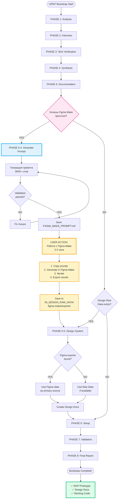
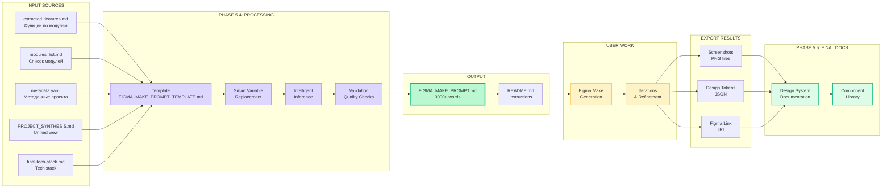
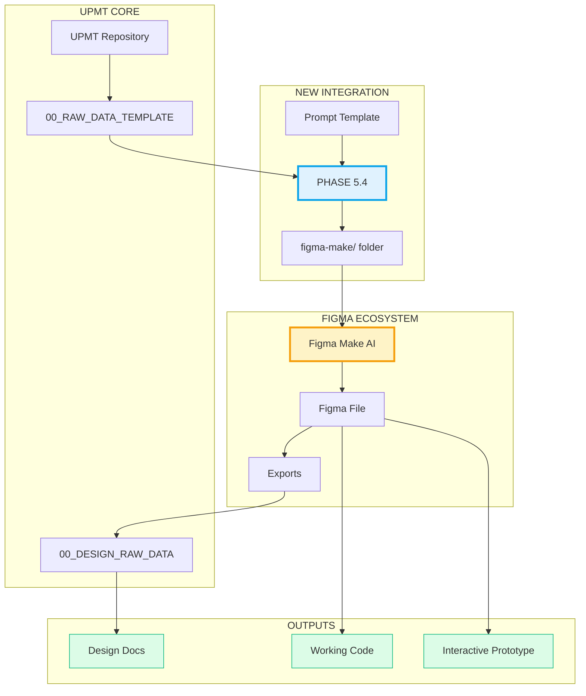
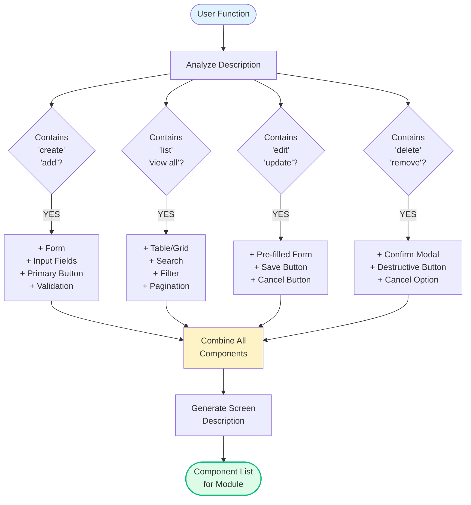
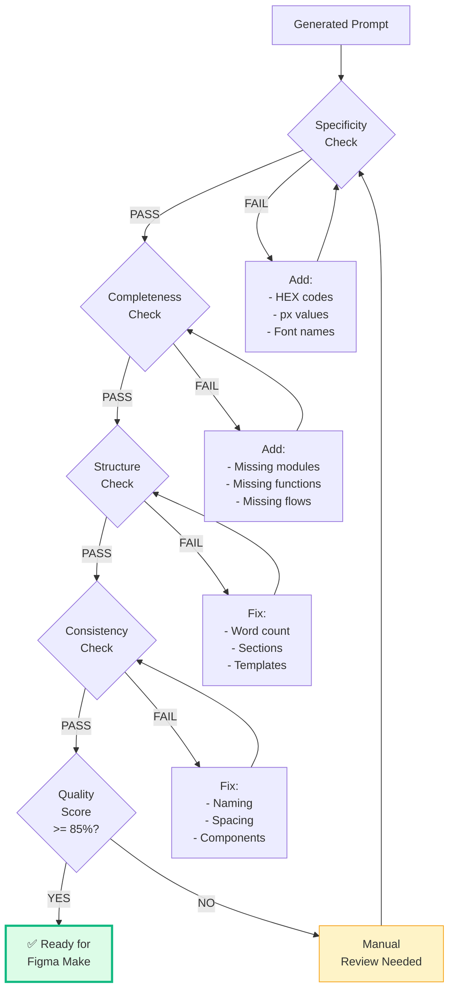

# FIGMA MAKE + UPMT PROCESS FLOW

## Визуализация полного процесса



## Data Flow Diagram



## Architecture Overview



## Timeline Comparison

```mermaid
gantt
    title Design Creation Time: Traditional vs UPMT+Figma
    dateFormat X
    axisFormat %H:%M
    
    section Traditional
    Initial Mockups       :done, t1, 0, 24h
    Iterations           :done, t2, 24h, 48h
    High-fidelity Design :done, t3, 48h, 96h
    Component Library    :done, t4, 96h, 144h
    Documentation        :done, t5, 144h, 168h
    Total (1 week)       :milestone, 168h, 0h
    
    section UPMT + Figma Make
    Bootstrap (PHASE 1-5) :active, u1, 0, 2h
    Generate Prompt (5.4) :active, u2, 2h, 2.5h
    Figma Make Work      :crit, u3, 2.5h, 5h
    Design Docs (5.5)    :active, u4, 5h, 6h
    Total (6 hours)      :milestone, 6h, 0h
```

## Component Inference Logic



## Quality Validation Flow



---

## Используй эти диаграммы для:

1. **Понимания процесса** - как всё работает end-to-end
2. **Презентаций** - показать стейкхолдерам workflow
3. **Документации** - включить в README или guides
4. **Обучения** - объяснить новым пользователям

Все диаграммы в Mermaid формате - можно рендерить в:
- GitHub README
- GitLab
- Notion
- VS Code (с плагином)
- Confluence
- Markdown viewers

---

**Создано для UPMT + Figma Make Integration**  
**Date:** 2025-11-16
