# BOOTSTRAP FLOW DIAGRAM

**Purpose:** Visual representation of complete bootstrap process  
**Use:** Understand flow and dependencies

---

## 🔄 COMPLETE FLOW

```mermaid
graph TD
    Start[Start: Template Deployed] --> PrepareData[Collect Raw Data]
    PrepareData --> ConfigMeta[Configure metadata.yaml]
    ConfigMeta --> ChoosePrompt{Choose Scenario}
    
    ChoosePrompt -->|CLI New| PromptCLINew[Prompt: CLI + New Project]
    ChoosePrompt -->|CLI Existing| PromptCLIExist[Prompt: CLI + Existing]
    ChoosePrompt -->|Web New| PromptWebNew[Prompt: Web + New Project]
    ChoosePrompt -->|Web Existing| PromptWebExist[Prompt: Web + Existing]
    
    PromptCLINew --> LaunchClaude[Launch Claude Code]
    PromptCLIExist --> LaunchClaude
    PromptWebNew --> LaunchClaude
    PromptWebExist --> LaunchClaude
    
    LaunchClaude --> ReadData[Phase 1: Read ALL Raw Data]
    ReadData --> Analyze[Extract Information]
    Analyze --> CheckCode{Existing Code?}
    
    CheckCode -->|Yes| AnalyzeCode[Analyze Code<br/>- Tech stack<br/>- Features<br/>- Dependencies]
    CheckCode -->|No| Interview[Phase 2: Interactive Q&A]
    AnalyzeCode --> Interview
    
    Interview --> AskQuestions[Ask 5-10 Questions]
    AskQuestions --> UserAnswers[User Answers]
    UserAnswers --> TechVerif[Phase 3: Tech Stack Verification]
    
    TechVerif --> GenPrompt[Generate Verification Prompt]
    GenPrompt --> UserWebSearch[User: Run in Claude.ai<br/>with Web Search]
    UserWebSearch --> SaveResults[Save Analysis Results]
    SaveResults --> ProcessAnalysis[Claude: Process Analysis]
    ProcessAnalysis --> FinalStack[Present Final Tech Stack]
    FinalStack --> UserApprove{User Approves?}
    
    UserApprove -->|No| AdjustStack[Adjust Stack]
    AdjustStack --> FinalStack
    UserApprove -->|Yes| Synthesis[Phase 4: Synthesis]
    
    Synthesis --> CombineData[Combine All Data<br/>- Raw data<br/>- User answers<br/>- Code analysis<br/>- Tech decisions]
    CombineData --> GenDocs[Phase 5: Generate Documentation]
    
    GenDocs --> GenCore[1. PROJECT_CORE/]
    GenCore --> GenEssence[00_PROJECT_ESSENCE.md]
    GenEssence --> GenPRD[01_PRD.md]
    GenPRD --> GenRoadmap[02_ROADMAP.md]
    GenRoadmap --> GenTechStack[03_TECH_STACK.md]
    GenTechStack --> GenArch[04_ARCHITECTURE.md]
    
    GenArch --> GenModules[2. MODULES_REQUIREMENTS/]
    GenModules --> ModuleFiles[Create module_requirements.md<br/>for each module]
    
    ModuleFiles --> GenContext[3. CONTEXT_MEMORY/]
    GenContext --> StateFile[state.md]
    StateFile --> DecisionsFile[decisions.md]
    DecisionsFile --> InsightsFile[insights.md]
    
    InsightsFile --> GenProgress[4. PROGRESS_TRACKING/]
    GenProgress --> ModStatus[modules_status.md]
    ModStatus --> SprintPlan[sprint_current.md]
    SprintPlan --> Backlog[backlog.md]
    
    Backlog --> CheckAI[5. AI_INSTRUCTIONS/]
    CheckAI --> AIUpdate{Need Updates?}
    AIUpdate -->|Yes| UpdateAI[Update .cursorrules/.clauderules]
    AIUpdate -->|No| GenFinal[6. Generate Final Files]
    UpdateAI --> GenFinal
    
    GenFinal --> BootstrapReport[BOOTSTRAP_REPORT.md]
    BootstrapReport --> FinalInstr[FINAL_SETUP_INSTRUCTIONS.md]
    FinalInstr --> ReviewChecklist[REVIEW_CHECKLIST.md]
    
    ReviewChecklist --> Validate[Phase 6: Validation]
    Validate --> SelfCheck[Self-Check<br/>- Completeness<br/>- Consistency<br/>- Cross-refs]
    SelfCheck --> ShowReport[Show Bootstrap Report to User]
    
    ShowReport --> UserReview[User Reviews Documentation]
    UserReview --> ReviewOK{Review OK?}
    
    ReviewOK -->|Issues Found| FixIssues[Fix Issues]
    FixIssues --> UserReview
    ReviewOK -->|All Good| FinalSetup[User: Follow FINAL_SETUP_INSTRUCTIONS.md]
    
    FinalSetup --> SetupCursor[Setup Cursor Rules]
    SetupCursor --> SetupClaude[Verify Claude Code]
    SetupClaude --> GitCommit[Git Commit]
    GitCommit --> Complete[🎉 Bootstrap Complete!<br/>Ready to Code]
```



---

## 📊 PHASE BREAKDOWN

### PHASE 1: ANALYSIS (1-2 hours, autonomous)

**Input:**
- Raw data files in `00_RAW_DATA_TEMPLATE/`
- `metadata.yaml` (if partially filled)
- Existing code (if applicable)

**Process:**
1. Read all files
2. Extract key information
3. Identify contradictions
4. Find information gaps
5. Analyze existing code (if present)

**Output:**
- Analysis report (internal)
- List of questions for user
- Tech stack mentions extracted

---

### PHASE 2: INTERVIEW (30-60 min, interactive)

**Input:**
- Analysis report
- User availability

**Process:**
1. Present findings summary
2. Ask critical questions (contradictions)
3. Ask important questions (gaps)
4. Record user answers
5. Auto-fill metadata.yaml

**Output:**
- Completed metadata.yaml
- Interview responses
- Resolved contradictions

---

### PHASE 3: TECH VERIFICATION (45-60 min)

**Input:**
- Tech stack mentions from raw data
- Current date ({CURRENT_MONTH_YEAR})

**Process:**
1. Generate verification prompt
2. **[USER ACTION]** Run in Claude.ai with web search
3. **[USER ACTION]** Save results
4. Process analysis results
5. Make recommendations
6. Get user approval

**Output:**
- Verified tech stack
- Modernization recommendations
- Final tech decisions

---

### PHASE 4: SYNTHESIS (15 min, autonomous)

**Input:**
- Extracted information
- Resolved contradictions
- User answers
- Verified tech stack

**Process:**
1. Combine all sources
2. Create unified project view
3. Resolve any remaining conflicts

**Output:**
- Synthesized project data (internal)

---

### PHASE 5: DOCUMENTATION (2-4 hours, autonomous)

**Input:**
- Synthesized data

**Process:**
```
ORDER MATTERS!
1. PROJECT_CORE/ (foundation)
   ↓
2. MODULES_REQUIREMENTS/ (detailed specs)
   ↓
3. CONTEXT_MEMORY/ (current state)
   ↓
4. PROGRESS_TRACKING/ (tracking setup)
   ↓
5. AI_INSTRUCTIONS/ (if adjustments needed)
```

**Output:**
- Complete documentation structure (~50 files)
- ~7000+ lines of documentation

---

### PHASE 6: VALIDATION (15 min, autonomous)

**Input:**
- Generated documentation

**Process:**
1. Self-check completeness
2. Verify consistency
3. Test cross-references
4. Generate reports

**Output:**
- BOOTSTRAP_REPORT.md
- FINAL_SETUP_INSTRUCTIONS.md
- REVIEW_CHECKLIST.md

---

## 🔀 DECISION POINTS

### 1. Scenario Choice (Start)

```
Question: What's your scenario?

A. CLI + New Project
   ↓ Use: Scenario 1 prompt
   ↓ Claude reads local files
   
B. CLI + Existing Project
   ↓ Use: Scenario 2 prompt
   ↓ Claude reads local files + code
   
C. Web + New Project
   ↓ Use: Scenario 3 prompt
   ↓ Claude reads via GitHub API
   
D. Web + Existing Project
   ↓ Use: Scenario 4 prompt
   ↓ Claude reads via GitHub API + code
```

### 2. Code Detection (Phase 1)

```
Check: Does code exist?

IF found /src, /app, /backend, etc:
   ↓ Scenario = Existing Project
   ↓ Analyze code automatically
   
ELSE:
   ↓ Scenario = New Project
   ↓ Skip code analysis
```

### 3. Tech Stack Approval (Phase 3)

```
Present: Recommended tech stack

User Options:
A. Approve All
   ↓ Continue immediately
   
B. Adjust Individual Items
   ↓ Discuss each component
   ↓ Make changes
   ↓ Continue
   
C. Keep Original
   ↓ Document reasons
   ↓ Continue
```

### 4. Review Outcome (Phase 6)

```
User Reviews: Generated documentation

IF Issues Found:
   ↓ Fix specific issues
   ↓ Re-validate
   ↓ Review again
   
ELSE:
   ↓ Proceed to Final Setup
```

---

## ⏱️ TIME ESTIMATES

### Total Time: 4-6 hours

**Breakdown:**

| Phase | User Time | Claude Time | Total |
|-------|-----------|-------------|-------|
| Phase 1: Analysis | 0 min | 30-60 min | 30-60 min |
| Phase 2: Interview | 10-20 min | 10-20 min | 20-40 min |
| Phase 3: Tech Verif | 15-30 min | 15 min | 30-45 min |
| Phase 4: Synthesis | 0 min | 10-15 min | 10-15 min |
| Phase 5: Documentation | 0 min | 120-240 min | 120-240 min |
| Phase 6: Validation | 30 min | 10 min | 40 min |
| **TOTAL** | **55-80 min** | **195-360 min** | **4-6 hours** |

**User Active Time:** ~1 hour  
**Claude Autonomous Time:** 3-5 hours  
**User can work on other things during Claude's autonomous phases**

---

## 🚦 SUCCESS CRITERIA

**Bootstrap считается успешным когда:**

✅ Все файлы в PROJECT_CORE/ заполнены  
✅ Requirements созданы для всех модулей  
✅ Tech stack верифицирован  
✅ Нет противоречий в документации  
✅ Cross-references работают  
✅ AI ассистенты настроены  
✅ Пользователь одобрил результат

---

## 🔧 TROUBLESHOOTING POINTS

**Где могут быть проблемы:**

```
1. Raw Data Quality
   Issue: Недостаточно данных
   Fix: Добавь больше контекста

2. Tech Verification
   Issue: Claude.ai не доступен
   Fix: Можно пропустить, Claude Code даст базовые рекомендации

3. Existing Code Analysis
   Issue: Код не обнаружен автоматически
   Fix: Укажи путь к коду явно

4. Documentation Gaps
   Issue: Некоторые секции пустые
   Fix: Попроси Claude Code заполнить или заполни вручную

5. Final Setup
   Issue: Cursor не читает правила
   Fix: Проверь что .cursorrules в корне и Settings настроены
```

---

**Используй эту диаграмму для понимания процесса!** 🗺️

