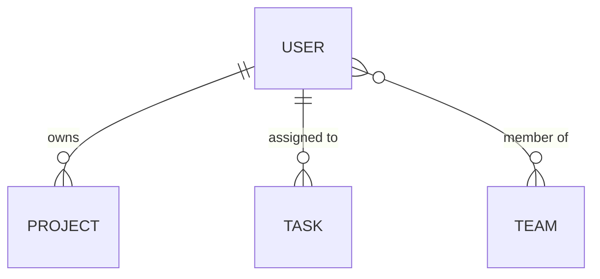
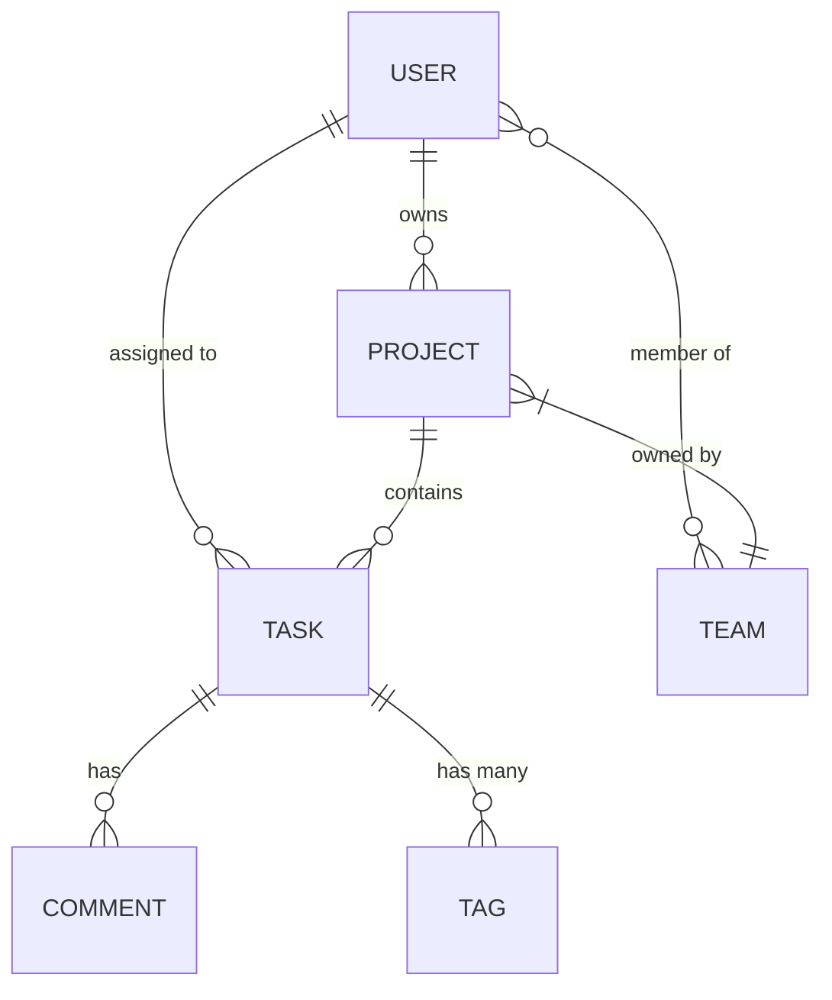

# BOOTSTRAP START PROMPTS

**Версия:** 2.0.0  
**Дата:** 2025-11-10  
**Назначение:** Готовые промпты для запуска bootstrap процесса (v2 - полное заполнение, строгие требования)

---

## 📋 КАК ИСПОЛЬЗОВАТЬ

Этот файл содержит **4 готовых промпта** для разных сценариев bootstrap.

**Инструкция:**
1. Выбери нужный сценарий ниже
2. Скопируй ВЕСЬ промпт (от "---НАЧАЛО ПРОМПТА---" до "---КОНЕЦ ПРОМПТА---")
3. Запусти `claude` (CLI) или открой Cursor
4. Вставь промпт и отправь

Claude Code прочитает все @ссылки и начнёт автономную работу.

---

## 🎯 ВЫБЕРИ СЦЕНАРИЙ

### Сценарий 1: CLI + Новый проект
- Работаешь локально (через терминал или Cursor)
- Только raw data (чаты, документы, заметки)
- Нет существующего кода

### Сценарий 2: CLI + Существующий проект
- Работаешь локально (через терминал или Cursor)
- Есть raw data + существующий код в проекте
- Claude Code автоматически обнаружит и изучит код

### Сценарий 3: Web (GitHub) + Новый проект
- Работаешь через Claude.ai (web) с GitHub
- Raw data загружены в GitHub репозиторий
- Нет существующего кода

### Сценарий 4: Web (GitHub) + Существующий проект
- Работаешь через Claude.ai (web) с GitHub
- Raw data + код в GitHub репозитории
- Claude Code через GitHub API изучит код

---

# СЦЕНАРИЙ 1: CLI + НОВЫЙ ПРОЕКТ

<a name="сценарий-1-cli--новый-проект"></a>

**Когда использовать:**
- Локальная работа (терминал `claude` или Cursor)
- Только raw data в `UPMT/bootstrap/00_RAW_DATA_TEMPLATE/`
- Нет существующего кода

---НАЧАЛО ПРОМПТА---

Ты - Claude Code, автономный AI-ассистент для bootstrap проекта.

## КОНТЕКСТ

Я развернул шаблон project-management-template в локальный репозиторий.
Добавил сырые данные (чаты, документы, заметки) в `UPMT/bootstrap/00_RAW_DATA_TEMPLATE/`.

Это **новый проект** - существующего кода НЕТ.

## ТВОЯ ЗАДАЧА

Запустить полный bootstrap процесс с AUTO-FILL режимом метаданных.

## ПОСЛЕДОВАТЕЛЬНОСТЬ ВЫПОЛНЕНИЯ

**Этот промпт полностью самодостаточен - следуй инструкциям ниже.**

### PHASE 1: ANALYSIS (1-2 часа, автономно)

1. Прочитай ВСЁ из `UPMT/bootstrap/00_RAW_DATA_TEMPLATE/`:
   - Все файлы в `chats/`
   - Все файлы в `documents/`
   - Все файлы в `notes/`
   - `metadata.yaml` (если частично заполнен)

2. **⚠️ КРИТИЧНО: ПОЛНОЕ извлечение ВСЕХ функций**

   **ОБЯЗАТЕЛЬНЫЕ действия:**
   - Прочитай КАЖДЫЙ чат, документ, заметку ПОЛНОСТЬЮ
   - Извлеки КАЖДУЮ упомянутую функцию/фичу (как в Ground Control: 150+ функций)
   - Создай ПОЛНЫЙ список функций, сгруппированный по модулям
   - **НИЧЕГО НЕ ПРОПУСКАЙ** - каждое упоминание функционала важно
   
   **Формат extracted_features:**
   ```markdown
   ## EXTRACTED FEATURES (ПОЛНЫЙ СПИСОК)
   
   **Total Functions:** [N]
   
   ### Модуль 1: [Name]
   - Function 1.1: [description]
   - Function 1.2: [description]
   - Function 1.3: [description]
   
   ### Модуль 2: [Name]
   - Function 2.1: [description]
   - Function 2.2: [description]
   
   [... для ВСЕХ модулей]
   ```
   
   **Проверка полноты:**
   - Пройдись по каждому чату ПОВТОРНО
   - Убедись что ВСЕ функции извлечены
   - Если в чате упомянуто 150+ функций → в списке должно быть 150+
   - **ЕСЛИ НЕПОЛНЫЙ СПИСОК → ПЕРЕДЕЛАЙ!**

3. **💾 СОХРАНЕНИЕ И СОГЛАСОВАНИЕ СПИСКА:**
   
   **ШАГ 3.1: Сохрани extracted_features в файл**
   - Создай файл: `UPMT/bootstrap/00_RAW_DATA_TEMPLATE/extracted_features.md`
   - Сохрани ПОЛНЫЙ список в формате выше
   - Убедись что файл создан и содержит ВСЕ функции
   
   **ШАГ 3.2: Покажи список пользователю для согласования**
   
   **⚠️ ВАЖНО:** Покажи ВСЕ функции из extracted_features.md прямо в диалоговом окне. НЕ проси пользователя открывать файл - покажи всё здесь для удобного просмотра и согласования.
   
   Выведи в диалоговое окно:
   ```
   📋 EXTRACTED FEATURES - СОГЛАСОВАНИЕ
   
   Я извлек [N] функций из ваших данных, сгруппированных в [M] модулей:
   
   **Модули с детальным списком функций:**
   
   ### Модуль 1: [Module Name] - [X] функций ([статус: New/Planned])
   
   **Функции:**
   - Function 1.1: [название функции] - [краткое описание]
   - Function 1.2: [название функции] - [краткое описание]
   - Function 1.3: [название функции] - [краткое описание]
   [... для ВСЕХ функций модуля 1]
   
   ### Модуль 2: [Module Name] - [Y] функций ([статус])
   
   **Функции:**
   - Function 2.1: [название функции] - [краткое описание]
   - Function 2.2: [название функции] - [краткое описание]
   [... для ВСЕХ функций модуля 2]
   
   [... повтори для КАЖДОГО модуля с полным списком функций]
   
   **Ключевые находки:**
   - Total Functions: [N]
   - Total Modules: [M]
   
   **Приоритеты (если есть в данных):**
   - 🔴 CRITICAL: [модуль/функция] - [описание]
   - 🟠 HIGH: [модуль/функция] - [описание]
   - 🟡 MEDIUM: [модуль/функция] - [описание]
   
   **Вопросы для согласования:**
   1. Все модули корректны? Есть ли модули, которые нужно объединить или разделить?
   2. Все функции извлечены? Не пропущено ли что-то важное?
   3. Названия модулей правильные? (можно предложить альтернативы)
   4. Есть ли функции, которые нужно переместить в другой модуль?
   
   **Инструкции:**
   - Если всё корректно → напиши "APPROVED" или "✅"
   - Если нужны изменения → опиши что изменить, я обновлю список
   - Если пропущены функции → укажи их, я добавлю
   - Если модули нужно перегруппировать → укажи как
   
   ⏸️ ЖДУ ВАШЕГО ПОДТВЕРЖДЕНИЯ ПЕРЕД ПРОДОЛЖЕНИЕМ
   ```
   
   **ШАГ 3.3: Обработка ответа пользователя**
   
   **ЕСЛИ пользователь написал "APPROVED" или "✅":**
   - Продолжай к шагу 4
   - Используй согласованный список для дальнейшей работы
   
   **ЕСЛИ пользователь запросил изменения:**
   - Обнови extracted_features согласно замечаниям
   - Обнови файл `extracted_features.md`
   - Покажи обновлённый список снова
   - Повторяй до получения APPROVED
   
   **ЕСЛИ пользователь добавил новые функции:**
   - Добавь их в соответствующие модули
   - Обнови счётчик Total Functions
   - Обнови файл `extracted_features.md`
   - Покажи обновлённый список

4. Извлеки информацию:
   - Название проекта
   - Целевая аудитория
   - Ключевые фичи (из СОГЛАСОВАННОГО extracted_features)
   - Упоминания технологий
   - Временные рамки
   - Противоречия между источниками
   - Пробелы в информации

5. **Финальная валидация модулей (PHASE 1.5):**
   
   После согласования extracted_features:
   
   **ШАГ 5.1: Определи финальный список модулей**
   - Из согласованного extracted_features извлеки уникальные модули
   - Создай список: `UPMT/bootstrap/00_RAW_DATA_TEMPLATE/modules_list.md` с описанием каждого модуля
   
   **ШАГ 5.2: Сохрани список модулей**
   - Формат `modules_list.md`:
     ```markdown
     # СПИСОК МОДУЛЕЙ ПРОЕКТА
     
     ## Всего модулей: [N]
     
     ### 1. [Module Name]
     **Описание:** [краткое описание модуля]
     **Функций:** [X]
     **Источник:** Raw Data
     **Статус:** New
     
     [... для всех модулей]
     ```

6. Создай analysis report с секцией EXTRACTED FEATURES (используй СОГЛАСОВАННЫЙ список)

### PHASE 2: INTERVIEW (30-60 минут, интерактивно)

**⚠️ КОНТЕКСТ ДЛЯ ВОПРОСОВ:**

Перед задаванием вопросов:
1. Прочитай `UPMT/bootstrap/00_RAW_DATA_TEMPLATE/extracted_features.md` (согласованный список функций)
2. Прочитай `UPMT/bootstrap/00_RAW_DATA_TEMPLATE/modules_list.md` (список модулей)
3. Используй эти файлы как контекст для формулирования вопросов

1. Покажи мне краткий summary findings
   - Используй данные из `extracted_features.md` и `modules_list.md`
   - Упомяни количество модулей и функций

2. Задай уточняющие вопросы (5-10 штук):
   - **CRITICAL:** Разрешение противоречий
   - **IMPORTANT:** Недостающая ключевая информация
   - **MODULE-RELATED:** Используй `modules_list.md` для вопросов о модулях
   - **OPTIONAL:** Детали (можешь infer если я не отвечу)

3. Используй режим AUTO-FILL:
   - Автоматически заполни `UPMT/bootstrap/00_RAW_DATA_TEMPLATE/metadata.yaml`
   - На основе извлечённых данных + моих ответов
   - Используй данные из `extracted_features.md` и `modules_list.md`

### PHASE 3: TECH STACK VERIFICATION (45-60 минут)

1. Проанализируй упоминания технологий из raw data

2. Сгенерируй verification prompt:
   - Создай файл `/verification/VERIFICATION_PROMPT_FOR_CLAUDE.md`
   - Включи все технологии для проверки актуальности ({CURRENT_MONTH_YEAR})

3. **ПАУЗА - МОЁ ДЕЙСТВИЕ:**
   - Я скопирую prompt
   - Выполню в Claude.ai (web) с web search
   - Сохраню результат в `/verification/tech-stack-analysis.md`
   - Скажу тебе "continue"

4. После моего "continue":
   - Прочитай `/verification/tech-stack-analysis.md`
   - Проанализируй рекомендации
   - Предложи финальный tech stack
   - **Сохрани финальный tech stack в:** `/verification/final-tech-stack.md` (после одобрения)
   - **Обнови `UPMT/bootstrap/00_RAW_DATA_TEMPLATE/metadata.yaml`** (секция tech_stack) после одобрения
   - Жди моего одобрения

### PHASE 4: SYNTHESIS (15 минут, автономно)

**⚠️ КОНТЕКСТ ДЛЯ SYNTHESIS:**

Перед созданием unified view:
1. Прочитай `UPMT/bootstrap/00_RAW_DATA_TEMPLATE/extracted_features.md` (согласованный список функций)
2. Прочитай `UPMT/bootstrap/00_RAW_DATA_TEMPLATE/modules_list.md` (список модулей)
3. Прочитай `UPMT/bootstrap/00_RAW_DATA_TEMPLATE/metadata.yaml` (метаданные проекта)
4. Прочитай `/verification/tech-stack-analysis.md` (если есть)
5. Прочитай `/verification/final-tech-stack.md` (если есть, после одобрения)

Объедини:
- Извлечённую информацию (из `extracted_features.md`)
- Список модулей (из `modules_list.md`)
- Разрешённые противоречия (из `metadata.yaml`)
- Мои ответы (из `metadata.yaml`)
- Верифицированный tech stack (из `final-tech-stack.md` или `tech-stack-analysis.md`)

Создай unified view: `/synthesized-project-data.md`

### PHASE 5: DOCUMENTATION GENERATION (2-4 часа, автономно)

**⚠️ СТРОГИЕ ТРЕБОВАНИЯ - ОБЯЗАТЕЛЬНОЕ ПОЛНОЕ ЗАПОЛНЕНИЕ:**

**⚠️ ВАЖНО: Новая UPMT структура!** Все файлы создаются в новых путях.

**⚠️ КОНТЕКСТ ДЛЯ ГЕНЕРАЦИИ:**

Перед заполнением документации:
1. Прочитай `/synthesized-project-data.md` (unified view из PHASE 4)
2. Прочитай `UPMT/bootstrap/00_RAW_DATA_TEMPLATE/extracted_features.md` (согласованный список функций)
3. Прочитай `UPMT/bootstrap/00_RAW_DATA_TEMPLATE/modules_list.md` (список модулей)
4. Прочитай `UPMT/bootstrap/00_RAW_DATA_TEMPLATE/metadata.yaml` (метаданные проекта)

Заполни документацию **В СТРОГОМ ПОРЯДКЕ**:

1. **docs/core/** (проектная документация):
   - Используй данные из `synthesized-project-data.md` и `metadata.yaml`
   - `00_PROJECT_ESSENCE.md` - **ОБЯЗАТЕЛЬНО заполни полностью** (видение, цели, аудитория, personas)
   - `01_PRD.md` - **ОБЯЗАТЕЛЬНО заполни полностью** (requirements, user stories для ВСЕХ модулей из `modules_list.md`)
   - `02_ROADMAP.md` - **ОБЯЗАТЕЛЬНО заполни полностью** (фазы, timeline, milestones)
   - `03_TECH_STACK.md` - **ОБЯЗАТЕЛЬНО заполни полностью** (технологии с обоснованием из `final-tech-stack.md` или `tech-stack-analysis.md`)
   - `04_ARCHITECTURE.md` - **ОБЯЗАТЕЛЬНО заполни полностью** (архитектура системы, диаграммы)

2. **docs/requirements/** (требования по модулям):
   
   **КРИТИЧНО ВАЖНО - ВСЕ ФУНКЦИИ ДОЛЖНЫ БЫТЬ УЧТЕНЫ:**
   
   - Используй СОГЛАСОВАННЫЙ extracted_features из PHASE 1 (из файла `extracted_features.md`)
   - Создай файл для КАЖДОГО модуля: `docs/requirements/[module_name]_requirements.md`
   - Для каждого модуля: перечисли ВСЕ его функции из extracted_features
   - **НЕ создавай "групповые" requirements**
   - **НЕ пропускай функции**
   
   **Формат module_requirements.md:**
   ```markdown
   # [MODULE NAME] Requirements
   
   ## Features
   
   ### Feature 1: [Name]
   **Priority:** Must/Should/Nice
   **Status:** ❌ Not Started
   **Description:** [detail]
   **User Story:** As a [user] I want [action] so that [benefit]
   **Acceptance Criteria:**
   - [ ] Criterion 1
   - [ ] Criterion 2
   
   [ПОВТОРИ для КАЖДОЙ функции модуля]
   ```
   
   **ПРОВЕРКА полноты:**
   - Количество функций в requirements ДОЛЖНО = количеству в extracted_features
   - ЕСЛИ НЕ СОВПАДАЕТ → ERROR, переделай!

3. **.context/** (контекст проекта):
   - `state.md` - **ОБЯЗАТЕЛЬНО заполни** (Phase: Planning, Last Activity: Bootstrap, РЕАЛЬНЫЕ данные)
   - `decisions.md` - **ОБЯЗАТЕЛЬНО залогируй ВСЕ принятые решения** (минимум 5 decision records)
   - `insights.md` - **ОБЯЗАТЕЛЬНО добавь** ключевые инсайты из анализа
   - `changes_log.md` - **ОБЯЗАТЕЛЬНО создай** начальную запись с bootstrap

4. **docs/progress/** (трекинг прогресса):
   - `modules_status.md` - **ОБЯЗАТЕЛЬНО заполни** используя `modules_list.md` как источник списка модулей (статус ВСЕХ модулей из `modules_list.md`, 0% для нового проекта)
   - `sprint_current.md` - **ОБЯЗАТЕЛЬНО создай** планирование первого спринта
   - `backlog.md` - **ОБЯЗАТЕЛЬНО заполни** приоритизированный backlog используя `extracted_features.md` как источник функций

5. **.upmt/ и .cursorrules:**
   - Прочитай `UPMT/bootstrap/00_RAW_DATA_TEMPLATE/metadata.yaml`
   - Скопируй `UPMT/bootstrap/00_RAW_DATA_TEMPLATE/metadata.yaml` → `.upmt/metadata.yaml`
   - Прочитай `UPMT/structure-templates/AI_INSTRUCTIONS/All_Project_rules.md`
   - **ОБЯЗАТЕЛЬНО создай** `.cursorrules` в корне проекта
   - **ОБЯЗАТЕЛЬНО скопируй** `UPMT/structure-templates/AI_INSTRUCTIONS/.cursorrules.template` и заполни AUTO-GENERATED секцию используя данные из `metadata.yaml` и `modules_list.md`
   - **ПРОВЕРЬ** что файл создан в корне: `.cursorrules`

6. **README.md (проектный):**
   - Прочитай `/README.md` (placeholder)
   - Замени его на полное описание проекта:
     * Название проекта
     * Описание (из docs/core/00_PROJECT_ESSENCE.md)
     * Quick start инструкции
     * Tech stack (из docs/core/03_TECH_STACK.md)
     * Структура проекта
     * Links to docs/core/
   - **НЕ путай с `UPMT/README_TEMPLATE.md` (про UPMT систему)!**

### PHASE 5.5: DESIGN SYSTEM GENERATION (1-2 часа, автономно)

**⚡ ПРОВЕРКА: SKIP или ПРОДОЛЖИТЬ?**

1. Проверь наличие design raw data:
   ```bash
   UPMT/bootstrap/00_DESIGN_RAW_DATA/
   ```

2. **ЕСЛИ папка пуста или содержит только README и примеры:**
   - ⏭️ **SKIP PHASE 5.5** (дизайн будет создан позже)
   - Переход к PHASE 6

3. **ЕСЛИ есть реальные design файлы** (chats/, moodboards/, screenshots/, figma/, research/, brand/):
   - ✅ **ПРОДОЛЖАЙ PHASE 5.5**

---

**ШАГ 1: Анализ Design Raw Data (30 минут)**

Прочитай ВСЕ файлы из:
- `UPMT/bootstrap/00_DESIGN_RAW_DATA/chats/`
- `UPMT/bootstrap/00_DESIGN_RAW_DATA/moodboards/` + notes
- `UPMT/bootstrap/00_DESIGN_RAW_DATA/screenshots/` + notes
- `UPMT/bootstrap/00_DESIGN_RAW_DATA/figma/` + links
- `UPMT/bootstrap/00_DESIGN_RAW_DATA/research/`
- `UPMT/bootstrap/00_DESIGN_RAW_DATA/brand/`
- `UPMT/bootstrap/00_DESIGN_RAW_DATA/design-metadata.yaml` (если заполнен)

**Извлеки:**
- Цветовую палитру (primary, secondary, semantic, grays)
- Типографику (font families, sizes, weights)
- Design principles (упомянутые в чатах/мудбордах)
- Компоненты (упомянутые или показанные)
- Visual style (minimal, bold, playful, etc.)
- Inspiration sources (Linear, Notion, etc.)
- UI framework предпочтения (если упомянуты)

---

**ШАГ 2: Создание Design System Structure (30-45 минут)**

**СОЗДАЙ полную структуру `docs/design/`:**

```bash
docs/design/
├── 00_DESIGN_SYSTEM.md
├── foundation/
│   ├── colors.md
│   ├── typography.md
│   ├── spacing.md
│   ├── elevation.md
│   ├── motion.md
│   ├── iconography.md
│   └── principles.md
├── components/
│   └── [компоненты по необходимости]
├── patterns/
│   └── [паттерны по необходимости]
├── content/
│   ├── voice-and-tone.md
│   ├── writing-guidelines.md
│   ├── error-messages.md
│   └── microcopy.md
├── accessibility/
│   ├── overview.md
│   ├── keyboard-navigation.md
│   ├── screen-readers.md
│   ├── color-contrast.md
│   └── testing.md
├── user-research/
│   └── [из raw data если есть]
├── screens/
│   └── _SCREEN_TEMPLATE.md
└── resources/
    ├── figma-links.md
    ├── design-tokens.json
    └── changelog.md
```

**Используй templates:**
- Copy structure from `UPMT/structure-templates/_COMPONENT_TEMPLATE.md` для reference
- Screens template уже в `docs/design/screens/_SCREEN_TEMPLATE.md`

---

**ШАГ 3: Заполнение Foundation (30 минут)**

**colors.md:**
- Определи PRIMARY color (из мудбордов/чатов или предложи based on brand)
- Создай полную палитру (50-900 shades) **ИЛИ** используй стандартную из template
- Semantic colors (success, error, warning, info)
- Grays (50-900)
- **ПРОВЕРЬ accessibility:** Все тексты ≥4.5:1 контраст

**typography.md:**
- Font family (из design data или предложи Inter как default)
- Font sizes (display, h1-h4, body, small, caption)
- Font weights (400, 500, 600, 700)
- Line heights

**spacing.md, elevation.md, motion.md, iconography.md:**
- Используй стандартные значения из templates
- Адаптируй если есть специфические требования из design data

**principles.md:**
- Если в чатах/мудбордах упоминались principles → используй их
- Если нет → используй стандартные: Clarity, Consistency, Efficiency, Accessibility, Feedback, Delight

---

**ШАГ 4: Components Documentation (если данные есть)**

**ЕСЛИ в design data упомянуты конкретные компоненты:**
- Создай `docs/design/components/[name].md` для каждого
- Используй `UPMT/structure-templates/_COMPONENT_TEMPLATE.md` как base
- Документируй на основе доступной информации

**ЕСЛИ конкретных компонентов нет:**
- Создай базовые: button.md, input.md, card.md
- Минимальная документация (anatomy, variants, states)
- Остальное заполнится по мере разработки

---

**ШАГ 5: Content Guidelines (20 минут)**

**voice-and-tone.md:**
- Из чатов/research: Какой tone упоминался? (friendly, professional, casual, formal)
- Определи Voice characteristics (3-4 характеристики)
- Примеры tone по context (success, error, empty state)

**error-messages.md, microcopy.md:**
- Стандартные guidelines из templates
- Адаптируй если есть специфика из design data

---

**ШАГ 6: Accessibility (15 минут)**

Создай все accessibility docs:
- overview.md (WCAG 2.1 AA compliance)
- keyboard-navigation.md
- screen-readers.md
- color-contrast.md (проверь созданную палитру!)
- testing.md

**Используй стандартные templates** - accessibility универсальна!

---

**ШАГ 7: User Research (если есть)**

**ЕСЛИ в `research/` есть файлы:**
- Создай `docs/design/user-research/personas.md` (из interview data)
- Создай `docs/design/user-research/pain-points.md` (из research)
- Создай `docs/design/user-research/journey-maps.md` (если упомянуты)

**ЕСЛИ research данных нет:**
- Создай templates как placeholders
- Заполнятся позже на основе реальных users

---

**ШАГ 8: Resources & Tokens (15 минут)**

**figma-links.md:**
- Добавь ссылки из `figma/figma-links.md` (если есть)
- Placeholder если нет

**design-tokens.json:**
- Экспортируй определенные colors, typography, spacing в JSON
- Формат:
  ```json
  {
    "colors": { "primary": { "500": "#..." }, ... },
    "typography": { "fontSize": { ... }, ... },
    "spacing": { ... }
  }
  ```

**changelog.md:**
- Первая запись: "v1.0.0 - Initial design system created during bootstrap"

---

**ШАГ 9: Integration with Module Requirements (15 минут)**

**Обнови module requirements (созданные в PHASE 5):**

Перед обновлением:
1. Прочитай `UPMT/bootstrap/00_RAW_DATA_TEMPLATE/modules_list.md`
2. Для каждого модуля из `modules_list.md`:
   - Найди соответствующий `docs/requirements/[module_name]_requirements.md`
   - Найди **section 7: UI/UX REQUIREMENTS**
   - Заполни **7.1 Design System Reference:**
     ```markdown
     **Foundation:**
     - Colors: See docs/design/foundation/colors.md
     - Typography: See docs/design/foundation/typography.md
     - Spacing: See docs/design/foundation/spacing.md
     
     **Design Files:**
     - Figma: [Link if exists]
     ```
   - Если известны конкретные компоненты для модуля → заполни **7.2 Components Used**

---

**ШАГ 10: Design Questions (5-10 минут)**

**Задай 3-5 уточняющих вопросов пользователю:**

Примеры вопросов:
1. "Цветовая палитра: Я извлек [primary color] как основной. Подтверждаешь или хочешь изменить?"
2. "Font: Предлагаю [Inter/другой]. Согласен или есть предпочтения?"
3. "Visual style: Понял как [minimal/bold/playful]. Верно?"
4. "UI framework: Видел упоминание [MUI/Ant Design/custom]. Подтверждаешь выбор?"
5. "Accessibility: Target WCAG 2.1 AA compliance. Нужен AAA или AA достаточно?"

**Подожди ответов (если пользователь онлайн) ИЛИ продолжай с assumptions.**

---

**ШАГ 11: Finalize & Validate (10 минут)**

**Проверь что создано:**
- [ ] `docs/design/00_DESIGN_SYSTEM.md` (overview заполнен)
- [ ] `docs/design/foundation/*` (7 файлов: colors, typography, spacing, elevation, motion, iconography, principles)
- [ ] `docs/design/components/` (минимум 3: button, input, card) ИЛИ те что упомянуты
- [ ] `docs/design/content/*` (4 файла)
- [ ] `docs/design/accessibility/*` (5 файлов)
- [ ] `docs/design/resources/` (figma-links, design-tokens.json, changelog)
- [ ] Module requirements section 7 обновлен (design system references)

**Залогируй:**
```markdown
✅ PHASE 5.5 COMPLETED:
→ Design System: [Created/Skipped]
→ Foundation docs: [X files]
→ Components documented: [X components]
→ Accessibility: WCAG 2.1 AA target
→ Module requirements: Section 7 updated
```

---

## PHASE 5.7: BACKEND DOCUMENTATION GENERATION (30-90 минут, условно)

**⚠️ УСЛОВНОЕ ВЫПОЛНЕНИЕ:** Эта фаза выполняется ТОЛЬКО если обнаружен backend.

**Проверка необходимости:**

```typescript
// Псевдокод логики
IF (raw_data_mentions_backend OR tech_stack_has_backend_framework):
    EXECUTE PHASE 5.7
ELSE:
    SKIP → ПЕРЕХОД К PHASE 6
```

**Триггеры для выполнения PHASE 5.7:**

1. ✅ Raw data содержит backend спецификации (API endpoints, database schema, entities)
2. ✅ Tech stack включает backend framework (Express, Fastify, NestJS, Django, etc.)
3. ✅ Проект типа требует backend (web app, mobile backend, SaaS, etc.)

**ЕСЛИ НИ ОДИН ТРИГГЕР НЕ СРАБОТАЛ:**

```text
ℹ️ PHASE 5.7 SKIPPED:
→ Backend не обнаружен в raw data
→ Backend framework не найден в tech stack
→ Проект типа не требует backend
→ ПЕРЕХОД К PHASE 6
```

---

**ЕСЛИ ХОТЯ БЫ ОДИН ТРИГГЕР СРАБОТАЛ → ВЫПОЛНЯЕМ PHASE 5.7:**

### ШАГ 1: Анализ backend данных (5-10 минут)

**Определи стратегию:**

| Сценарий | Источник данных | Стратегия |
|----------|-----------------|-----------|
| **A) Raw data содержит backend спецификации** | Чаты/документы с API, entities, database | **Генерация из raw data** (100% точность) |
| **B) Только tech stack упоминания** | Express/PostgreSQL упомянуты, детали отсутствуют | **Intelligent inference** (на основе контекста проекта) |
| **C) Частичные данные** | Некоторые entities/API упомянуты, остальное нет | **Гибрид:** raw data + inference |

**Извлеки из raw data (если есть):**

- Упоминания сущностей (User, Project, Task, etc.)
- Упоминания API endpoints
- Упоминания database tables
- Упоминания backend services
- Архитектурные решения (REST vs GraphQL, monolith vs microservices)

**Используй extracted_features из PHASE 1:**

- Функции часто подразумевают entities
- Пример: "User can create projects" → entities: User, Project

---

### ШАГ 2: Intelligent Inference (если данных нет/мало) (10-15 минут)

**Основа для inference:**

**A) Из типа проекта:**

| Тип проекта | Предполагаемые entities | Предполагаемые services |
|-------------|------------------------|------------------------|
| **Task Manager** | User, Project, Task, Comment, Tag | Auth, Tasks, Notifications, Teams |
| **E-commerce** | User, Product, Category, Order, Cart, Payment | Auth, Catalog, Orders, Payments, Shipping |
| **Social Network** | User, Post, Comment, Like, Follow, Message | Auth, Posts, Feed, Messaging, Notifications |
| **Blog Platform** | User, Article, Comment, Tag, Category | Auth, Content, Comments, Search |
| **SaaS Platform** | User, Organization, Subscription, Invoice | Auth, Billing, Organizations, API |

**B) Из функций (extracted_features):**

```text
Функция: "Users can register and login"
→ Entity: User (email, password_hash, name)
→ Service: Auth Service
→ API: POST /auth/register, POST /auth/login

Функция: "Users can create and manage projects"
→ Entity: Project (name, description, owner_id)
→ Relationships: User ||--o{ Project
→ API: POST /projects, GET /projects, GET /projects/:id

Функция: "Team collaboration features"
→ Entities: Team, TeamMember (join table)
→ Relationships: User }o--o{ Team
→ API: POST /teams, POST /teams/:id/members
```

**C) Из tech stack:**

| Tech Stack | Следствия |
|------------|-----------|
| **PostgreSQL** | Relational entities, foreign keys, migrations, ERD diagrams |
| **MongoDB** | Document-based entities, no strict schema, JSON-like structure |
| **Express/Fastify** | RESTful API, middleware, route-based structure |
| **NestJS** | Module-based, services, controllers, decorators |
| **Prisma/Drizzle** | Schema-first, type-safe, migrations, generated types |

---

### ШАГ 3: Генерация backend документации (30-60 минут)

**Используй templates из `UPMT/structure-templates/backend-documentation/`:**

**Создай структуру:**

```text
docs/
├── backend/
│   ├── 00_BACKEND_OVERVIEW.md          # Backend architecture overview
│   ├── entities/
│   │   ├── 00_ENTITY_CATALOG.md        # Master catalog with Mermaid ERD
│   │   └── [entity-name].md            # One file per entity (from _ENTITY_TEMPLATE.md)
│   ├── api/
│   │   ├── 00_API_OVERVIEW.md          # API design overview
│   │   └── [resource]-api.md           # One file per resource (from _API_ENDPOINT_TEMPLATE.md)
│   ├── services/
│   │   ├── 00_SERVICES_CATALOG.md      # Services catalog
│   │   └── [service-name]-service.md   # One file per service (from _SERVICE_TEMPLATE.md)
│   └── database/
│       ├── 00_DATABASE_SCHEMA.md       # Complete schema with ERD
│       └── relationships.md            # Detailed relationships
│
└── adr/
    ├── 00_ADR_INDEX.md                 # Architecture decisions index
    └── [number]-[title].md             # One file per decision (from _ADR_TEMPLATE.md)
```

---

#### ШАГ 3.1: Backend Overview (5 минут)

**Создай `docs/backend/00_BACKEND_OVERVIEW.md`:**

```markdown
# Backend Architecture Overview

## Stack

- **Runtime:** [Node.js 22 / Python 3.12 / etc]
- **Framework:** [Express / Fastify / Django / etc]
- **Database:** [PostgreSQL 16 / MongoDB 7 / etc]
- **ORM:** [Prisma / Drizzle / TypeORM / etc]

## Architecture Pattern

[Monolith / Modular Monolith / Microservices]

## Key Entities

[List of 5-10 main entities]

## API Design

[REST / GraphQL / tRPC / Hybrid]

## Documentation Links

- [Entity Catalog](entities/00_ENTITY_CATALOG.md)
- [API Overview](api/00_API_OVERVIEW.md)
- [Services](services/00_SERVICES_CATALOG.md)
```

---

#### ШАГ 3.2: Entities Documentation (20-30 минут)

**Для каждой обнаруженной/inferred entity:**

**1) Используй template `UPMT/structure-templates/backend-documentation/_ENTITY_TEMPLATE.md`**

**2) Заполни секции:**

| Секция | Откуда данные | Если данных нет → Inference |
|--------|---------------|----------------------------|
| **Overview** | Raw data | Опиши purpose на основе названия entity |
| **Database Schema** | Raw data schema ИЛИ inference | Стандартные поля: id, created_at, updated_at |
| **TypeScript Type** | Derive from schema | Auto-generate from schema |
| **Relationships** | Raw data ИЛИ функции | Логические связи (User owns Projects) |
| **API Endpoints** | Raw data API ИЛИ стандарт | Standard CRUD: GET/POST/PATCH/DELETE |
| **Frontend Mapping** | Если упомянуто | Placeholder если неизвестно |
| **Permissions** | Из требований ИЛИ стандарт | Admin full, User own, Guest read |

**3) Создай файл:** `docs/backend/entities/[entity-name].md`

**Пример inference для User entity:**

```markdown
# User Entity

## Overview

User entity represents a person who can interact with the system. Central entity for authentication and ownership.

**Type:** Core  
**Module:** Authentication

## Database Schema

```sql
CREATE TABLE users (
  id                UUID PRIMARY KEY DEFAULT gen_random_uuid(),
  email             VARCHAR(255) UNIQUE NOT NULL,
  name              VARCHAR(100) NOT NULL,
  password_hash     VARCHAR(255) NOT NULL,
  avatar_url        VARCHAR(500),
  role              VARCHAR(20) DEFAULT 'user',
  is_active         BOOLEAN DEFAULT true,
  email_verified    BOOLEAN DEFAULT false,
  created_at        TIMESTAMP DEFAULT NOW(),
  updated_at        TIMESTAMP DEFAULT NOW()
);
```

## Relationships



## API Endpoints

| Method | Endpoint | Description |
|--------|----------|-------------|
| GET | `/api/users/:id` | Get user by ID |
| PATCH | `/api/users/:id` | Update user |
| DELETE | `/api/users/:id` | Delete user (soft) |

## Permissions

| Action | Admin | User | Guest |
|--------|-------|------|-------|
| Read own | ✅ | ✅ | ❌ |
| Update own | ✅ | ✅ | ❌ |
| Delete own | ✅ | ✅ | ❌ |

```

---

#### ШАГ 3.3: Entity Catalog with ERD (10 минут)

**Создай `docs/backend/entities/00_ENTITY_CATALOG.md`:**

**Включи:**

**1) Master Mermaid ERD** со ВСЕМИ entities и relationships:



**2) Entity Table:**

| Entity | Type | Module | Description | Status |
|--------|------|--------|-------------|--------|
| User | Core | Auth | System users | Implemented |
| Project | Core | Projects | Work containers | Implemented |
| Task | Core | Tasks | Work items | Planned |

**3) Relationships Matrix:**

|        | User | Project | Task | Comment |
|--------|------|---------|------|---------|
| User   | -    | owns (1:N) | assigned (1:N) | writes (1:N) |
| Project | owned by (N:1) | - | contains (1:N) | - |
| Task   | assigned to (N:1) | in project (N:1) | - | has (1:N) |
| Comment | written by (N:1) | - | on task (N:1) | - |

---

#### ШАГ 3.4: API Documentation (10-15 минут)

**1) Создай `docs/backend/api/00_API_OVERVIEW.md`:**

- API design principles (REST/GraphQL)
- Authentication strategy (JWT/OAuth)
- Conventions (naming, versioning, error format)
- Rate limiting
- CORS policy

**2) Для каждого resource (entity):**

**Используй template `UPMT/structure-templates/backend-documentation/_API_ENDPOINT_TEMPLATE.md`**

**Создай:** `docs/backend/api/[resource]-api.md`

**Минимум:**

- GET /api/[resource] - List
- GET /api/[resource]/:id - Get one
- POST /api/[resource] - Create
- PATCH /api/[resource]/:id - Update
- DELETE /api/[resource]/:id - Delete

**Заполни из raw data ИЛИ standard patterns:**

- Request/response formats
- Authentication requirements
- Validation rules
- Error responses (400, 401, 403, 404, 422, 500)

---

#### ШАГ 3.5: Database Schema (5 минут)

**Создай `docs/backend/database/00_DATABASE_SCHEMA.md`:**

**Включи:**

- Full database schema (все tables)
- Master ERD (Mermaid diagram)
- Indexes
- Constraints
- Migration strategy

**Создай `docs/backend/database/relationships.md`:**

- Детальные ERD по модулям
- Foreign keys
- Join tables
- Query examples

**Создай `docs/backend/relationships_matrix.md`:**

**Используй template `UPMT/structure-templates/backend-documentation/_RELATIONSHIPS_MATRIX_TEMPLATE.md`**

**Включи:**
- Entity ↔ Entity relationships matrix
- Entity ↔ API endpoints matrix
- Entity ↔ Services matrix
- Services ↔ API endpoints matrix
- Module ↔ Components matrix
- Mermaid diagrams:
  - Master ERD (entity relationships)
  - Entity ↔ API flow diagram
  - Service dependencies diagram
  - Module architecture diagram
- Quick reference tables (dependencies)

**Этот файл показывает ВСЕ связи между компонентами backend для быстрого понимания архитектуры.**

---

#### ШАГ 3.6: Architecture Decision Records (ADR) (10-15 минут)

**Создай `docs/adr/00_ADR_INDEX.md`**

**Создай ADRs для key decisions:**

##### 1) ADR-001: Database Choice

Используй template `UPMT/structure-templates/backend-documentation/_ADR_TEMPLATE.md`

```markdown
# ADR-001: Use PostgreSQL

**Date:** 2025-11-11
**Status:** Accepted

## Context

Need relational database for [project name] with strong ACID guarantees.

## Decision

We will use PostgreSQL 16.

## Alternatives

- MySQL: Good but PostgreSQL has better JSON support
- MongoDB: Not suitable for relational data
- SQLite: Not for multi-user production

## Consequences

**Pros:** ACID, JSON support, mature
**Cons:** Hosting cost, learning curve
```

##### 2) ADR-002: Architecture Pattern

```markdown
# ADR-002: Modular Monolith

**Date:** 2025-11-11
**Status:** Accepted

## Decision

Modular monolith (not microservices for MVP).

## Rationale

- Simpler deployment
- Faster development
- Can split to microservices later
```

##### 3) ADR-003: Authentication

```markdown
# ADR-003: JWT Authentication

**Date:** 2025-11-11
**Status:** Accepted

## Decision

Use JWT for stateless auth.

## Alternatives

- Sessions: Less scalable
- OAuth only: Need email/password too
```

**Создай минимум 3 ADRs** (database, architecture, auth).

---

### ШАГ 4: Integration with Existing Docs (5 минут)

**1) Обнови `docs/core/04_ARCHITECTURE.md`:**

Добавь секцию:

```markdown
## Backend Architecture

See detailed backend documentation:
- [Backend Overview](../backend/00_BACKEND_OVERVIEW.md)
- [Entity Catalog](../backend/entities/00_ENTITY_CATALOG.md)
- [API Overview](../backend/api/00_API_OVERVIEW.md)
- [Architecture Decisions](../adr/00_ADR_INDEX.md)
```

**2) Обнови module requirements:**

В каждом `docs/requirements/[module]_requirements.md`:

- Добавь **Section 8: Backend Integration**:

  ```markdown
  ## 8. BACKEND INTEGRATION
  
  **Entities Used:**
  - User (docs/backend/entities/user.md)
  - Project (docs/backend/entities/project.md)
  
  **API Endpoints:**
  - GET /api/projects
  - POST /api/projects
  
  **Services:**
  - Auth Service (authentication check)
  ```

---

### ШАГ 5: Validation (5 минут)

**Проверь что создано:**

- [ ] `docs/backend/00_BACKEND_OVERVIEW.md`
- [ ] `docs/backend/entities/00_ENTITY_CATALOG.md` с Mermaid ERD
- [ ] Минимум 3 entity docs (user, [entity2], [entity3])
- [ ] `docs/backend/api/00_API_OVERVIEW.md`
- [ ] Минимум 2 API endpoint docs
- [ ] `docs/backend/database/00_DATABASE_SCHEMA.md` с ERD
- [ ] `docs/adr/00_ADR_INDEX.md`
- [ ] Минимум 3 ADRs (database, architecture, auth)
- [ ] Cross-references в ARCHITECTURE.md и module requirements

**Залогируй:**

```markdown
✅ PHASE 5.7 COMPLETED (Backend Documentation):
→ Backend detected: [Yes - from raw data / Yes - inferred from stack / No - skipped]
→ Strategy: [Raw data / Intelligent inference / Hybrid]
→ Entities documented: [N]
→ API endpoints documented: [N]
→ ADRs created: [N]
→ Mermaid ERDs: [N diagrams]
→ Integration: ARCHITECTURE.md + module requirements updated
```


**⏭️ ПЕРЕХОД К PHASE 6**

### PHASE 6: FINAL SETUP INSTRUCTIONS (15 минут, автономно)

**⚠️ КОНТЕКСТ ДЛЯ ИНСТРУКЦИЙ:**

Перед созданием инструкций:
1. Прочитай `.upmt/metadata.yaml` (метаданные проекта, если уже создан)
2. Прочитай `docs/core/03_TECH_STACK.md` (технологии, если уже создан)
3. Прочитай `.cursorrules` (если уже создан)

1. Создай `UPMT/bootstrap/BOOTSTRAP_CONFIG/FINAL_SETUP_INSTRUCTIONS.md`

2. Включи:
   - Инструкции по настройке Cursor project rules (используй данные из `.upmt/metadata.yaml`)
   - Инструкции по настройке Claude Code
   - Правила обновления при изменениях
   - Ссылки на ресурсы (используй данные из `docs/core/03_TECH_STACK.md` если доступен)

3. Используй стандартный формат инструкций

### PHASE 7: BASIC VALIDATION (15 минут, автономно)

1. Базовая проверка:
   - Все файлы созданы
   - Нет противоречий между документами
   - Все cross-references работают

### PHASE 7.5: COMPLETENESS VALIDATION (30 минут, ОБЯЗАТЕЛЬНО!)

**⚠️ КРИТИЧЕСКИЙ ЧЕК-ЛИСТ - ВСЁ ДОЛЖНО БЫТЬ 100%:**

**Проверка документации:**
- [ ] `metadata.yaml` заполнен на 100% (НЕ template, все поля заполнены)
- [ ] Все 6 файлов `docs/core/` созданы И заполнены полностью
- [ ] `state.md` содержит РЕАЛЬНЫЕ данные (НЕ template, реальный phase, реальный progress)
- [ ] `decisions.md` содержит минимум 5 decision records
- [ ] `changes_log.md` содержит начальную запись о bootstrap

**Проверка извлечения функций:**
- [ ] `extracted_features.md` создан и содержит ВСЕ функции (проверь по чатам)
- [ ] `extracted_features.md` был согласован пользователем (APPROVED)
- [ ] Все функции из СОГЛАСОВАННОГО `extracted_features.md` отражены в `docs/requirements/`
- [ ] Каждый модуль имеет свой `[name]_requirements.md` файл
- [ ] Количество функций в requirements = количеству в СОГЛАСОВАННОМ extracted_features.md
- [ ] `modules_list.md` создан и содержит финальный список модулей
- [ ] **ЕСЛИ НЕ СОВПАДАЕТ → ❌ VALIDATION FAILED**

**Проверка файлов:**
- [ ] `extracted_features.md` создан в `UPMT/bootstrap/00_RAW_DATA_TEMPLATE/`
- [ ] `modules_list.md` создан в `UPMT/bootstrap/00_RAW_DATA_TEMPLATE/`
- [ ] `.cursorrules` создан в КОРНЕ проекта (не в template, а в корне!)
- [ ] `.cursorrules` содержит AUTO-GENERATED секцию (заполненную)
- [ ] `BOOTSTRAP_REPORT.md` создан
- [ ] `synthesized-project-data.md` создан
- [ ] `UPMT/bootstrap/BOOTSTRAP_CONFIG/FINAL_SETUP_INSTRUCTIONS.md` создан

**Проверка прогресса:**
- [ ] `modules_status.md` содержит ВСЕ модули из PRD
- [ ] `sprint_current.md` НЕ template (содержит реальные задачи)
- [ ] `backlog.md` содержит ВСЕ задачи из СОГЛАСОВАННОГО extracted_features.md

**🚨 ЕСЛИ ХОТЯ БЫ ОДИН ПУНКТ НЕ ВЫПОЛНЕН:**

```
❌ COMPLETENESS VALIDATION FAILED
→ Недостающие/неполные файлы: [список]
→ ВОЗВРАЩАЮСЬ к PHASE [X] для исправления
→ После исправления ПОВТОРЯЮ PHASE 7.5
```

**✅ ЕСЛИ ВСЕ ПУНКТЫ ВЫПОЛНЕНЫ:**

```
✅ COMPLETENESS VALIDATION PASSED
→ Все файлы созданы: [N] файлов
→ Все функции учтены: [M] функций
→ Готовность: 100%
→ Переход к PHASE 8
```

### PHASE 8: FINAL REPORT (10 минут, автономно)

1. Создай `/BOOTSTRAP_REPORT.md`:
   - Что создано (детальная статистика)
   - Какие решения приняты
   - Что требует проверки
   - Next steps для меня
   - **COMPLETENESS VALIDATION: ✅ PASSED**

2. Покажи мне summary и попроси проверить

## СИСТЕМА ПРОЕКТНЫХ ПРАВИЛ

**⚠️ В КАЖДОЙ PHASE:**

**В НАЧАЛЕ PHASE:**
- Проверь файл `UPMT/structure-templates/AI_INSTRUCTIONS/All_Project_rules.md`
- Определи какие правила активны для текущей phase
- Выведи: "👀 АКТИВНЫ ПРАВИЛА: [список применимых RULE_XX]"

**В КОНЦЕ PHASE (при соблюдении триггеров):**
- Выведи: "✅ ПРАВИЛА СРАБОТАЛИ:"
  ```
  - RULE_XX [название]: обновлены [файлы Y, Z] по триггеру [название]
  - RULE_YY [название]: обновлены [файлы A, B] по триггеру [название]
  ```

## ВАЖНЫЕ ПРАВИЛА

**Автономность:**
- Работай автономно где возможно
- Спрашивай только критически важное
- Информируй о прогрессе каждые 30 минут

**Качество:**
- Используй информацию из raw data, **НЕ ВЫДУМЫВАЙ**
- Если чего-то нет в данных - помечай как TODO или спрашивай
- Все решения должны иметь обоснование
- **ВСЕ файлы должны быть заполнены, НЕ оставляй templates**

**Прозрачность:**
- Логируй все решения в `decisions.md`
- Отмечай assumptions явно
- Предупреждай о рисках

## НАЧИНАЙ!

Начни с **PHASE 1: ANALYSIS**.

Прочитай все файлы в `UPMT/bootstrap/00_RAW_DATA_TEMPLATE/` и создай analysis report.

---КОНЕЦ ПРОМПТА---

---

# СЦЕНАРИЙ 2: CLI + СУЩЕСТВУЮЩИЙ ПРОЕКТ

<a name="сценарий-2-cli--существующий-проект"></a>

**Когда использовать:**
- Локальная работа (терминал `claude` или Cursor)
- Raw data в `UPMT/bootstrap/00_RAW_DATA_TEMPLATE/`
- **Есть существующий код** (в ../src, ../app, и т.д.)

---НАЧАЛО ПРОМПТА---

Ты - Claude Code, автономный AI-ассистент для bootstrap проекта.

## КОНТЕКСТ

Я развернул шаблон project-management-template в локальный репозиторий.
Добавил сырые данные (чаты, документы, заметки) в `UPMT/bootstrap/00_RAW_DATA_TEMPLATE/`.

Это **существующий проект** - есть код в соседних директориях (например: `../src`, `../app`, `../backend`, и т.д.).

## ТВОЯ ЗАДАЧА

Запустить полный bootstrap процесс с:
- AUTO-FILL режимом метаданных
- **Автоматическим анализом существующего кода**

## ПОСЛЕДОВАТЕЛЬНОСТЬ ВЫПОЛНЕНИЯ

**Этот промпт полностью самодостаточен - следуй инструкциям ниже.**

### PHASE 1: ANALYSIS (1-2 часа, автономно)

**Часть A: Анализ Raw Data**

1. Прочитай ВСЁ из `UPMT/bootstrap/00_RAW_DATA_TEMPLATE/`:
   - Все файлы в `chats/`, `documents/`, `notes/`
   - `metadata.yaml`

2. **⚠️ КРИТИЧНО: ПОЛНОЕ извлечение ВСЕХ функций**

   **ОБЯЗАТЕЛЬНЫЕ действия:**
   - Прочитай КАЖДЫЙ чат, документ, заметку ПОЛНОСТЬЮ
   - Извлеки КАЖДУЮ упомянутую функцию/фичу
   - Создай ПОЛНЫЙ список функций, сгруппированный по модулям
   - **НИЧЕГО НЕ ПРОПУСКАЙ** - каждое упоминание функционала важно
   
   **Формат extracted_features:**
   ```markdown
   ## EXTRACTED FEATURES (ПОЛНЫЙ СПИСОК)
   
   **Total Functions:** [N]
   
   ### Модуль 1: [Name]
   - Function 1.1: [description]
   - Function 1.2: [description]
   
   [... для ВСЕХ модулей]
   ```
   
   **Проверка полноты:**
   - Пройдись по каждому чату ПОВТОРНО
   - Убедись что ВСЕ функции извлечены
   - **ЕСЛИ НЕПОЛНЫЙ СПИСОК → ПЕРЕДЕЛАЙ!**

3. **💾 СОХРАНЕНИЕ И СОГЛАСОВАНИЕ СПИСКА:**
   
   **ШАГ 3.1: Сохрани extracted_features в файл**
   - Создай файл: `UPMT/bootstrap/00_RAW_DATA_TEMPLATE/extracted_features.md`
   - Сохрани ПОЛНЫЙ список в формате выше
   - Убедись что файл создан и содержит ВСЕ функции
   
   **ШАГ 3.2: Покажи список пользователю для согласования**
   
   **⚠️ ВАЖНО:** Покажи ВСЕ функции из extracted_features.md прямо в диалоговом окне. НЕ проси пользователя открывать файл - покажи всё здесь для удобного просмотра и согласования.
   
   Выведи в диалоговое окно:
   ```
   📋 EXTRACTED FEATURES - СОГЛАСОВАНИЕ
   
   Я извлек [N] функций из ваших данных (raw data + code analysis), сгруппированных в [M] модулей:
   
   **Модули с детальным списком функций:**
   
   ### ✅ Модуль 1: [Module Name] - [X] функций ([статус: Implemented/Partial/Not Started])
   
   **Функции:**
   - Function 1.1: [название функции] - [краткое описание] - [статус: ✅ Implemented / ⚠️ Partial / ❌ Not Started]
   - Function 1.2: [название функции] - [краткое описание] - [статус]
   - Function 1.3: [название функции] - [краткое описание] - [статус]
   [... для ВСЕХ функций модуля 1]
   
   ### ✅ Модуль 2: [Module Name] - [Y] функций ([статус])
   
   **Функции:**
   - Function 2.1: [название функции] - [краткое описание] - [статус]
   - Function 2.2: [название функции] - [краткое описание] - [статус]
   [... для ВСЕХ функций модуля 2]
   
   [... повтори для КАЖДОГО модуля с полным списком функций]
   
   **Ключевые находки:**
   - Current Progress: [X]% overall (из code analysis)
   - Total Functions: [N]
   - Implemented: ~[X] функций
   - In Progress: ~[Y] функций
   - Not Started: ~[Z] функций
   
   **Приоритеты (если есть в данных):**
   - 🔴 CRITICAL: [модуль/функция] - [описание]
   - 🟠 HIGH: [модуль/функция] - [описание]
   - 🟡 MEDIUM: [модуль/функция] - [описание]
   
   **Вопросы для согласования:**
   1. Все модули корректны? Есть ли модули, которые нужно объединить или разделить?
   2. Все функции извлечены? Не пропущено ли что-то важное?
   3. Названия модулей правильные? (можно предложить альтернативы)
   4. Есть ли функции, которые нужно переместить в другой модуль?
   5. Статусы функций (implemented/partial/not started) соответствуют реальности?
   
   **Инструкции:**
   - Если всё корректно → напиши "APPROVED" или "✅"
   - Если нужны изменения → опиши что изменить, я обновлю список
   - Если пропущены функции → укажи их, я добавлю
   - Если модули нужно перегруппировать → укажи как
   
   ⏸️ ЖДУ ВАШЕГО ПОДТВЕРЖДЕНИЯ ПЕРЕД ПРОДОЛЖЕНИЕМ
   ```
   
   **ШАГ 3.3: Обработка ответа пользователя**
   
   **ЕСЛИ пользователь написал "APPROVED" или "✅":**
   - Продолжай к шагу 4
   - Используй согласованный список для дальнейшей работы
   
   **ЕСЛИ пользователь запросил изменения:**
   - Обнови extracted_features согласно замечаниям
   - Обнови файл `extracted_features.md`
   - Покажи обновлённый список снова
   - Повторяй до получения APPROVED
   
   **ЕСЛИ пользователь добавил новые функции:**
   - Добавь их в соответствующие модули
   - Обнови счётчик Total Functions
   - Обнови файл `extracted_features.md`
   - Покажи обновлённый список

4. Извлеки информацию:
   - Название проекта
   - Целевая аудитория
   - Ключевые фичи (из СОГЛАСОВАННОГО extracted_features)
   - Упоминания технологий
   - Временные рамки
   - Противоречия между источниками
   - Пробелы в информации

**Часть B: Анализ Существующего Кода** ⚠️ ВАЖНО!

1. **Автоматическое обнаружение кода:**
   - Проверь наличие директорий: `../src`, `../app`, `../backend`, `../frontend`, `../server`, `../client`
   - Если нашёл → это существующий проект, код нужно изучить

2. **Сканирование кода:**
   ```
   Прочитай:
   - package.json / requirements.txt / go.mod (зависимости)
   - Структуру директорий (какие модули есть)
   - Ключевые файлы (main, index, app entry points)
   - README.md (если есть в коде)
   ```

3. **Извлеки из кода:**
   - Tech stack (реальный, из зависимостей)
   - Уже реализованные фичи (из структуры папок, файлов)
   - Архитектурные паттерны (из кода)
   - Версии зависимостей

4. **Сопоставь:**
   ```
   Raw Data Requirements     vs     Existing Code Reality
   
   Feature X (planned)       →      ✅ Implemented (found in /src/feature-x)
   Feature Y (planned)       →      ⚠️ Partial (UI found, backend missing)
   Feature Z (planned)       →      ❌ Not Found (нужно реализовать)
   ```

5. **Проверь устаревшие зависимости:**
   ```
   Из package.json:
   - react: "18.2.0" (2022) → Latest: 19.0 (2025) ⚠️ Outdated
   - typescript: "5.0" (2023) → Latest: 5.3 (2025) ⚠️ Minor update
   
   Рекомендации: UPDATE список
   ```

**Часть C: Создай Combined Analysis Report**
- Findings из raw data
- Findings из existing code
- Сопоставление требований vs реальности
- Рекомендации по модернизации

**Часть D: Финальная валидация модулей (PHASE 1.5):**

После согласования extracted_features и анализа кода:

**ШАГ D.1: Определи финальный список модулей**
- Из согласованного extracted_features извлеки уникальные модули
- Из анализа кода извлеки модули из структуры папок
- Объедини оба списка, устранив дубликаты
- Создай список: `UPMT/bootstrap/00_RAW_DATA_TEMPLATE/modules_list.md`

**ШАГ D.2: Сравни модули из requirements vs код**
- Если есть расхождения → уточни у пользователя:
  * "В коде найден модуль X, но его нет в requirements. Это корректно?"
  * "В requirements есть модуль Y, но в коде его нет. Это новый модуль?"
  * "Модуль Z найден и в коде, и в requirements. Статус: Implemented или Partial?"

**ШАГ D.3: Сохрани список модулей**
- Формат `modules_list.md`:
  ```markdown
  # СПИСОК МОДУЛЕЙ ПРОЕКТА
  
  ## Всего модулей: [N]
  
  ### 1. [Module Name]
  **Описание:** [краткое описание модуля]
  **Функций:** [X]
  **Источник:** Raw Data / Existing Code / Both
  **Статус:** New / Existing / Partial
  **Расположение в коде:** [путь, если есть]
  
  [... для всех модулей]
  ```

### PHASE 2: INTERVIEW (30-60 минут, интерактивно)

**⚠️ КОНТЕКСТ ДЛЯ ВОПРОСОВ:**

Перед задаванием вопросов:
1. Прочитай `UPMT/bootstrap/00_RAW_DATA_TEMPLATE/extracted_features.md` (согласованный список функций)
2. Прочитай `UPMT/bootstrap/00_RAW_DATA_TEMPLATE/modules_list.md` (список модулей)
3. Используй эти файлы как контекст для формулирования вопросов

1. Покажи мне краткий summary findings (raw data + code analysis)
   - Используй данные из `extracted_features.md` и `modules_list.md`
   - Упомяни количество модулей и функций
   - Упомяни статус модулей из `modules_list.md` (New/Existing/Partial)

2. Задай уточняющие вопросы (5-10 штук):
   - **CRITICAL:** Разрешение противоречий
   - **IMPORTANT:** Недостающая ключевая информация
   - **CODE-RELATED:** Подтверждение обнаруженных фич:
     * "Нашёл реализацию Feature X, это правильно?"
     * "Feature Y частично реализован, это корректно?"
   - **MODULE-RELATED:** Используй `modules_list.md` для вопросов о модулях
   - **MODERNIZATION:** Устаревшие зависимости:
     * "Рекомендую обновить React 18→19, согласен?"
   - **OPTIONAL:** Детали (можешь infer если я не отвечу)

3. Используй режим AUTO-FILL:
   - Автоматически заполни `UPMT/bootstrap/00_RAW_DATA_TEMPLATE/metadata.yaml`
   - На основе: raw data + code analysis + мои ответы
   - Используй данные из `extracted_features.md` и `modules_list.md`

### PHASE 3: TECH STACK VERIFICATION (45-60 минут)

1. Проанализируй технологии:
   - Из raw data (упоминания)
   - **Из code analysis (реальные версии из package.json)**

2. Сгенерируй verification prompt:
   - Создай файл `/verification/VERIFICATION_PROMPT_FOR_CLAUDE.md`
   - Включи:
     * Текущие версии из кода
     * Упоминания из raw data
     * Вопросы об обновлениях

3. **ПАУЗА - МОЁ ДЕЙСТВИЕ:**
   - Я скопирую prompt
   - Выполню в Claude.ai (web) с web search
   - Сохраню результат в `/verification/tech-stack-analysis.md`
   - Скажу тебе "continue"

4. После моего "continue":
   - Прочитай `/verification/tech-stack-analysis.md`
   - Проанализируй рекомендации
   - Предложи финальный tech stack + план модернизации
   - **Сохрани финальный tech stack в:** `/verification/final-tech-stack.md` (после одобрения)
   - **Обнови `UPMT/bootstrap/00_RAW_DATA_TEMPLATE/metadata.yaml`** (секция tech_stack) после одобрения
   - Жди моего одобрения

### PHASE 4: SYNTHESIS (15 минут, автономно)

**⚠️ КОНТЕКСТ ДЛЯ SYNTHESIS:**

Перед созданием unified view:
1. Прочитай `UPMT/bootstrap/00_RAW_DATA_TEMPLATE/extracted_features.md` (согласованный список функций)
2. Прочитай `UPMT/bootstrap/00_RAW_DATA_TEMPLATE/modules_list.md` (список модулей)
3. Прочитай `UPMT/bootstrap/00_RAW_DATA_TEMPLATE/metadata.yaml` (метаданные проекта)
4. Прочитай `/verification/tech-stack-analysis.md` (если есть)
5. Прочитай `/verification/final-tech-stack.md` (если есть, после одобрения)

Объедини:
- Raw data информацию (из `extracted_features.md`)
- Code analysis результаты
- Список модулей (из `modules_list.md`)
- Разрешённые противоречия (из `metadata.yaml`)
- Мои ответы (из `metadata.yaml`)
- Верифицированный tech stack + modernization plan (из `final-tech-stack.md` или `tech-stack-analysis.md`)

Создай unified view: `/synthesized-project-data.md`

### PHASE 5: DOCUMENTATION GENERATION (2-4 часа, автономно)

**⚠️ СТРОГИЕ ТРЕБОВАНИЯ - ОБЯЗАТЕЛЬНОЕ ПОЛНОЕ ЗАПОЛНЕНИЕ:**

**⚠️ КОНТЕКСТ ДЛЯ ГЕНЕРАЦИИ:**

Перед заполнением документации:
1. Прочитай `/synthesized-project-data.md` (unified view из PHASE 4)
2. Прочитай `UPMT/bootstrap/00_RAW_DATA_TEMPLATE/extracted_features.md` (согласованный список функций)
3. Прочитай `UPMT/bootstrap/00_RAW_DATA_TEMPLATE/modules_list.md` (список модулей)
4. Прочитай `UPMT/bootstrap/00_RAW_DATA_TEMPLATE/metadata.yaml` (метаданные проекта)

Заполни документацию **В СТРОГОМ ПОРЯДКЕ**:

1. **docs/core/** (проектная документация):
   - Используй данные из `synthesized-project-data.md` и `metadata.yaml`
   - `00_PROJECT_ESSENCE.md` - **ОБЯЗАТЕЛЬНО заполни полностью** (видение, цели, аудитория, personas)
   - `01_PRD.md` - **ОБЯЗАТЕЛЬНО заполни полностью** с отметками статуса используя `modules_list.md`:
     * ✅ Implemented (из code analysis)
     * ⚠️ Partial (UI есть, backend нет)
     * ❌ Planned (не реализовано)
   - `02_ROADMAP.md` - **ОБЯЗАТЕЛЬНО заполни полностью** (фазы с учётом текущего прогресса)
   - `03_TECH_STACK.md` - **ОБЯЗАТЕЛЬНО заполни полностью**, добавь секцию используя данные из `final-tech-stack.md` или `tech-stack-analysis.md`:
     ```markdown
     ## Existing Project Analysis
     
     **Current Stack (from code):**
     - React 18.2.0 (из package.json)
     - TypeScript 5.0
     - Express 4.18
     
     **Recommendations ({CURRENT_MONTH_YEAR}):**
     - React 18.2 → 19.0 (performance improvements)
     - TypeScript 5.0 → 5.3 (minor update)
     - Express 4.18 → Keep (stable)
     ```
   - `04_ARCHITECTURE.md` - **ОБЯЗАТЕЛЬНО заполни полностью** (с учётом найденных паттернов)

2. **docs/requirements/** (требования по модулям):
   
   **КРИТИЧНО ВАЖНО - ВСЕ ФУНКЦИИ ДОЛЖНЫ БЫТЬ УЧТЕНЫ:**
   
   - Используй СОГЛАСОВАННЫЙ extracted_features из PHASE 1 (из файла `extracted_features.md`)
   - Используй список модулей из `modules_list.md` для определения какие модули создавать
   - Создай файл для КАЖДОГО модуля из `modules_list.md`: `[module_name]_requirements.md`
   - Для реализованных модулей: включи ссылки на код + статус ✅
   - Для частично реализованных: статус ⚠️
   - Для нереализованных: статус ❌
   - **НЕ пропускай функции**
   
   **ПРОВЕРКА полноты:**
   - Количество функций в requirements ДОЛЖНО = количеству в extracted_features
   - ЕСЛИ НЕ СОВПАДАЕТ → ERROR, переделай!

3. **.context/** (контекст проекта):
   - `state.md` - **ОБЯЗАТЕЛЬНО заполни** с РЕАЛЬНЫМИ данными:
     * Current Phase: "In Progress (добавление документации)"
     * Last Activity: "Analyzed existing code, found X features implemented"
     * Progress: "X% complete" (реальный % из анализа)
   - `decisions.md` - **ОБЯЗАТЕЛЬНО залогируй ВСЕ решения** + найденные паттерны (минимум 5 records)
   - `insights.md` - **ОБЯЗАТЕЛЬНО добавь** инсайты из code analysis
   - `changes_log.md` - **ОБЯЗАТЕЛЬНО создай** начальную запись

4. **docs/progress/** (трекинг прогресса):
   - `modules_status.md` - **ОБЯЗАТЕЛЬНО заполни** используя `modules_list.md` как источник списка модулей с реальным статусом:
     * ✅ Complete (100%)
     * 🔄 In Progress (частичная реализация)
     * ❌ Not Started (0%)
   - `sprint_current.md` - **ОБЯЗАТЕЛЬНО создай** планирование с учётом кода
   - `backlog.md` - **ОБЯЗАТЕЛЬНО заполни** используя `extracted_features.md` как источник нереализованных фич

5. **.upmt/ и .cursorrules:**
   - Прочитай `UPMT/bootstrap/00_RAW_DATA_TEMPLATE/metadata.yaml`
   - Скопируй `UPMT/bootstrap/00_RAW_DATA_TEMPLATE/metadata.yaml` → `.upmt/metadata.yaml`
   - Прочитай `UPMT/structure-templates/AI_INSTRUCTIONS/All_Project_rules.md`
   - **ОБЯЗАТЕЛЬНО создай** `.cursorrules` в корне проекта
   - **ОБЯЗАТЕЛЬНО скопируй** `UPMT/structure-templates/AI_INSTRUCTIONS/.cursorrules.template` и заполни AUTO-GENERATED секцию используя данные из `metadata.yaml` и `modules_list.md`
   - **ПРОВЕРЬ** что файл создан в корне: `.cursorrules`

### PHASE 5.5: DESIGN SYSTEM GENERATION (2-3 часа, автономно)

**⚠️ СЦЕНАРИЙ 2 СПЕЦИФИКА: Code Analysis + Raw Data**

**⚡ ПРОВЕРКА: SKIP или ПРОДОЛЖИТЬ?**

1. Проверь наличие design raw data:
   ```bash
   UPMT/bootstrap/00_DESIGN_RAW_DATA/
   ```

2. **ЕСЛИ папка пуста ИЛИ ЕСЛИ папка НЕ СУЩЕСТВУЕТ:**
   - ⚠️ **НЕ SKIP!** В существующем проекте есть код!
   - ✅ **ПРОДОЛЖАЙ - используй code analysis**

3. **ЕСЛИ есть design файлы + код:**
   - ✅ **ПРОДОЛЖАЙ - комбинируй code analysis + raw data**

---

**ШАГ 1: CODE ANALYSIS - Извлечение Design из Кода (45-60 минут)**

**⚡ CRITICAL:** Существующий код содержит design decisions!

**A. Найди style файлы:**

Ищи в `../src`, `../app`, `../components`, `../styles`:
- `*.css`, `*.scss`, `*.sass`
- `styled-components` (`.ts`, `.tsx`, `.js`, `.jsx` с `styled`)
- `*.module.css`
- Tailwind config (`tailwind.config.js`)
- MUI/Ant Design theme files
- CSS-in-JS (emotion, styled-components)

**B. Извлеки Colors:**

Из CSS/SCSS:
```css
/* Ищи patterns: */
--color-primary: #2196F3;
--primary-color: #2196F3;
$primary: #2196F3;
background-color: #2196F3;
color: #333;
```

Из styled-components:
```js
const primary = '#2196F3';
theme.colors.primary
```

Из Tailwind config:
```js
colors: {
  primary: '#2196F3'
}
```

**Создай палитру:**
- Собери ВСЕ уникальные цвета
- Группируй похожие (primary, gray, semantic)
- Определи most used = primary

**C. Извлеки Typography:**

Ищи:
```css
font-family: 'Inter', sans-serif;
font-size: 16px; /* собери все sizes */
font-weight: 400, 500, 600, 700; /* собери all weights */
```

**D. Извлеки Spacing:**

Ищи padding/margin patterns:
```css
padding: 16px;
margin: 24px;
gap: 8px;
```

**Определи spacing scale (4, 8, 16, 24, 32...)**

**E. Извлеки Components:**

Список существующих компонентов:
```bash
find ../src/components -name "*.tsx" -o -name "*.jsx"
```

Для каждого компонента:
- Название
- Props interface (if TypeScript)
- Variants (if multiple)
- States (loading, error, disabled, etc.)

**F. Определи UI Framework:**

Проверь imports:
```js
import { Button } from '@mui/material' → Material-UI
import { Button } from 'antd' → Ant Design
import { Button } from 'react-bootstrap' → Bootstrap
// No imports → Custom components
```

**G. Извлеки Design Patterns:**

- Навигация (sidebar, top nav, tabs)
- Формы (layout, validation patterns)
- Data display (tables, cards, lists)
- Feedback (toasts, modals, alerts)

---

**ШАГ 2: Анализ Design Raw Data (30 минут, если есть)**

**ЕСЛИ `UPMT/bootstrap/00_DESIGN_RAW_DATA/` содержит файлы:**

Прочитай:
- `chats/` - design discussions
- `moodboards/` + notes
- `screenshots/` + notes
- `figma/` + links
- `research/`
- `design-metadata.yaml`

**Извлеки:**
- Planned design changes (vs current code)
- Design decisions (why current design)
- Future direction
- Known issues

---

**ШАГ 3: Synthesis - Объединение Code + Raw Data (15 минут)**

**Создай unified picture:**

```markdown
CURRENT STATE (from code):
- Colors: [extracted colors]
- Typography: [extracted fonts]
- Components: [list of existing]
- Framework: [MUI/Ant/custom]

PLANNED CHANGES (from raw data):
- [Changes mentioned in chats/design files]

GAPS:
- [What's missing in code]
- [What needs documentation]
```

---

**ШАГ 4: Создание Design System Structure (30-45 минут)**

**СОЗДАЙ полную структуру `docs/design/`:**

```bash
docs/design/
├── 00_DESIGN_SYSTEM.md
├── foundation/
│   ├── colors.md
│   ├── typography.md
│   ├── spacing.md
│   ├── elevation.md
│   ├── motion.md
│   ├── iconography.md
│   └── principles.md
├── components/
│   └── [компоненты по необходимости]
├── patterns/
│   └── [паттерны по необходимости]
├── content/
│   ├── voice-and-tone.md
│   ├── writing-guidelines.md
│   ├── error-messages.md
│   └── microcopy.md
├── accessibility/
│   ├── overview.md
│   ├── keyboard-navigation.md
│   ├── screen-readers.md
│   ├── color-contrast.md
│   └── testing.md
├── user-research/
│   └── [из raw data если есть]
├── screens/
│   └── _SCREEN_TEMPLATE.md
└── resources/
    ├── figma-links.md
    ├── design-tokens.json
    └── changelog.md
```

**Используй templates:**
- Copy structure from `UPMT/structure-templates/_COMPONENT_TEMPLATE.md` для reference
- Screens template уже в `docs/design/screens/_SCREEN_TEMPLATE.md`

---

**ШАГ 5: Заполнение Foundation - ЧТО УЖЕ РЕАЛИЗОВАНО (45 минут)**

**⚡ CRITICAL DIFFERENCE:** Документируй ЧТО УЖЕ ЕСТЬ в коде!

**colors.md:**
```markdown
# COLORS

## Current Implementation (from code)

Primary:
- 500: #2196F3 (found in: theme.js, Button.styled.tsx)
- Usage: Buttons, links, active states

[Document ACTUAL colors from code]

## Planned Changes (from design data)
[If any changes discussed in raw data]
```

**typography.md:**
```markdown
# TYPOGRAPHY

## Current Implementation

Font Family: 
- Primary: 'Inter' (found in: global.css, App.tsx)

Font Sizes:
- h1: 32px (found in: Typography.tsx)
- body: 16px (found in: global.css)

[Document ACTUAL typography from code]
```

**spacing.md:**
```markdown
# SPACING

## Current Implementation (from code)

Spacing Scale:
- xs: 4px (found in: theme.js, common usage)
- sm: 8px
- md: 16px
- lg: 24px
- xl: 32px

[Document ACTUAL spacing patterns from code]

## Planned Changes (from design data)
[If any changes discussed]
```

**elevation.md, motion.md, iconography.md:**
- Документируй ЧТО УЖЕ в коде (если есть shadows, transitions, icons)
- Используй стандартные значения из templates для недостающего
- Адаптируй если есть специфические требования из design data

---

**ШАГ 6: Components Documentation - СУЩЕСТВУЮЩИЕ + ПЛАНИРУЕМЫЕ (60 минут)**

**Для КАЖДОГО существующего компонента:**

Создай `docs/design/components/[name].md`:

```markdown
# [COMPONENT NAME]

**Status:** ✅ IMPLEMENTED (in codebase)

**Location:** `../src/components/[Name]/[Name].tsx`

**Variants:** [extracted from code/props]

**States:** [extracted from code]

**Props/API:** [from TypeScript interface or PropTypes]

## Gaps / TODO
- [ ] Missing variants
- [ ] Accessibility improvements

## Planned Changes
[From design raw data if any]
```

---

**ШАГ 7: Patterns - ЧТО ИСПОЛЬЗУЕТСЯ (30 минут)**

Документируй СУЩЕСТВУЮЩИЕ patterns из кода.

---

**ШАГ 8: Content Guidelines - ТЕКУЩИЙ STYLE (20 минут)**

Проанализируй existing UI text и документируй current voice.

---

**ШАГ 9: Accessibility - CURRENT STATE (15 минут)**

Audit existing code для accessibility gaps.

---

**ШАГ 10: User Research (если есть)**

**ЕСЛИ в `research/` есть файлы:**
- Создай `docs/design/user-research/personas.md` (из interview data)
- Создай `docs/design/user-research/pain-points.md` (из research)
- Создай `docs/design/user-research/journey-maps.md` (если упомянуты)

**ЕСЛИ research данных нет:**
- Создай templates как placeholders
- Заполнятся позже на основе реальных users

---

**ШАГ 11: Integration with Module Requirements (15 минут)**

**Обнови module requirements (созданные в PHASE 5):**

Перед обновлением:
1. Прочитай `UPMT/bootstrap/00_RAW_DATA_TEMPLATE/modules_list.md`
2. Для каждого модуля из `modules_list.md`:
   - Найди соответствующий `docs/requirements/[module_name]_requirements.md`
   - Найди **section 7: UI/UX REQUIREMENTS**
   - Заполни **7.1 Design System Reference:**
     ```markdown
     **Foundation:**
     - Colors: See docs/design/foundation/colors.md (extracted from code)
     - Typography: See docs/design/foundation/typography.md (extracted from code)
     - Spacing: See docs/design/foundation/spacing.md (extracted from code)
     
     **Design Files:**
     - Figma: [Link if exists]
     ```
   - Если известны существующие компоненты для модуля → заполни **7.2 Components Used** с references к реальным компонентам

---

**ШАГ 12: Finalize & Validate (10 минут)**

**Залогируй:**
```markdown
✅ PHASE 5.5 COMPLETED (CODE ANALYSIS MODE):
→ Code Analyzed: [X files]
→ Colors Extracted: [X colors]
→ Typography Extracted: [fonts, sizes, weights]
→ Components Found: [X existing]
→ UI Framework: [MUI/Ant Design/custom]
→ Design System: DOCUMENTED (current + planned)
→ Module requirements: Section 7 updated
→ Accessibility Audit: Completed (gaps identified)
→ User Research: [Documented/Skipped]
```

---

## PHASE 5.7: BACKEND DOCUMENTATION GENERATION (30-90 минут, условно)

**⚠️ УСЛОВНОЕ ВЫПОЛНЕНИЕ:** Эта фаза выполняется ТОЛЬКО если обнаружен backend.

**Проверка необходимости:**

```typescript
// Псевдокод логики
IF (raw_data_mentions_backend OR tech_stack_has_backend_framework):
    EXECUTE PHASE 5.7
ELSE:
    SKIP → ПЕРЕХОД К PHASE 6
```

**Триггеры для выполнения PHASE 5.7:**

1. ✅ Raw data содержит backend спецификации (API endpoints, database schema, entities)
2. ✅ Tech stack включает backend framework (Express, Fastify, NestJS, Django, etc.)
3. ✅ Проект типа требует backend (web app, mobile backend, SaaS, etc.)

**ЕСЛИ НИ ОДИН ТРИГГЕР НЕ СРАБОТАЛ:**

```text
ℹ️ PHASE 5.7 SKIPPED:
→ Backend не обнаружен в raw data
→ Backend framework не найден в tech stack
→ Проект типа не требует backend
→ ПЕРЕХОД К PHASE 6
```

---

**ЕСЛИ ХОТЯ БЫ ОДИН ТРИГГЕР СРАБОТАЛ → ВЫПОЛНЯЕМ PHASE 5.7:**

### ШАГ 1: Анализ backend данных (5-10 минут)

**Определи стратегию:**

| Сценарий | Источник данных | Стратегия |
|----------|-----------------|-----------|
| **A) Raw data содержит backend спецификации** | Чаты/документы с API, entities, database | **Генерация из raw data** (100% точность) |
| **B) Только tech stack упоминания** | Express/PostgreSQL упомянуты, детали отсутствуют | **Intelligent inference** (на основе контекста проекта) |
| **C) Частичные данные** | Некоторые entities/API упомянуты, остальное нет | **Гибрид:** raw data + inference |

**Извлеки из raw data (если есть):**

- Упоминания сущностей (User, Project, Task, etc.)
- Упоминания API endpoints
- Упоминания database tables
- Упоминания backend services
- Архитектурные решения (REST vs GraphQL, monolith vs microservices)

**Используй extracted_features из PHASE 1:**

- Функции часто подразумевают entities
- Пример: "User can create projects" → entities: User, Project

---

### ШАГ 2: Intelligent Inference (если данных нет/мало) (10-15 минут)

**Основа для inference:**

**A) Из типа проекта:**

| Тип проекта | Предполагаемые entities | Предполагаемые services |
|-------------|------------------------|------------------------|
| **Task Manager** | User, Project, Task, Comment, Tag | Auth, Tasks, Notifications, Teams |
| **E-commerce** | User, Product, Category, Order, Cart, Payment | Auth, Catalog, Orders, Payments, Shipping |
| **Social Network** | User, Post, Comment, Like, Follow, Message | Auth, Posts, Feed, Messaging, Notifications |
| **Blog Platform** | User, Article, Comment, Tag, Category | Auth, Content, Comments, Search |
| **SaaS Platform** | User, Organization, Subscription, Invoice | Auth, Billing, Organizations, API |

**B) Из функций (extracted_features):**

```text
Функция: "Users can register and login"
→ Entity: User (email, password_hash, name)
→ Service: Auth Service
→ API: POST /auth/register, POST /auth/login

Функция: "Users can create and manage projects"
→ Entity: Project (name, description, owner_id)
→ Relationships: User ||--o{ Project
→ API: POST /projects, GET /projects, GET /projects/:id

Функция: "Team collaboration features"
→ Entities: Team, TeamMember (join table)
→ Relationships: User }o--o{ Team
→ API: POST /teams, POST /teams/:id/members
```

**C) Из tech stack:**

| Tech Stack | Следствия |
|------------|-----------|
| **PostgreSQL** | Relational entities, foreign keys, migrations, ERD diagrams |
| **MongoDB** | Document-based entities, no strict schema, JSON-like structure |
| **Express/Fastify** | RESTful API, middleware, route-based structure |
| **NestJS** | Module-based, services, controllers, decorators |
| **Prisma/Drizzle** | Schema-first, type-safe, migrations, generated types |

---

### ШАГ 3: Генерация backend документации (30-60 минут)

**Используй templates из `UPMT/structure-templates/backend-documentation/`:**

**Создай структуру:**

```text
docs/
├── backend/
│   ├── 00_BACKEND_OVERVIEW.md          # Backend architecture overview
│   ├── entities/
│   │   ├── 00_ENTITY_CATALOG.md        # Master catalog with Mermaid ERD
│   │   └── [entity-name].md            # One file per entity (from _ENTITY_TEMPLATE.md)
│   ├── api/
│   │   ├── 00_API_OVERVIEW.md          # API design overview
│   │   └── [resource]-api.md           # One file per resource (from _API_ENDPOINT_TEMPLATE.md)
│   ├── services/
│   │   ├── 00_SERVICES_CATALOG.md      # Services catalog
│   │   └── [service-name]-service.md   # One file per service (from _SERVICE_TEMPLATE.md)
│   └── database/
│       ├── 00_DATABASE_SCHEMA.md       # Complete schema with ERD
│       └── relationships.md            # Detailed relationships
│
└── adr/
    ├── 00_ADR_INDEX.md                 # Architecture decisions index
    └── [number]-[title].md             # One file per decision (from _ADR_TEMPLATE.md)
```

---

#### ШАГ 3.1: Backend Overview (5 минут)

**Создай `docs/backend/00_BACKEND_OVERVIEW.md`:**

```markdown
# Backend Architecture Overview

## Stack

- **Runtime:** [Node.js 22 / Python 3.12 / etc]
- **Framework:** [Express / Fastify / Django / etc]
- **Database:** [PostgreSQL 16 / MongoDB 7 / etc]
- **ORM:** [Prisma / Drizzle / TypeORM / etc]

## Architecture Pattern

[Monolith / Modular Monolith / Microservices]

## Key Entities

[List of 5-10 main entities]

## API Design

[REST / GraphQL / tRPC / Hybrid]

## Documentation Links

- [Entity Catalog](entities/00_ENTITY_CATALOG.md)
- [API Overview](api/00_API_OVERVIEW.md)
- [Services](services/00_SERVICES_CATALOG.md)
```

---

#### ШАГ 3.2: Entities Documentation (20-30 минут)

**Для каждой обнаруженной/inferred entity:**

**1) Используй template `UPMT/structure-templates/backend-documentation/_ENTITY_TEMPLATE.md`**

**2) Заполни секции:**

| Секция | Откуда данные | Если данных нет → Inference |
|--------|---------------|----------------------------|
| **Overview** | Raw data | Опиши purpose на основе названия entity |
| **Database Schema** | Raw data schema ИЛИ inference | Стандартные поля: id, created_at, updated_at |
| **TypeScript Type** | Derive from schema | Auto-generate from schema |
| **Relationships** | Raw data ИЛИ функции | Логические связи (User owns Projects) |
| **API Endpoints** | Raw data API ИЛИ стандарт | Standard CRUD: GET/POST/PATCH/DELETE |
| **Frontend Mapping** | Если упомянуто | Placeholder если неизвестно |
| **Permissions** | Из требований ИЛИ стандарт | Admin full, User own, Guest read |

**3) Создай файл:** `docs/backend/entities/[entity-name].md`

**Пример inference для User entity:**

```markdown
# User Entity

## Overview

User entity represents a person who can interact with the system. Central entity for authentication and ownership.

**Type:** Core  
**Module:** Authentication

## Database Schema

```sql
CREATE TABLE users (
  id                UUID PRIMARY KEY DEFAULT gen_random_uuid(),
  email             VARCHAR(255) UNIQUE NOT NULL,
  name              VARCHAR(100) NOT NULL,
  password_hash     VARCHAR(255) NOT NULL,
  avatar_url        VARCHAR(500),
  role              VARCHAR(20) DEFAULT 'user',
  is_active         BOOLEAN DEFAULT true,
  email_verified    BOOLEAN DEFAULT false,
  created_at        TIMESTAMP DEFAULT NOW(),
  updated_at        TIMESTAMP DEFAULT NOW()
);
```

## Relationships


## API Endpoints

| Method | Endpoint | Description |
|--------|----------|-------------|
| GET | `/api/users/:id` | Get user by ID |
| PATCH | `/api/users/:id` | Update user |
| DELETE | `/api/users/:id` | Delete user (soft) |

## Permissions

| Action | Admin | User | Guest |
|--------|-------|------|-------|
| Read own | ✅ | ✅ | ❌ |
| Update own | ✅ | ✅ | ❌ |
| Delete own | ✅ | ✅ | ❌ |

```

---

#### ШАГ 3.3: Entity Catalog with ERD (10 минут)

**Создай `docs/backend/entities/00_ENTITY_CATALOG.md`:**

**Включи:**

**1) Master Mermaid ERD** со ВСЕМИ entities и relationships:


**2) Entity Table:**

| Entity | Type | Module | Description | Status |
|--------|------|--------|-------------|--------|
| User | Core | Auth | System users | Implemented |
| Project | Core | Projects | Work containers | Implemented |
| Task | Core | Tasks | Work items | Planned |

**3) Relationships Matrix:**

|        | User | Project | Task | Comment |
|--------|------|---------|------|---------|
| User   | -    | owns (1:N) | assigned (1:N) | writes (1:N) |
| Project | owned by (N:1) | - | contains (1:N) | - |
| Task   | assigned to (N:1) | in project (N:1) | - | has (1:N) |
| Comment | written by (N:1) | - | on task (N:1) | - |

---

#### ШАГ 3.4: API Documentation (10-15 минут)

**1) Создай `docs/backend/api/00_API_OVERVIEW.md`:**

- API design principles (REST/GraphQL)
- Authentication strategy (JWT/OAuth)
- Conventions (naming, versioning, error format)
- Rate limiting
- CORS policy

**2) Для каждого resource (entity):**

**Используй template `UPMT/structure-templates/backend-documentation/_API_ENDPOINT_TEMPLATE.md`**

**Создай:** `docs/backend/api/[resource]-api.md`

**Минимум:**

- GET /api/[resource] - List
- GET /api/[resource]/:id - Get one
- POST /api/[resource] - Create
- PATCH /api/[resource]/:id - Update
- DELETE /api/[resource]/:id - Delete

**Заполни из raw data ИЛИ standard patterns:**

- Request/response formats
- Authentication requirements
- Validation rules
- Error responses (400, 401, 403, 404, 422, 500)

---

#### ШАГ 3.5: Database Schema (5 минут)

**Создай `docs/backend/database/00_DATABASE_SCHEMA.md`:**

**Включи:**

- Full database schema (все tables)
- Master ERD (Mermaid diagram)
- Indexes
- Constraints
- Migration strategy

**Создай `docs/backend/database/relationships.md`:**

- Детальные ERD по модулям
- Foreign keys
- Join tables
- Query examples

**Создай `docs/backend/relationships_matrix.md`:**

**Используй template `UPMT/structure-templates/backend-documentation/_RELATIONSHIPS_MATRIX_TEMPLATE.md`**

**Включи:**
- Entity ↔ Entity relationships matrix
- Entity ↔ API endpoints matrix
- Entity ↔ Services matrix
- Services ↔ API endpoints matrix
- Module ↔ Components matrix
- Mermaid diagrams:
  - Master ERD (entity relationships)
  - Entity ↔ API flow diagram
  - Service dependencies diagram
  - Module architecture diagram
- Quick reference tables (dependencies)

**Этот файл показывает ВСЕ связи между компонентами backend для быстрого понимания архитектуры.**

---

#### ШАГ 3.6: Architecture Decision Records (ADR) (10-15 минут)

**Создай `docs/adr/00_ADR_INDEX.md`**

**Создай ADRs для key decisions:**

##### 1) ADR-001: Database Choice

Используй template `UPMT/structure-templates/backend-documentation/_ADR_TEMPLATE.md`

```markdown
# ADR-001: Use PostgreSQL

**Date:** 2025-11-11
**Status:** Accepted

## Context

Need relational database for [project name] with strong ACID guarantees.

## Decision

We will use PostgreSQL 16.

## Alternatives

- MySQL: Good but PostgreSQL has better JSON support
- MongoDB: Not suitable for relational data
- SQLite: Not for multi-user production

## Consequences

**Pros:** ACID, JSON support, mature
**Cons:** Hosting cost, learning curve
```

##### 2) ADR-002: Architecture Pattern

```markdown
# ADR-002: Modular Monolith

**Date:** 2025-11-11
**Status:** Accepted

## Decision

Modular monolith (not microservices for MVP).

## Rationale

- Simpler deployment
- Faster development
- Can split to microservices later
```

##### 3) ADR-003: Authentication

```markdown
# ADR-003: JWT Authentication

**Date:** 2025-11-11
**Status:** Accepted

## Decision

Use JWT for stateless auth.

## Alternatives

- Sessions: Less scalable
- OAuth only: Need email/password too
```

**Создай минимум 3 ADRs** (database, architecture, auth).

---

### ШАГ 4: Integration with Existing Docs (5 минут)

**1) Обнови `docs/core/04_ARCHITECTURE.md`:**

Добавь секцию:

```markdown
## Backend Architecture

See detailed backend documentation:
- [Backend Overview](../backend/00_BACKEND_OVERVIEW.md)
- [Entity Catalog](../backend/entities/00_ENTITY_CATALOG.md)
- [API Overview](../backend/api/00_API_OVERVIEW.md)
- [Architecture Decisions](../adr/00_ADR_INDEX.md)
```

**2) Обнови module requirements:**

В каждом `docs/requirements/[module]_requirements.md`:

- Добавь **Section 8: Backend Integration**:

  ```markdown
  ## 8. BACKEND INTEGRATION
  
  **Entities Used:**
  - User (docs/backend/entities/user.md)
  - Project (docs/backend/entities/project.md)
  
  **API Endpoints:**
  - GET /api/projects
  - POST /api/projects
  
  **Services:**
  - Auth Service (authentication check)
  ```

---

### ШАГ 5: Validation (5 минут)

**Проверь что создано:**

- [ ] `docs/backend/00_BACKEND_OVERVIEW.md`
- [ ] `docs/backend/entities/00_ENTITY_CATALOG.md` с Mermaid ERD
- [ ] Минимум 3 entity docs (user, [entity2], [entity3])
- [ ] `docs/backend/api/00_API_OVERVIEW.md`
- [ ] Минимум 2 API endpoint docs
- [ ] `docs/backend/database/00_DATABASE_SCHEMA.md` с ERD
- [ ] `docs/adr/00_ADR_INDEX.md`
- [ ] Минимум 3 ADRs (database, architecture, auth)
- [ ] Cross-references в ARCHITECTURE.md и module requirements

**Залогируй:**

```markdown
✅ PHASE 5.7 COMPLETED (Backend Documentation):
→ Backend detected: [Yes - from raw data / Yes - inferred from stack / No - skipped]
→ Strategy: [Raw data / Intelligent inference / Hybrid]
→ Entities documented: [N]
→ API endpoints documented: [N]
→ ADRs created: [N]
→ Mermaid ERDs: [N diagrams]
→ Integration: ARCHITECTURE.md + module requirements updated
```
---

**⏭️ ПЕРЕХОД К PHASE 6**

### PHASE 6: FINAL SETUP INSTRUCTIONS (15 минут, автономно)

**⚠️ КОНТЕКСТ ДЛЯ ИНСТРУКЦИЙ:**

Перед созданием инструкций:
1. Прочитай `.upmt/metadata.yaml` (метаданные проекта, если уже создан)
2. Прочитай `docs/core/03_TECH_STACK.md` (технологии, если уже создан)
3. Прочитай `.cursorrules` (если уже создан)

1. Создай `UPMT/bootstrap/BOOTSTRAP_CONFIG/FINAL_SETUP_INSTRUCTIONS.md`

2. Включи:
   - Инструкции по настройке Cursor project rules (используй данные из `.upmt/metadata.yaml`)
   - Инструкции по настройке Claude Code
   - Правила обновления при изменениях
   - Ссылки на ресурсы (используй данные из `docs/core/03_TECH_STACK.md` если доступен)

3. Используй стандартный формат инструкций

### PHASE 7: BASIC VALIDATION (15 минут, автономно)

1. Базовая проверка:
   - Все файлы созданы
   - Документация отражает code reality
   - Все cross-references работают

### PHASE 7.5: COMPLETENESS VALIDATION (30 минут, ОБЯЗАТЕЛЬНО!)

**⚠️ КРИТИЧЕСКИЙ ЧЕК-ЛИСТ - ВСЁ ДОЛЖНО БЫТЬ 100%:**

**Проверка документации:**
- [ ] `metadata.yaml` заполнен на 100% (НЕ template, все поля заполнены)
- [ ] Все 6 файлов `docs/core/` созданы И заполнены полностью
- [ ] `state.md` содержит РЕАЛЬНЫЕ данные (реальный phase, реальный progress %)
- [ ] `decisions.md` содержит минимум 5 decision records
- [ ] `changes_log.md` содержит начальную запись о bootstrap

**Проверка извлечения функций:**
- [ ] `extracted_features.md` создан и содержит ВСЕ функции (проверь по чатам)
- [ ] `extracted_features.md` был согласован пользователем (APPROVED)
- [ ] Все функции из СОГЛАСОВАННОГО `extracted_features.md` отражены в `docs/requirements/`
- [ ] Каждый модуль имеет свой `[name]_requirements.md` файл
- [ ] Количество функций в requirements = количеству в СОГЛАСОВАННОМ extracted_features.md
- [ ] `modules_list.md` создан и содержит финальный список модулей
- [ ] **ЕСЛИ НЕ СОВПАДАЕТ → ❌ VALIDATION FAILED**

**Проверка файлов:**
- [ ] `extracted_features.md` создан в `UPMT/bootstrap/00_RAW_DATA_TEMPLATE/`
- [ ] `modules_list.md` создан в `UPMT/bootstrap/00_RAW_DATA_TEMPLATE/`
- [ ] `.cursorrules` создан в КОРНЕ проекта (не в template!)
- [ ] `.cursorrules` содержит AUTO-GENERATED секцию (заполненную)
- [ ] `BOOTSTRAP_REPORT.md` создан
- [ ] `synthesized-project-data.md` создан
- [ ] `UPMT/bootstrap/BOOTSTRAP_CONFIG/FINAL_SETUP_INSTRUCTIONS.md` создан

**Проверка прогресса:**
- [ ] `modules_status.md` содержит ВСЕ модули из PRD
- [ ] `sprint_current.md` НЕ template (содержит реальные задачи)
- [ ] `backlog.md` содержит ВСЕ задачи из СОГЛАСОВАННОГО extracted_features.md

**🚨 ЕСЛИ ХОТЯ БЫ ОДИН ПУНКТ НЕ ВЫПОЛНЕН:**

```
❌ COMPLETENESS VALIDATION FAILED
→ Недостающие/неполные файлы: [список]
→ ВОЗВРАЩАЮСЬ к PHASE [X] для исправления
→ После исправления ПОВТОРЯЮ PHASE 7.5
```

**✅ ЕСЛИ ВСЕ ПУНКТЫ ВЫПОЛНЕНЫ:**

```
✅ COMPLETENESS VALIDATION PASSED
→ Все файлы созданы: [N] файлов
→ Все функции учтены: [M] функций
→ Готовность: 100%
→ Переход к PHASE 8
```

### PHASE 8: FINAL REPORT (10 минут, автономно)

1. Создай `/BOOTSTRAP_REPORT.md`:
   - **Existing Code Summary:**
     * Found X features implemented (список)
     * Y features partial (список)
     * Z features missing (список)
   - **Progress:** X% complete
   - **Tech Stack:** Current vs Recommended
   - **Next Steps:** Что делать дальше
   - **COMPLETENESS VALIDATION: ✅ PASSED**

2. Покажи мне summary и попроси проверить

## КРИТИЧЕСКИ ВАЖНО

**Автоматическое обнаружение:**
Ты ДОЛЖЕН автоматически обнаружить существующий код БЕЗ явного указания.

Проверяй директории:
- `../src/` - исходный код
- `../app/` - приложение
- `../backend/` - бэкенд
- `../frontend/` - фронтенд
- `../server/` - сервер
- `../client/` - клиент
- `../packages/` - monorepo пакеты

Если НЕ НАШЁЛ код - спроси: "Не нашёл существующий код. Это действительно новый проект?"

## СИСТЕМА ПРОЕКТНЫХ ПРАВИЛ

**⚠️ В КАЖДОЙ PHASE:**

**В НАЧАЛЕ PHASE:**
- Проверь файл `UPMT/structure-templates/AI_INSTRUCTIONS/All_Project_rules.md`
- Определи какие правила активны для текущей phase
- Выведи: "👀 АКТИВНЫ ПРАВИЛА: [список применимых RULE_XX]"

**В КОНЦЕ PHASE (при соблюдении триггеров):**
- Выведи: "✅ ПРАВИЛА СРАБОТАЛИ:"
  ```
  - RULE_XX [название]: обновлены [файлы Y, Z] по триггеру [название]
  - RULE_YY [название]: обновлены [файлы A, B] по триггеру [название]
  ```

## ВАЖНЫЕ ПРАВИЛА

**Автономность:**
- Работай автономно где возможно
- Спрашивай только критически важное
- Информируй о прогрессе каждые 30 минут

**Качество:**
- Используй информацию из raw data + code analysis, **НЕ ВЫДУМЫВАЙ**
- Если чего-то нет в данных - помечай как TODO или спрашивай
- Все решения должны иметь обоснование
- **ВСЕ файлы должны быть заполнены, НЕ оставляй templates**

**Прозрачность:**
- Логируй все решения в `decisions.md`
- Отмечай assumptions явно
- Предупреждай о рисках

## НАЧИНАЙ!

Начни с **PHASE 1: ANALYSIS** (обе части: Raw Data + Existing Code).

---КОНЕЦ ПРОМПТА---

---

# СЦЕНАРИЙ 3: WEB (GITHUB) + НОВЫЙ ПРОЕКТ

<a name="сценарий-3-web-github--новый-проект"></a>

**Когда использовать:**
- Работа через Claude.ai (web) с GitHub
- Raw data загружены в GitHub репозиторий
- Нет существующего кода

---НАЧАЛО ПРОМПТА---

Ты - Claude, AI-ассистент для bootstrap проекта через GitHub API.

## КОНТЕКСТ

Я загрузил project-management-template в GitHub репозиторий.
Добавил сырые данные (чаты, документы, заметки) в `UPMT/bootstrap/00_RAW_DATA_TEMPLATE/`.

Это **новый проект** - существующего кода НЕТ.

**Важно:** Ты работаешь через GitHub API (ограниченный доступ к файлам).

## НАСТРОЙКА

В `UPMT/bootstrap/00_RAW_DATA_TEMPLATE/metadata.yaml` установлено:
```yaml
existing_project:
  enabled: false
  github_repo: "https://github.com/[username]/[repo]"
```

## ТВОЯ ЗАДАЧА

Запустить bootstrap процесс через GitHub API с AUTO-FILL режимом.

## ПОСЛЕДОВАТЕЛЬНОСТЬ ВЫПОЛНЕНИЯ

**Этот промпт полностью самодостаточен - следуй инструкциям ниже.**

**Используй GitHub API для:**
1. Чтения файлов из репозитория
2. Создания новых файлов
3. Обновления существующих файлов

### PHASE 1: ANALYSIS (1-2 часа, автономно)

**⚠️ ВАЖНО:** Все операции через GitHub API.

1. Прочитай через GitHub API ВСЁ из `UPMT/bootstrap/00_RAW_DATA_TEMPLATE/`:
   ```
   GET /repos/{owner}/{repo}/contents/UPMT/bootstrap/00_RAW_DATA_TEMPLATE/chats
   GET /repos/{owner}/{repo}/contents/UPMT/bootstrap/00_RAW_DATA_TEMPLATE/documents
   GET /repos/{owner}/{repo}/contents/UPMT/bootstrap/00_RAW_DATA_TEMPLATE/notes
   GET /repos/{owner}/{repo}/contents/UPMT/bootstrap/00_RAW_DATA_TEMPLATE/metadata.yaml
   ```

2. **⚠️ КРИТИЧНО: ПОЛНОЕ извлечение ВСЕХ функций**

   **ОБЯЗАТЕЛЬНЫЕ действия:**
   - Прочитай КАЖДЫЙ чат, документ, заметку ПОЛНОСТЬЮ
   - Извлеки КАЖДУЮ упомянутую функцию/фичу
   - Создай ПОЛНЫЙ список функций, сгруппированный по модулям
   - **НИЧЕГО НЕ ПРОПУСКАЙ**
   
   **Формат extracted_features:**
   ```markdown
   ## EXTRACTED FEATURES (ПОЛНЫЙ СПИСОК)
   
   **Total Functions:** [N]
   
   ### Модуль 1: [Name]
   - Function 1.1: [description]
   - Function 1.2: [description]
   
   [... для ВСЕХ модулей]
   ```
   
   **Проверка полноты:**
   - Пройдись по каждому чату ПОВТОРНО
   - Убедись что ВСЕ функции извлечены
   - **ЕСЛИ НЕПОЛНЫЙ СПИСОК → ПЕРЕДЕЛАЙ!**

3. **💾 СОХРАНЕНИЕ И СОГЛАСОВАНИЕ СПИСКА:**
   
   **ШАГ 3.1: Сохрани extracted_features в файл через GitHub API**
   - Создай файл через GitHub API: `UPMT/bootstrap/00_RAW_DATA_TEMPLATE/extracted_features.md`
   - Используй PUT request для создания файла
   - Сохрани ПОЛНЫЙ список в формате выше
   - Убедись что файл создан и содержит ВСЕ функции
   
   **ШАГ 3.2: Покажи список пользователю для согласования**
   
   **⚠️ ВАЖНО:** Покажи ВСЕ функции из extracted_features.md прямо в диалоговом окне. НЕ проси пользователя открывать файл - покажи всё здесь для удобного просмотра и согласования.
   
   Выведи в диалоговое окно:
   ```
   📋 EXTRACTED FEATURES - СОГЛАСОВАНИЕ
   
   Я извлек [N] функций из ваших данных, сгруппированных в [M] модулей:
   
   **Модули с детальным списком функций:**
   
   ### Модуль 1: [Module Name] - [X] функций ([статус: New/Planned])
   
   **Функции:**
   - Function 1.1: [название функции] - [краткое описание]
   - Function 1.2: [название функции] - [краткое описание]
   - Function 1.3: [название функции] - [краткое описание]
   [... для ВСЕХ функций модуля 1]
   
   ### Модуль 2: [Module Name] - [Y] функций ([статус])
   
   **Функции:**
   - Function 2.1: [название функции] - [краткое описание]
   - Function 2.2: [название функции] - [краткое описание]
   [... для ВСЕХ функций модуля 2]
   
   [... повтори для КАЖДОГО модуля с полным списком функций]
   
   **Ключевые находки:**
   - Total Functions: [N]
   - Total Modules: [M]
   
   **Приоритеты (если есть в данных):**
   - 🔴 CRITICAL: [модуль/функция] - [описание]
   - 🟠 HIGH: [модуль/функция] - [описание]
   - 🟡 MEDIUM: [модуль/функция] - [описание]
   
   **Вопросы для согласования:**
   1. Все модули корректны? Есть ли модули, которые нужно объединить или разделить?
   2. Все функции извлечены? Не пропущено ли что-то важное?
   3. Названия модулей правильные? (можно предложить альтернативы)
   4. Есть ли функции, которые нужно переместить в другой модуль?
   
   **Инструкции:**
   - Если всё корректно → напиши "APPROVED" или "✅"
   - Если нужны изменения → опиши что изменить, я обновлю список
   - Если пропущены функции → укажи их, я добавлю
   - Если модули нужно перегруппировать → укажи как
   
   ⏸️ ЖДУ ВАШЕГО ПОДТВЕРЖДЕНИЯ ПЕРЕД ПРОДОЛЖЕНИЕМ
   ```
   
   **ШАГ 3.3: Обработка ответа пользователя**
   
   **ЕСЛИ пользователь написал "APPROVED" или "✅":**
   - Продолжай к шагу 4
   - Используй согласованный список для дальнейшей работы
   
   **ЕСЛИ пользователь запросил изменения:**
   - Обнови extracted_features согласно замечаниям
   - Обнови файл `extracted_features.md` через GitHub API (PUT request)
   - Покажи обновлённый список снова
   - Повторяй до получения APPROVED
   
   **ЕСЛИ пользователь добавил новые функции:**
   - Добавь их в соответствующие модули
   - Обнови счётчик Total Functions
   - Обнови файл `extracted_features.md` через GitHub API
   - Покажи обновлённый список

4. Извлеки информацию:
   - Название проекта
   - Целевая аудитория
   - Ключевые фичи (из СОГЛАСОВАННОГО extracted_features)
   - Упоминания технологий
   - Временные рамки
   - Противоречия между источниками
   - Пробелы в информации

5. **Финальная валидация модулей (PHASE 1.5):**
   
   После согласования extracted_features:
   
   **ШАГ 5.1: Определи финальный список модулей**
   - Из согласованного extracted_features извлеки уникальные модули
   - Создай список через GitHub API: `UPMT/bootstrap/00_RAW_DATA_TEMPLATE/modules_list.md`
   
   **ШАГ 5.2: Сохрани список модулей через GitHub API**
   - Формат `modules_list.md`:
     ```markdown
     # СПИСОК МОДУЛЕЙ ПРОЕКТА
     
     ## Всего модулей: [N]
     
     ### 1. [Module Name]
     **Описание:** [краткое описание модуля]
     **Функций:** [X]
     **Источник:** Raw Data
     **Статус:** New
     
     [... для всех модулей]
     ```

6. Создай analysis report в репозитории с секцией EXTRACTED FEATURES (используй СОГЛАСОВАННЫЙ список)

### PHASE 2: INTERVIEW (30-60 минут, интерактивно)

**⚠️ КОНТЕКСТ ДЛЯ ВОПРОСОВ:**

Перед задаванием вопросов:
1. Прочитай через GitHub API `UPMT/bootstrap/00_RAW_DATA_TEMPLATE/extracted_features.md` (согласованный список функций)
2. Прочитай через GitHub API `UPMT/bootstrap/00_RAW_DATA_TEMPLATE/modules_list.md` (список модулей)
3. Используй эти файлы как контекст для формулирования вопросов

1. Покажи мне краткий summary findings
   - Используй данные из `extracted_features.md` и `modules_list.md`
   - Упомяни количество модулей и функций

2. Задай уточняющие вопросы (5-10 штук):
   - **CRITICAL:** Разрешение противоречий
   - **IMPORTANT:** Недостающая ключевая информация
   - **MODULE-RELATED:** Используй `modules_list.md` для вопросов о модулях
   - **OPTIONAL:** Детали (можешь infer если я не отвечу)

3. Используй режим AUTO-FILL:
   - Автоматически заполни `UPMT/bootstrap/00_RAW_DATA_TEMPLATE/metadata.yaml`
   - На основе извлечённых данных + моих ответов
   - Используй данные из `extracted_features.md` и `modules_list.md`
   - Обнови файл через GitHub API (PUT request)

### PHASE 3: TECH STACK VERIFICATION (45-60 минут)

1. Проанализируй упоминания технологий из raw data

2. Сгенерируй verification prompt:
   - Создай файл `/verification/VERIFICATION_PROMPT_FOR_CLAUDE.md` в репозитории
   - Включи все технологии для проверки актуальности ({CURRENT_MONTH_YEAR})

3. **ПАУЗА - МОЁ ДЕЙСТВИЕ:**
   - Я скопирую prompt из GitHub
   - Выполню в Claude.ai (новая вкладка) с web search
   - Создам `/verification/tech-stack-analysis.md` в репозитории с результатом
   - Скажу тебе "continue"

4. После моего "continue":
   - Прочитай `/verification/tech-stack-analysis.md` через GitHub API
   - Проанализируй рекомендации
   - Предложи финальный tech stack
   - **Сохрани финальный tech stack в:** `/verification/final-tech-stack.md` через GitHub API (после одобрения)
   - **Обнови `UPMT/bootstrap/00_RAW_DATA_TEMPLATE/metadata.yaml`** через GitHub API (секция tech_stack) после одобрения
   - Жди моего одобрения

### PHASE 4: SYNTHESIS (15 минут, автономно)

**⚠️ КОНТЕКСТ ДЛЯ SYNTHESIS:**

Перед созданием unified view:
1. Прочитай через GitHub API `UPMT/bootstrap/00_RAW_DATA_TEMPLATE/extracted_features.md` (согласованный список функций)
2. Прочитай через GitHub API `UPMT/bootstrap/00_RAW_DATA_TEMPLATE/modules_list.md` (список модулей)
3. Прочитай через GitHub API `UPMT/bootstrap/00_RAW_DATA_TEMPLATE/metadata.yaml` (метаданные проекта)
4. Прочитай через GitHub API `/verification/tech-stack-analysis.md` (если есть)
5. Прочитай через GitHub API `/verification/final-tech-stack.md` (если есть, после одобрения)

Объедини:
- Извлечённую информацию (из `extracted_features.md`)
- Список модулей (из `modules_list.md`)
- Разрешённые противоречия (из `metadata.yaml`)
- Мои ответы (из `metadata.yaml`)
- Верифицированный tech stack (из `final-tech-stack.md` или `tech-stack-analysis.md`)

Создай unified view: `/synthesized-project-data.md` в репозитории через GitHub API

### PHASE 5: DOCUMENTATION GENERATION (2-4 часа, автономно)

**⚠️ ЧЕРЕЗ GITHUB API:** Создавай файлы постепенно, коммить каждый.

**⚠️ СТРОГИЕ ТРЕБОВАНИЯ - ОБЯЗАТЕЛЬНОЕ ПОЛНОЕ ЗАПОЛНЕНИЕ:**

**⚠️ КОНТЕКСТ ДЛЯ ГЕНЕРАЦИИ:**

Перед заполнением документации:
1. Прочитай через GitHub API `/synthesized-project-data.md` (unified view из PHASE 4)
2. Прочитай через GitHub API `UPMT/bootstrap/00_RAW_DATA_TEMPLATE/extracted_features.md` (согласованный список функций)
3. Прочитай через GitHub API `UPMT/bootstrap/00_RAW_DATA_TEMPLATE/modules_list.md` (список модулей)
4. Прочитай через GitHub API `UPMT/bootstrap/00_RAW_DATA_TEMPLATE/metadata.yaml` (метаданные проекта)

Заполни документацию **В СТРОГОМ ПОРЯДКЕ**:

1. **docs/core/** (проектная документация):
   - Используй данные из `synthesized-project-data.md` и `metadata.yaml`
   - `00_PROJECT_ESSENCE.md` - **ОБЯЗАТЕЛЬНО заполни полностью** (видение, цели, аудитория, personas)
   - `01_PRD.md` - **ОБЯЗАТЕЛЬНО заполни полностью** (requirements, user stories для ВСЕХ модулей из `modules_list.md`)
   - `02_ROADMAP.md` - **ОБЯЗАТЕЛЬНО заполни полностью** (фазы, timeline, milestones)
   - `03_TECH_STACK.md` - **ОБЯЗАТЕЛЬНО заполни полностью** (технологии с обоснованием, верифицированные данные из `final-tech-stack.md` или `tech-stack-analysis.md`)
   - `04_ARCHITECTURE.md` - **ОБЯЗАТЕЛЬНО заполни полностью** (архитектура системы, диаграммы)
   - `99_SYSTEM_GUIDE.md` - **ОБЯЗАТЕЛЬНО заполни** (руководство по использованию системы)

2. **docs/requirements/** (требования по модулям):
   **КРИТИЧНО ВАЖНО - ВСЕ ФУНКЦИИ ДОЛЖНЫ БЫТЬ УЧТЕНЫ:**
   - Используй СОГЛАСОВАННЫЙ extracted_features из PHASE 1 (из файла `extracted_features.md`)
   - Используй список модулей из `modules_list.md` для определения какие модули создавать
   - Создай файл для КАЖДОГО модуля из `modules_list.md`: `[module_name]_requirements.md`
   - Для каждого модуля: перечисли ВСЕ его функции из extracted_features
   - **НЕ создавай "групповые" requirements**
   - **НЕ пропускай функции**
   
   **ПРОВЕРКА полноты:**
   - Количество функций в requirements ДОЛЖНО = количеству в extracted_features
   - ЕСЛИ НЕ СОВПАДАЕТ → ERROR, переделай!

3. **.context/** (контекст проекта):
   - `state.md` - **НЕ template!** Заполни реальными данными (phase: Planning, progress, current_focus)
   - `decisions.md` - минимум 5 decision records о начальных решениях
   - `insights.md` - ключевые инсайты из анализа
   - `changes_log.md` - начальная запись о bootstrap

4. **docs/progress/** (трекинг прогресса):
   - `modules_status.md` - **ОБЯЗАТЕЛЬНО заполни** используя `modules_list.md` как источник списка модулей (статус ВСЕХ модулей из `modules_list.md`, 0% для нового проекта)
   - `sprint_current.md` - **НЕ template!** Планирование первого спринта с реальными задачами
   - `backlog.md` - **ОБЯЗАТЕЛЬНО заполни** приоритизированный backlog используя `extracted_features.md` как источник функций, содержащий ВСЕ задачи из СОГЛАСОВАННОГО extracted_features.md

5. **.upmt/ и .cursorrules:**
   - Прочитай через GitHub API `UPMT/bootstrap/00_RAW_DATA_TEMPLATE/metadata.yaml`
   - Скопируй `UPMT/bootstrap/00_RAW_DATA_TEMPLATE/metadata.yaml` → `.upmt/metadata.yaml` через GitHub API
   - Прочитай `UPMT/structure-templates/AI_INSTRUCTIONS/All_Project_rules.md`
   - **ОБЯЗАТЕЛЬНО создай** `.cursorrules` в корне репозитория через GitHub API
   - **ОБЯЗАТЕЛЬНО скопируй** `UPMT/structure-templates/AI_INSTRUCTIONS/.cursorrules.template` и заполни AUTO-GENERATED секцию используя данные из `metadata.yaml` и `modules_list.md`
   - **ПРОВЕРЬ** что файл создан в корне: `.cursorrules`

### PHASE 5.5: DESIGN SYSTEM GENERATION (1-2 часа, автономно)

**⚡ ПРОВЕРКА: SKIP или ПРОДОЛЖИТЬ?**

1. Проверь наличие design raw data:
   ```bash
   UPMT/bootstrap/00_DESIGN_RAW_DATA/
   ```

2. **ЕСЛИ папка пуста или содержит только README и примеры:**
   - ⏭️ **SKIP PHASE 5.5** (дизайн будет создан позже)
   - Переход к PHASE 6

3. **ЕСЛИ есть реальные design файлы** (chats/, moodboards/, screenshots/, figma/, research/, brand/):
   - ✅ **ПРОДОЛЖАЙ PHASE 5.5**

---

**ШАГ 1: Анализ Design Raw Data (30 минут)**

Прочитай ВСЕ файлы из:
- `UPMT/bootstrap/00_DESIGN_RAW_DATA/chats/`
- `UPMT/bootstrap/00_DESIGN_RAW_DATA/moodboards/` + notes
- `UPMT/bootstrap/00_DESIGN_RAW_DATA/screenshots/` + notes
- `UPMT/bootstrap/00_DESIGN_RAW_DATA/figma/` + links
- `UPMT/bootstrap/00_DESIGN_RAW_DATA/research/`
- `UPMT/bootstrap/00_DESIGN_RAW_DATA/brand/`
- `UPMT/bootstrap/00_DESIGN_RAW_DATA/design-metadata.yaml` (если заполнен)

**Извлеки:**
- Цветовую палитру (primary, secondary, semantic, grays)
- Типографику (font families, sizes, weights)
- Design principles (упомянутые в чатах/мудбордах)
- Компоненты (упомянутые или показанные)
- Visual style (minimal, bold, playful, etc.)
- Inspiration sources (Linear, Notion, etc.)
- UI framework предпочтения (если упомянуты)

---

**ШАГ 2: Создание Design System Structure (30-45 минут)**

**СОЗДАЙ полную структуру `docs/design/`:**

```bash
docs/design/
├── 00_DESIGN_SYSTEM.md
├── foundation/
│   ├── colors.md
│   ├── typography.md
│   ├── spacing.md
│   ├── elevation.md
│   ├── motion.md
│   ├── iconography.md
│   └── principles.md
├── components/
│   └── [компоненты по необходимости]
├── patterns/
│   └── [паттерны по необходимости]
├── content/
│   ├── voice-and-tone.md
│   ├── writing-guidelines.md
│   ├── error-messages.md
│   └── microcopy.md
├── accessibility/
│   ├── overview.md
│   ├── keyboard-navigation.md
│   ├── screen-readers.md
│   ├── color-contrast.md
│   └── testing.md
├── user-research/
│   └── [из raw data если есть]
├── screens/
│   └── _SCREEN_TEMPLATE.md
└── resources/
    ├── figma-links.md
    ├── design-tokens.json
    └── changelog.md
```

**Используй templates:**
- Copy structure from `UPMT/structure-templates/_COMPONENT_TEMPLATE.md` для reference
- Screens template уже в `docs/design/screens/_SCREEN_TEMPLATE.md`

---

**ШАГ 3: Заполнение Foundation (30 минут)**

**colors.md:**
- Определи PRIMARY color (из мудбордов/чатов или предложи based on brand)
- Создай полную палитру (50-900 shades) **ИЛИ** используй стандартную из template
- Semantic colors (success, error, warning, info)
- Grays (50-900)
- **ПРОВЕРЬ accessibility:** Все тексты ≥4.5:1 контраст

**typography.md:**
- Font family (из design data или предложи Inter как default)
- Font sizes (display, h1-h4, body, small, caption)
- Font weights (400, 500, 600, 700)
- Line heights

**spacing.md, elevation.md, motion.md, iconography.md:**
- Используй стандартные значения из templates
- Адаптируй если есть специфические требования из design data

**principles.md:**
- Если в чатах/мудбордах упоминались principles → используй их
- Если нет → используй стандартные: Clarity, Consistency, Efficiency, Accessibility, Feedback, Delight

---

**ШАГ 4: Components Documentation (если данные есть)**

**ЕСЛИ в design data упомянуты конкретные компоненты:**
- Создай `docs/design/components/[name].md` для каждого
- Используй `UPMT/structure-templates/_COMPONENT_TEMPLATE.md` как base
- Документируй на основе доступной информации

**ЕСЛИ конкретных компонентов нет:**
- Создай базовые: button.md, input.md, card.md
- Минимальная документация (anatomy, variants, states)
- Остальное заполнится по мере разработки

---

**ШАГ 5: Content Guidelines (20 минут)**

**voice-and-tone.md:**
- Из чатов/research: Какой tone упоминался? (friendly, professional, casual, formal)
- Определи Voice characteristics (3-4 характеристики)
- Примеры tone по context (success, error, empty state)

**error-messages.md, microcopy.md:**
- Стандартные guidelines из templates
- Адаптируй если есть специфика из design data

---

**ШАГ 6: Accessibility (15 минут)**

Создай все accessibility docs:
- overview.md (WCAG 2.1 AA compliance)
- keyboard-navigation.md
- screen-readers.md
- color-contrast.md (проверь созданную палитру!)
- testing.md

**Используй стандартные templates** - accessibility универсальна!

---

**ШАГ 7: User Research (если есть)**

**ЕСЛИ в `research/` есть файлы:**
- Создай `docs/design/user-research/personas.md` (из interview data)
- Создай `docs/design/user-research/pain-points.md` (из research)
- Создай `docs/design/user-research/journey-maps.md` (если упомянуты)

**ЕСЛИ research данных нет:**
- Создай templates как placeholders
- Заполнятся позже на основе реальных users

---

**ШАГ 8: Resources & Tokens (15 минут)**

**figma-links.md:**
- Добавь ссылки из `figma/figma-links.md` (если есть)
- Placeholder если нет

**design-tokens.json:**
- Экспортируй определенные colors, typography, spacing в JSON
- Формат:
  ```json
  {
    "colors": { "primary": { "500": "#..." }, ... },
    "typography": { "fontSize": { ... }, ... },
    "spacing": { ... }
  }
  ```

**changelog.md:**
- Первая запись: "v1.0.0 - Initial design system created during bootstrap"

---

**ШАГ 9: Integration with Module Requirements (15 минут)**

**Обнови module requirements (созданные в PHASE 5):**

Перед обновлением:
1. Прочитай через GitHub API `UPMT/bootstrap/00_RAW_DATA_TEMPLATE/modules_list.md`
2. Для каждого модуля из `modules_list.md`:
   - Найди соответствующий `docs/requirements/[module_name]_requirements.md`
   - Найди **section 7: UI/UX REQUIREMENTS**
   - Заполни **7.1 Design System Reference:**
     ```markdown
     **Foundation:**
     - Colors: See docs/design/foundation/colors.md
     - Typography: See docs/design/foundation/typography.md
     - Spacing: See docs/design/foundation/spacing.md
     
     **Design Files:**
     - Figma: [Link if exists]
     ```
   - Если известны конкретные компоненты для модуля → заполни **7.2 Components Used**

---

**ШАГ 10: Design Questions (5-10 минут)**

**Задай 3-5 уточняющих вопросов пользователю:**

Примеры вопросов:
1. "Цветовая палитра: Я извлек [primary color] как основной. Подтверждаешь или хочешь изменить?"
2. "Font: Предлагаю [Inter/другой]. Согласен или есть предпочтения?"
3. "Visual style: Понял как [minimal/bold/playful]. Верно?"
4. "UI framework: Видел упоминание [MUI/Ant Design/custom]. Подтверждаешь выбор?"
5. "Accessibility: Target WCAG 2.1 AA compliance. Нужен AAA или AA достаточно?"

**Подожди ответов (если пользователь онлайн) ИЛИ продолжай с assumptions.**

---

**ШАГ 11: Finalize & Validate (10 минут)**

**Проверь что создано:**
- [ ] `docs/design/00_DESIGN_SYSTEM.md` (overview заполнен)
- [ ] `docs/design/foundation/*` (7 файлов: colors, typography, spacing, elevation, motion, iconography, principles)
- [ ] `docs/design/components/` (минимум 3: button, input, card) ИЛИ те что упомянуты
- [ ] `docs/design/content/*` (4 файла)
- [ ] `docs/design/accessibility/*` (5 файлов)
- [ ] `docs/design/resources/` (figma-links, design-tokens.json, changelog)
- [ ] Module requirements section 7 обновлен (design system references)

**Залогируй:**
```markdown
✅ PHASE 5.5 COMPLETED:
→ Design System: [Created/Skipped]
→ Foundation docs: [X files]
→ Components documented: [X components]
→ Accessibility: WCAG 2.1 AA target
→ Module requirements: Section 7 updated
```

---
## PHASE 5.7: BACKEND DOCUMENTATION GENERATION (30-90 минут, условно)

**⚠️ УСЛОВНОЕ ВЫПОЛНЕНИЕ:** Эта фаза выполняется ТОЛЬКО если обнаружен backend.

**Проверка необходимости:**

```typescript
// Псевдокод логики
IF (raw_data_mentions_backend OR tech_stack_has_backend_framework):
    EXECUTE PHASE 5.7
ELSE:
    SKIP → ПЕРЕХОД К PHASE 6
```

**Триггеры для выполнения PHASE 5.7:**

1. ✅ Raw data содержит backend спецификации (API endpoints, database schema, entities)
2. ✅ Tech stack включает backend framework (Express, Fastify, NestJS, Django, etc.)
3. ✅ Проект типа требует backend (web app, mobile backend, SaaS, etc.)

**ЕСЛИ НИ ОДИН ТРИГГЕР НЕ СРАБОТАЛ:**

```text
ℹ️ PHASE 5.7 SKIPPED:
→ Backend не обнаружен в raw data
→ Backend framework не найден в tech stack
→ Проект типа не требует backend
→ ПЕРЕХОД К PHASE 6
```

---

**ЕСЛИ ХОТЯ БЫ ОДИН ТРИГГЕР СРАБОТАЛ → ВЫПОЛНЯЕМ PHASE 5.7:**

### ШАГ 1: Анализ backend данных (5-10 минут)

**Определи стратегию:**

| Сценарий | Источник данных | Стратегия |
|----------|-----------------|-----------|
| **A) Raw data содержит backend спецификации** | Чаты/документы с API, entities, database | **Генерация из raw data** (100% точность) |
| **B) Только tech stack упоминания** | Express/PostgreSQL упомянуты, детали отсутствуют | **Intelligent inference** (на основе контекста проекта) |
| **C) Частичные данные** | Некоторые entities/API упомянуты, остальное нет | **Гибрид:** raw data + inference |

**Извлеки из raw data (если есть):**

- Упоминания сущностей (User, Project, Task, etc.)
- Упоминания API endpoints
- Упоминания database tables
- Упоминания backend services
- Архитектурные решения (REST vs GraphQL, monolith vs microservices)

**Используй extracted_features из PHASE 1:**

- Функции часто подразумевают entities
- Пример: "User can create projects" → entities: User, Project

---

### ШАГ 2: Intelligent Inference (если данных нет/мало) (10-15 минут)

**Основа для inference:**

**A) Из типа проекта:**

| Тип проекта | Предполагаемые entities | Предполагаемые services |
|-------------|------------------------|------------------------|
| **Task Manager** | User, Project, Task, Comment, Tag | Auth, Tasks, Notifications, Teams |
| **E-commerce** | User, Product, Category, Order, Cart, Payment | Auth, Catalog, Orders, Payments, Shipping |
| **Social Network** | User, Post, Comment, Like, Follow, Message | Auth, Posts, Feed, Messaging, Notifications |
| **Blog Platform** | User, Article, Comment, Tag, Category | Auth, Content, Comments, Search |
| **SaaS Platform** | User, Organization, Subscription, Invoice | Auth, Billing, Organizations, API |

**B) Из функций (extracted_features):**

```text
Функция: "Users can register and login"
→ Entity: User (email, password_hash, name)
→ Service: Auth Service
→ API: POST /auth/register, POST /auth/login

Функция: "Users can create and manage projects"
→ Entity: Project (name, description, owner_id)
→ Relationships: User ||--o{ Project
→ API: POST /projects, GET /projects, GET /projects/:id

Функция: "Team collaboration features"
→ Entities: Team, TeamMember (join table)
→ Relationships: User }o--o{ Team
→ API: POST /teams, POST /teams/:id/members
```

**C) Из tech stack:**

| Tech Stack | Следствия |
|------------|-----------|
| **PostgreSQL** | Relational entities, foreign keys, migrations, ERD diagrams |
| **MongoDB** | Document-based entities, no strict schema, JSON-like structure |
| **Express/Fastify** | RESTful API, middleware, route-based structure |
| **NestJS** | Module-based, services, controllers, decorators |
| **Prisma/Drizzle** | Schema-first, type-safe, migrations, generated types |

---

### ШАГ 3: Генерация backend документации (30-60 минут)

**Используй templates из `UPMT/structure-templates/backend-documentation/`:**

**Создай структуру:**

```text
docs/
├── backend/
│   ├── 00_BACKEND_OVERVIEW.md          # Backend architecture overview
│   ├── entities/
│   │   ├── 00_ENTITY_CATALOG.md        # Master catalog with Mermaid ERD
│   │   └── [entity-name].md            # One file per entity (from _ENTITY_TEMPLATE.md)
│   ├── api/
│   │   ├── 00_API_OVERVIEW.md          # API design overview
│   │   └── [resource]-api.md           # One file per resource (from _API_ENDPOINT_TEMPLATE.md)
│   ├── services/
│   │   ├── 00_SERVICES_CATALOG.md      # Services catalog
│   │   └── [service-name]-service.md   # One file per service (from _SERVICE_TEMPLATE.md)
│   └── database/
│       ├── 00_DATABASE_SCHEMA.md       # Complete schema with ERD
│       └── relationships.md            # Detailed relationships
│
└── adr/
    ├── 00_ADR_INDEX.md                 # Architecture decisions index
    └── [number]-[title].md             # One file per decision (from _ADR_TEMPLATE.md)
```

---

#### ШАГ 3.1: Backend Overview (5 минут)

**Создай `docs/backend/00_BACKEND_OVERVIEW.md`:**

```markdown
# Backend Architecture Overview

## Stack

- **Runtime:** [Node.js 22 / Python 3.12 / etc]
- **Framework:** [Express / Fastify / Django / etc]
- **Database:** [PostgreSQL 16 / MongoDB 7 / etc]
- **ORM:** [Prisma / Drizzle / TypeORM / etc]

## Architecture Pattern

[Monolith / Modular Monolith / Microservices]

## Key Entities

[List of 5-10 main entities]

## API Design

[REST / GraphQL / tRPC / Hybrid]

## Documentation Links

- [Entity Catalog](entities/00_ENTITY_CATALOG.md)
- [API Overview](api/00_API_OVERVIEW.md)
- [Services](services/00_SERVICES_CATALOG.md)
```

---

#### ШАГ 3.2: Entities Documentation (20-30 минут)

**Для каждой обнаруженной/inferred entity:**

**1) Используй template `UPMT/structure-templates/backend-documentation/_ENTITY_TEMPLATE.md`**

**2) Заполни секции:**

| Секция | Откуда данные | Если данных нет → Inference |
|--------|---------------|----------------------------|
| **Overview** | Raw data | Опиши purpose на основе названия entity |
| **Database Schema** | Raw data schema ИЛИ inference | Стандартные поля: id, created_at, updated_at |
| **TypeScript Type** | Derive from schema | Auto-generate from schema |
| **Relationships** | Raw data ИЛИ функции | Логические связи (User owns Projects) |
| **API Endpoints** | Raw data API ИЛИ стандарт | Standard CRUD: GET/POST/PATCH/DELETE |
| **Frontend Mapping** | Если упомянуто | Placeholder если неизвестно |
| **Permissions** | Из требований ИЛИ стандарт | Admin full, User own, Guest read |

**3) Создай файл:** `docs/backend/entities/[entity-name].md`

**Пример inference для User entity:**

```markdown
# User Entity

## Overview

User entity represents a person who can interact with the system. Central entity for authentication and ownership.

**Type:** Core  
**Module:** Authentication

## Database Schema

```sql
CREATE TABLE users (
  id                UUID PRIMARY KEY DEFAULT gen_random_uuid(),
  email             VARCHAR(255) UNIQUE NOT NULL,
  name              VARCHAR(100) NOT NULL,
  password_hash     VARCHAR(255) NOT NULL,
  avatar_url        VARCHAR(500),
  role              VARCHAR(20) DEFAULT 'user',
  is_active         BOOLEAN DEFAULT true,
  email_verified    BOOLEAN DEFAULT false,
  created_at        TIMESTAMP DEFAULT NOW(),
  updated_at        TIMESTAMP DEFAULT NOW()
);
```

## Relationships


## API Endpoints

| Method | Endpoint | Description |
|--------|----------|-------------|
| GET | `/api/users/:id` | Get user by ID |
| PATCH | `/api/users/:id` | Update user |
| DELETE | `/api/users/:id` | Delete user (soft) |

## Permissions

| Action | Admin | User | Guest |
|--------|-------|------|-------|
| Read own | ✅ | ✅ | ❌ |
| Update own | ✅ | ✅ | ❌ |
| Delete own | ✅ | ✅ | ❌ |

```

---

#### ШАГ 3.3: Entity Catalog with ERD (10 минут)

**Создай `docs/backend/entities/00_ENTITY_CATALOG.md`:**

**Включи:**

**1) Master Mermaid ERD** со ВСЕМИ entities и relationships:


**2) Entity Table:**

| Entity | Type | Module | Description | Status |
|--------|------|--------|-------------|--------|
| User | Core | Auth | System users | Implemented |
| Project | Core | Projects | Work containers | Implemented |
| Task | Core | Tasks | Work items | Planned |

**3) Relationships Matrix:**

|        | User | Project | Task | Comment |
|--------|------|---------|------|---------|
| User   | -    | owns (1:N) | assigned (1:N) | writes (1:N) |
| Project | owned by (N:1) | - | contains (1:N) | - |
| Task   | assigned to (N:1) | in project (N:1) | - | has (1:N) |
| Comment | written by (N:1) | - | on task (N:1) | - |

---

#### ШАГ 3.4: API Documentation (10-15 минут)

**1) Создай `docs/backend/api/00_API_OVERVIEW.md`:**

- API design principles (REST/GraphQL)
- Authentication strategy (JWT/OAuth)
- Conventions (naming, versioning, error format)
- Rate limiting
- CORS policy

**2) Для каждого resource (entity):**

**Используй template `UPMT/structure-templates/backend-documentation/_API_ENDPOINT_TEMPLATE.md`**

**Создай:** `docs/backend/api/[resource]-api.md`

**Минимум:**

- GET /api/[resource] - List
- GET /api/[resource]/:id - Get one
- POST /api/[resource] - Create
- PATCH /api/[resource]/:id - Update
- DELETE /api/[resource]/:id - Delete

**Заполни из raw data ИЛИ standard patterns:**

- Request/response formats
- Authentication requirements
- Validation rules
- Error responses (400, 401, 403, 404, 422, 500)

---

#### ШАГ 3.5: Database Schema (5 минут)

**Создай `docs/backend/database/00_DATABASE_SCHEMA.md`:**

**Включи:**

- Full database schema (все tables)
- Master ERD (Mermaid diagram)
- Indexes
- Constraints
- Migration strategy

**Создай `docs/backend/database/relationships.md`:**

- Детальные ERD по модулям
- Foreign keys
- Join tables
- Query examples

**Создай `docs/backend/relationships_matrix.md`:**

**Используй template `UPMT/structure-templates/backend-documentation/_RELATIONSHIPS_MATRIX_TEMPLATE.md`**

**Включи:**
- Entity ↔ Entity relationships matrix
- Entity ↔ API endpoints matrix
- Entity ↔ Services matrix
- Services ↔ API endpoints matrix
- Module ↔ Components matrix
- Mermaid diagrams:
  - Master ERD (entity relationships)
  - Entity ↔ API flow diagram
  - Service dependencies diagram
  - Module architecture diagram
- Quick reference tables (dependencies)

**Этот файл показывает ВСЕ связи между компонентами backend для быстрого понимания архитектуры.**

---

#### ШАГ 3.6: Architecture Decision Records (ADR) (10-15 минут)

**Создай `docs/adr/00_ADR_INDEX.md`**

**Создай ADRs для key decisions:**

##### 1) ADR-001: Database Choice

Используй template `UPMT/structure-templates/backend-documentation/_ADR_TEMPLATE.md`

```markdown
# ADR-001: Use PostgreSQL

**Date:** 2025-11-11
**Status:** Accepted

## Context

Need relational database for [project name] with strong ACID guarantees.

## Decision

We will use PostgreSQL 16.

## Alternatives

- MySQL: Good but PostgreSQL has better JSON support
- MongoDB: Not suitable for relational data
- SQLite: Not for multi-user production

## Consequences

**Pros:** ACID, JSON support, mature
**Cons:** Hosting cost, learning curve
```

##### 2) ADR-002: Architecture Pattern

```markdown
# ADR-002: Modular Monolith

**Date:** 2025-11-11
**Status:** Accepted

## Decision

Modular monolith (not microservices for MVP).

## Rationale

- Simpler deployment
- Faster development
- Can split to microservices later
```

##### 3) ADR-003: Authentication

```markdown
# ADR-003: JWT Authentication

**Date:** 2025-11-11
**Status:** Accepted

## Decision

Use JWT for stateless auth.

## Alternatives

- Sessions: Less scalable
- OAuth only: Need email/password too
```

**Создай минимум 3 ADRs** (database, architecture, auth).

---

### ШАГ 4: Integration with Existing Docs (5 минут)

**1) Обнови `docs/core/04_ARCHITECTURE.md`:**

Добавь секцию:

```markdown
## Backend Architecture

See detailed backend documentation:
- [Backend Overview](../backend/00_BACKEND_OVERVIEW.md)
- [Entity Catalog](../backend/entities/00_ENTITY_CATALOG.md)
- [API Overview](../backend/api/00_API_OVERVIEW.md)
- [Architecture Decisions](../adr/00_ADR_INDEX.md)
```

**2) Обнови module requirements:**

В каждом `docs/requirements/[module]_requirements.md`:

- Добавь **Section 8: Backend Integration**:

  ```markdown
  ## 8. BACKEND INTEGRATION
  
  **Entities Used:**
  - User (docs/backend/entities/user.md)
  - Project (docs/backend/entities/project.md)
  
  **API Endpoints:**
  - GET /api/projects
  - POST /api/projects
  
  **Services:**
  - Auth Service (authentication check)
  ```

---

### ШАГ 5: Validation (5 минут)

**Проверь что создано:**

- [ ] `docs/backend/00_BACKEND_OVERVIEW.md`
- [ ] `docs/backend/entities/00_ENTITY_CATALOG.md` с Mermaid ERD
- [ ] Минимум 3 entity docs (user, [entity2], [entity3])
- [ ] `docs/backend/api/00_API_OVERVIEW.md`
- [ ] Минимум 2 API endpoint docs
- [ ] `docs/backend/database/00_DATABASE_SCHEMA.md` с ERD
- [ ] `docs/adr/00_ADR_INDEX.md`
- [ ] Минимум 3 ADRs (database, architecture, auth)
- [ ] Cross-references в ARCHITECTURE.md и module requirements

**Залогируй:**

```markdown
✅ PHASE 5.7 COMPLETED (Backend Documentation):
→ Backend detected: [Yes - from raw data / Yes - inferred from stack / No - skipped]
→ Strategy: [Raw data / Intelligent inference / Hybrid]
→ Entities documented: [N]
→ API endpoints documented: [N]
→ ADRs created: [N]
→ Mermaid ERDs: [N diagrams]
→ Integration: ARCHITECTURE.md + module requirements updated
```

---

**⏭️ ПЕРЕХОД К PHASE 6**

### PHASE 6: FINAL SETUP INSTRUCTIONS (15 минут, автономно)

**⚠️ КОНТЕКСТ ДЛЯ ИНСТРУКЦИЙ:**

Перед созданием инструкций:
1. Прочитай через GitHub API `.upmt/metadata.yaml` (метаданные проекта, если уже создан)
2. Прочитай через GitHub API `docs/core/03_TECH_STACK.md` (технологии, если уже создан)
3. Прочитай через GitHub API `.cursorrules` (если уже создан)

1. Создай `UPMT/bootstrap/BOOTSTRAP_CONFIG/FINAL_SETUP_INSTRUCTIONS.md` через GitHub API

2. Включи:
   - Инструкции по настройке Cursor project rules (используй данные из `.upmt/metadata.yaml`)
   - Инструкции по настройке Claude Code
   - Правила обновления при изменениях
   - Ссылки на ресурсы (используй данные из `docs/core/03_TECH_STACK.md` если доступен)

### PHASE 7: BASIC VALIDATION (10 минут, автономно)

1. Проверь:
   - Все файлы созданы в GitHub
   - Нет противоречий между документами
   - Все cross-references работают
   - TODOs помечены где нужно

### PHASE 7.5: COMPLETENESS VALIDATION (30 минут, ОБЯЗАТЕЛЬНО!)

**⚠️ КРИТИЧЕСКИЙ ЧЕК-ЛИСТ - ВСЁ ДОЛЖНО БЫТЬ 100%:**

**Проверка документации:**
- [ ] `metadata.yaml` заполнен на 100% (НЕ template, все поля заполнены)
- [ ] Все 6 файлов `docs/core/` созданы И заполнены полностью
- [ ] `state.md` содержит РЕАЛЬНЫЕ данные (НЕ template, реальный phase, реальный progress)
- [ ] `decisions.md` содержит минимум 5 decision records
- [ ] `changes_log.md` содержит начальную запись о bootstrap

**Проверка извлечения функций:**
- [ ] `extracted_features.md` создан и содержит ВСЕ функции (проверь по чатам)
- [ ] `extracted_features.md` был согласован пользователем (APPROVED)
- [ ] Все функции из СОГЛАСОВАННОГО `extracted_features.md` отражены в `docs/requirements/`
- [ ] Каждый модуль имеет свой `[name]_requirements.md` файл
- [ ] Количество функций в requirements = количеству в СОГЛАСОВАННОМ extracted_features.md
- [ ] `modules_list.md` создан и содержит финальный список модулей
- [ ] **ЕСЛИ НЕ СОВПАДАЕТ → ❌ VALIDATION FAILED**

**Проверка файлов:**
- [ ] `extracted_features.md` создан в `UPMT/bootstrap/00_RAW_DATA_TEMPLATE/`
- [ ] `modules_list.md` создан в `UPMT/bootstrap/00_RAW_DATA_TEMPLATE/`
- [ ] `.cursorrules` создан в КОРНЕ проекта (не в template, а в корне!)
- [ ] `.cursorrules` содержит AUTO-GENERATED секцию (заполненную)
- [ ] `BOOTSTRAP_REPORT.md` создан
- [ ] `synthesized-project-data.md` создан
- [ ] `UPMT/bootstrap/BOOTSTRAP_CONFIG/FINAL_SETUP_INSTRUCTIONS.md` создан

**Проверка прогресса:**
- [ ] `modules_status.md` содержит ВСЕ модули из PRD
- [ ] `sprint_current.md` НЕ template (содержит реальные задачи)
- [ ] `backlog.md` содержит ВСЕ задачи из СОГЛАСОВАННОГО extracted_features.md

**🚨 ЕСЛИ ХОТЯ БЫ ОДИН ПУНКТ НЕ ВЫПОЛНЕН:**
```
❌ COMPLETENESS VALIDATION FAILED
→ Недостающие/неполные файлы: [список]
→ ВОЗВРАЩАЮСЬ к PHASE [X] для исправления
→ После исправления ПОВТОРЯЮ PHASE 7.5
```

**✅ ЕСЛИ ВСЕ ПУНКТЫ ВЫПОЛНЕНЫ:**
```
✅ COMPLETENESS VALIDATION PASSED
→ Все файлы созданы: [N] файлов
→ Все функции учтены: [M] функций
→ Готовность: 100%
→ Переход к PHASE 8
```

### PHASE 8: FINAL REPORT (10 минут, автономно)

1. Создай `/BOOTSTRAP_REPORT.md` в репозитории:
   - Что создано (детальная статистика)
   - Какие решения приняты
   - Что требует проверки
   - Next steps для меня
   - **COMPLETENESS VALIDATION: ✅ PASSED**

2. Покажи мне summary и попроси проверить

## ОГРАНИЧЕНИЯ GITHUB API

- Нельзя читать файлы вне репозитория
- Медленнее чем CLI (API calls)
- Нужно коммитить каждое изменение
- Лимиты на количество API calls (делай паузы если нужно)

## СИСТЕМА ПРОЕКТНЫХ ПРАВИЛ

**⚠️ В КАЖДОЙ PHASE:**

**В НАЧАЛЕ PHASE:**
- Проверь файл `UPMT/structure-templates/AI_INSTRUCTIONS/All_Project_rules.md`
- Определи какие правила активны для текущей phase
- Выведи: "👀 АКТИВНЫ ПРАВИЛА: [список применимых RULE_XX]"

**В КОНЦЕ PHASE (при соблюдении триггеров):**
- Выведи: "✅ ПРАВИЛА СРАБОТАЛИ:"
  ```
  - RULE_XX [название]: обновлены [файлы Y, Z] по триггеру [название]
  - RULE_YY [название]: обновлены [файлы A, B] по триггеру [название]
  ```

## ВАЖНЫЕ ПРАВИЛА

**Автономность:**
- Работай автономно где возможно
- Спрашивай только критически важное
- Информируй о прогрессе каждые 30 минут

**Качество:**
- Используй информацию из raw data, **НЕ ВЫДУМЫВАЙ**
- Если чего-то нет в данных - помечай как TODO или спрашивай
- Все решения должны иметь обоснование
- **ВСЕ файлы должны быть заполнены, НЕ оставляй templates**

**Прозрачность:**
- Логируй все решения в `decisions.md`
- Отмечай assumptions явно
- Предупреждай о рисках

**GitHub API:**
- Коммить файлы постепенно (не все сразу)
- Делай паузы при лимитах API
- Информируй о прогрессе коммитов

## НАЧИНАЙ!

Начни с **PHASE 1: ANALYSIS**.

Прочитай через GitHub API все файлы в `UPMT/bootstrap/00_RAW_DATA_TEMPLATE/`.

---КОНЕЦ ПРОМПТА---

---

# СЦЕНАРИЙ 4: WEB (GITHUB) + СУЩЕСТВУЮЩИЙ ПРОЕКТ

<a name="сценарий-4-web-github--существующий-проект"></a>

**Когда использовать:**
- Работа через Claude.ai (web) с GitHub
- Raw data + код в GitHub репозитории
- Claude анализирует код через GitHub API

---НАЧАЛО ПРОМПТА---

Ты - Claude, AI-ассистент для bootstrap проекта через GitHub API.

## КОНТЕКСТ

Я загрузил project-management-template в GitHub репозиторий.
Добавил сырые данные в `UPMT/bootstrap/00_RAW_DATA_TEMPLATE/`.

Это **существующий проект** - есть код в репозитории (например: `/src`, `/app`, и т.д.).

## НАСТРОЙКА

В `UPMT/bootstrap/00_RAW_DATA_TEMPLATE/metadata.yaml` установлено:
```yaml
existing_project:
  enabled: true
  github_repo: "https://github.com/[username]/[repo]"
  code_location: "https://github.com/[username]/[repo]"
```

## ТВОЯ ЗАДАЧА

Bootstrap с:
- AUTO-FILL режимом
- **Анализом существующего кода через GitHub API**

## ИНСТРУКЦИИ

Прочитай через GitHub API:
- `UPMT/bootstrap/BOOTSTRAP_CONFIG/BOOTSTRAP_INSTRUCTIONS.md`
- `UPMT/bootstrap/BOOTSTRAP_CONFIG/AUTO_FILL_INSTRUCTIONS.md` (особенно Step 4: Existing Code Analysis)
- `UPMT/bootstrap/BOOTSTRAP_CONFIG/tech-stack-verification.md`

## ПОСЛЕДОВАТЕЛЬНОСТЬ

### PHASE 1: ANALYSIS

**Часть A: Raw Data** ⚠️ ЧЕРЕЗ GITHUB API

1. Прочитай через GitHub API ВСЁ из `UPMT/bootstrap/00_RAW_DATA_TEMPLATE/`:
   ```
   GET /repos/{owner}/{repo}/contents/UPMT/bootstrap/00_RAW_DATA_TEMPLATE/chats
   GET /repos/{owner}/{repo}/contents/UPMT/bootstrap/00_RAW_DATA_TEMPLATE/documents
   GET /repos/{owner}/{repo}/contents/UPMT/bootstrap/00_RAW_DATA_TEMPLATE/notes
   GET /repos/{owner}/{repo}/contents/UPMT/bootstrap/00_RAW_DATA_TEMPLATE/metadata.yaml
   ```

2. **⚠️ КРИТИЧНО: ПОЛНОЕ извлечение ВСЕХ функций**

   **ОБЯЗАТЕЛЬНЫЕ действия:**
   - Прочитай КАЖДЫЙ чат, документ, заметку ПОЛНОСТЬЮ
   - Извлеки КАЖДУЮ упомянутую функцию/фичу
   - Создай ПОЛНЫЙ список функций, сгруппированный по модулям
   - **НИЧЕГО НЕ ПРОПУСКАЙ**
   
   **Формат extracted_features:**
   ```markdown
   ## EXTRACTED FEATURES (ПОЛНЫЙ СПИСОК)
   
   **Total Functions:** [N]
   
   ### Модуль 1: [Name]
   - Function 1.1: [description]
   - Function 1.2: [description]
   
   [... для ВСЕХ модулей]
   ```
   
   **Проверка полноты:**
   - Пройдись по каждому чату ПОВТОРНО
   - Убедись что ВСЕ функции извлечены
   - **ЕСЛИ НЕПОЛНЫЙ СПИСОК → ПЕРЕДЕЛАЙ!**

3. **💾 СОХРАНЕНИЕ И СОГЛАСОВАНИЕ СПИСКА:**
   
   **ШАГ 3.1: Сохрани extracted_features в файл через GitHub API**
   - Создай файл через GitHub API: `UPMT/bootstrap/00_RAW_DATA_TEMPLATE/extracted_features.md`
   - Используй PUT request для создания файла
   - Сохрани ПОЛНЫЙ список в формате выше
   - Убедись что файл создан и содержит ВСЕ функции
   
   **ШАГ 3.2: Покажи список пользователю для согласования**
   
   **⚠️ ВАЖНО:** Покажи ВСЕ функции из extracted_features.md прямо в диалоговом окне. НЕ проси пользователя открывать файл - покажи всё здесь для удобного просмотра и согласования.
   
   Выведи в диалоговое окно:
   ```
   📋 EXTRACTED FEATURES - СОГЛАСОВАНИЕ
   
   Я извлек [N] функций из ваших данных (raw data + code analysis), сгруппированных в [M] модулей:
   
   **Модули с детальным списком функций:**
   
   ### ✅ Модуль 1: [Module Name] - [X] функций ([статус: Implemented/Partial/Not Started])
   
   **Функции:**
   - Function 1.1: [название функции] - [краткое описание] - [статус: ✅ Implemented / ⚠️ Partial / ❌ Not Started]
   - Function 1.2: [название функции] - [краткое описание] - [статус]
   - Function 1.3: [название функции] - [краткое описание] - [статус]
   [... для ВСЕХ функций модуля 1]
   
   ### ✅ Модуль 2: [Module Name] - [Y] функций ([статус])
   
   **Функции:**
   - Function 2.1: [название функции] - [краткое описание] - [статус]
   - Function 2.2: [название функции] - [краткое описание] - [статус]
   [... для ВСЕХ функций модуля 2]
   
   [... повтори для КАЖДОГО модуля с полным списком функций]
   
   **Ключевые находки:**
   - Current Progress: [X]% overall (из code analysis)
   - Total Functions: [N]
   - Implemented: ~[X] функций
   - In Progress: ~[Y] функций
   - Not Started: ~[Z] функций
   
   **Приоритеты (если есть в данных):**
   - 🔴 CRITICAL: [модуль/функция] - [описание]
   - 🟠 HIGH: [модуль/функция] - [описание]
   - 🟡 MEDIUM: [модуль/функция] - [описание]
   
   **Вопросы для согласования:**
   1. Все модули корректны? Есть ли модули, которые нужно объединить или разделить?
   2. Все функции извлечены? Не пропущено ли что-то важное?
   3. Названия модулей правильные? (можно предложить альтернативы)
   4. Есть ли функции, которые нужно переместить в другой модуль?
   5. Статусы функций (implemented/partial/not started) соответствуют реальности?
   
   **Инструкции:**
   - Если всё корректно → напиши "APPROVED" или "✅"
   - Если нужны изменения → опиши что изменить, я обновлю список
   - Если пропущены функции → укажи их, я добавлю
   - Если модули нужно перегруппировать → укажи как
   
   ⏸️ ЖДУ ВАШЕГО ПОДТВЕРЖДЕНИЯ ПЕРЕД ПРОДОЛЖЕНИЕМ
   ```
   
   **ШАГ 3.3: Обработка ответа пользователя**
   
   **ЕСЛИ пользователь написал "APPROVED" или "✅":**
   - Продолжай к шагу 4
   - Используй согласованный список для дальнейшей работы
   
   **ЕСЛИ пользователь запросил изменения:**
   - Обнови extracted_features согласно замечаниям
   - Обнови файл `extracted_features.md` через GitHub API (PUT request)
   - Покажи обновлённый список снова
   - Повторяй до получения APPROVED
   
   **ЕСЛИ пользователь добавил новые функции:**
   - Добавь их в соответствующие модули
   - Обнови счётчик Total Functions
   - Обнови файл `extracted_features.md` через GitHub API
   - Покажи обновлённый список

4. Извлеки информацию:
   - Название проекта
   - Целевая аудитория
   - Ключевые фичи (из СОГЛАСОВАННОГО extracted_features)
   - Упоминания технологий
   - Временные рамки
   - Противоречия между источниками
   - Пробелы в информации

5. Создай analysis report (часть 1: Raw Data) с секцией EXTRACTED FEATURES (используй СОГЛАСОВАННЫЙ список)

**Часть B: Existing Code Analysis** ⚠️ ЧЕРЕЗ GITHUB API

1. **Обнаружение кода:**
   ```
   GET /repos/{owner}/{repo}/contents/
   
   Ищи директории:
   - src/
   - app/
   - backend/
   - frontend/
   - packages/
   ```

2. **Анализ структуры:**
   ```
   GET /repos/{owner}/{repo}/contents/src
   
   Изучи:
   - Какие модули/папки есть
   - Naming patterns
   - Архитектуру
   ```

3. **Читай ключевые файлы:**
   ```
   GET /repos/{owner}/{repo}/contents/package.json
   GET /repos/{owner}/{repo}/contents/tsconfig.json
   GET /repos/{owner}/{repo}/contents/README.md
   GET /repos/{owner}/{repo}/contents/src/index.ts (или main entry)
   ```

4. **Извлеки:**
   - Tech stack (из package.json, зависимости)
   - Реализованные фичи (из структуры)
   - Версии зависимостей

5. **Сопоставь:**
   ```
   Raw Data требования  vs  GitHub Code реальность
   ```

**Часть C: Combined Analysis Report**
- Findings из raw data
- Findings из existing code (через GitHub API)
- Сопоставление требований vs реальности
- Рекомендации по модернизации

**Часть D: Финальная валидация модулей (PHASE 1.5):**

После согласования extracted_features и анализа кода:

**ШАГ D.1: Определи финальный список модулей**
- Из согласованного extracted_features извлеки уникальные модули
- Из анализа кода через GitHub API извлеки модули из структуры папок
- Объедини оба списка, устранив дубликаты
- Создай список через GitHub API: `UPMT/bootstrap/00_RAW_DATA_TEMPLATE/modules_list.md`

**ШАГ D.2: Сравни модули из requirements vs код**
- Если есть расхождения → уточни у пользователя:
  * "В коде найден модуль X, но его нет в requirements. Это корректно?"
  * "В requirements есть модуль Y, но в коде его нет. Это новый модуль?"
  * "Модуль Z найден и в коде, и в requirements. Статус: Implemented или Partial?"

**ШАГ D.3: Сохрани список модулей через GitHub API**
- Формат `modules_list.md`:
  ```markdown
  # СПИСОК МОДУЛЕЙ ПРОЕКТА
  
  ## Всего модулей: [N]
  
  ### 1. [Module Name]
  **Описание:** [краткое описание модуля]
  **Функций:** [X]
  **Источник:** Raw Data / Existing Code / Both
  **Статус:** New / Existing / Partial
  **Расположение в коде:** [путь, если есть]
  
  [... для всех модулей]
  ```

### PHASE 2: INTERVIEW (30-60 минут, интерактивно)

**⚠️ КОНТЕКСТ ДЛЯ ВОПРОСОВ:**

Перед задаванием вопросов:
1. Прочитай через GitHub API `UPMT/bootstrap/00_RAW_DATA_TEMPLATE/extracted_features.md` (согласованный список функций)
2. Прочитай через GitHub API `UPMT/bootstrap/00_RAW_DATA_TEMPLATE/modules_list.md` (список модулей)
3. Используй эти файлы как контекст для формулирования вопросов

1. Покажи мне краткий summary findings (raw data + code analysis)
   - Используй данные из `extracted_features.md` и `modules_list.md`
   - Упомяни количество модулей и функций
   - Упомяни статус модулей из `modules_list.md` (New/Existing/Partial)

2. Задай уточняющие вопросы (5-10 штук):
   - **CRITICAL:** Разрешение противоречий
   - **IMPORTANT:** Недостающая информация
   - **CODE-RELATED:** Подтверждение обнаруженных фич:
     * "Нашёл реализацию Feature X в src/, это правильно?"
     * "Feature Y частично реализован - UI есть, backend нет. Это корректно?"
   - **MODULE-RELATED:** Используй `modules_list.md` для вопросов о модулях
   - **MODERNIZATION:** Устаревшие зависимости:
     * "Рекомендую обновить React 18→19, согласен?"

3. Используй режим AUTO-FILL:
   - Автоматически заполни `UPMT/bootstrap/00_RAW_DATA_TEMPLATE/metadata.yaml`
   - На основе: raw data + code analysis + мои ответы
   - Используй данные из `extracted_features.md` и `modules_list.md`
   - Обнови через GitHub API (PUT request)

### PHASE 3: TECH STACK VERIFICATION (45-60 минут)

1. Проанализируй технологии:
   - Из raw data (упоминания)
   - **Из code analysis (реальные версии из package.json)**

2. Сгенерируй verification prompt:
   - Создай `/verification/VERIFICATION_PROMPT_FOR_CLAUDE.md`
   - Включи:
     * Текущие версии из кода
     * Упоминания из raw data
     * Вопросы об обновлениях

3. **ПАУЗА - МОЁ ДЕЙСТВИЕ:**
   - Я скопирую prompt из GitHub
   - Выполню в Claude.ai (новая вкладка) с web search
   - Создам `/verification/tech-stack-analysis.md` с результатом
   - Скажу "continue"

4. После моего "continue":
   - Прочитай analysis через GitHub API
   - Предложи финальный tech stack + план модернизации
   - **Сохрани финальный tech stack в:** `/verification/final-tech-stack.md` через GitHub API (после одобрения)
   - **Обнови `UPMT/bootstrap/00_RAW_DATA_TEMPLATE/metadata.yaml`** через GitHub API (секция tech_stack) после одобрения
   - Жди одобрения

### PHASE 4: SYNTHESIS (15 минут, автономно)

**⚠️ КОНТЕКСТ ДЛЯ SYNTHESIS:**

Перед созданием unified view:
1. Прочитай через GitHub API `UPMT/bootstrap/00_RAW_DATA_TEMPLATE/extracted_features.md` (согласованный список функций)
2. Прочитай через GitHub API `UPMT/bootstrap/00_RAW_DATA_TEMPLATE/modules_list.md` (список модулей)
3. Прочитай через GitHub API `UPMT/bootstrap/00_RAW_DATA_TEMPLATE/metadata.yaml` (метаданные проекта)
4. Прочитай через GitHub API `/verification/tech-stack-analysis.md` (если есть)
5. Прочитай через GitHub API `/verification/final-tech-stack.md` (если есть, после одобрения)

Объедини:
- Raw data информацию (из `extracted_features.md`)
- Code analysis результаты
- Список модулей (из `modules_list.md`)
- Разрешённые противоречия (из `metadata.yaml`)
- Мои ответы (из `metadata.yaml`)
- Верифицированный tech stack + modernization plan (из `final-tech-stack.md` или `tech-stack-analysis.md`)

Создай `/synthesized-project-data.md` в репозитории через GitHub API

### PHASE 5: DOCUMENTATION GENERATION (2-4 часа, автономно)

**⚠️ ЧЕРЕЗ GITHUB API:** Создавай файлы постепенно, коммить каждый.

**⚠️ СТРОГИЕ ТРЕБОВАНИЯ - ОБЯЗАТЕЛЬНОЕ ПОЛНОЕ ЗАПОЛНЕНИЕ:**

**⚠️ КОНТЕКСТ ДЛЯ ГЕНЕРАЦИИ:**

Перед заполнением документации:
1. Прочитай через GitHub API `/synthesized-project-data.md` (unified view из PHASE 4)
2. Прочитай через GitHub API `UPMT/bootstrap/00_RAW_DATA_TEMPLATE/extracted_features.md` (согласованный список функций)
3. Прочитай через GitHub API `UPMT/bootstrap/00_RAW_DATA_TEMPLATE/modules_list.md` (список модулей)
4. Прочитай через GitHub API `UPMT/bootstrap/00_RAW_DATA_TEMPLATE/metadata.yaml` (метаданные проекта)

Заполни документацию **В СТРОГОМ ПОРЯДКЕ**:

1. **docs/core/** (проектная документация):
   - Используй данные из `synthesized-project-data.md` и `metadata.yaml`
   - `00_PROJECT_ESSENCE.md` - **ОБЯЗАТЕЛЬНО заполни полностью** (видение, цели, аудитория, personas)
   - `01_PRD.md` - **ОБЯЗАТЕЛЬНО заполни полностью** (requirements для ВСЕХ модулей из `modules_list.md` с отметками статуса):
     * ✅ Implemented (из code analysis)
     * ⚠️ Partial (UI есть, backend нет)
     * ❌ Planned (не реализовано)
   - `02_ROADMAP.md` - **ОБЯЗАТЕЛЬНО заполни полностью** (фазы с учётом текущего прогресса, timeline)
   - `03_TECH_STACK.md` - **ОБЯЗАТЕЛЬНО заполни полностью** (технологии с обоснованием) + добавь секцию используя данные из `final-tech-stack.md` или `tech-stack-analysis.md`:
     ```markdown
     ## Existing Project Analysis
     
     **Current Stack (from code):**
     - React 18.2.0 (из package.json)
     - TypeScript 5.0
     - Express 4.18
     
     **Recommendations ({CURRENT_MONTH_YEAR}):**
     - React 18.2 → 19.0 (performance improvements)
     - TypeScript 5.0 → 5.3 (minor update)
     - Express 4.18 → Keep (stable)
     ```
   - `04_ARCHITECTURE.md` - **ОБЯЗАТЕЛЬНО заполни полностью** (архитектура с учётом найденных паттернов, диаграммы)
   - `99_SYSTEM_GUIDE.md` - **ОБЯЗАТЕЛЬНО заполни** (руководство по использованию системы)

2. **docs/requirements/** (требования по модулям):
   **КРИТИЧНО ВАЖНО - ВСЕ ФУНКЦИИ ДОЛЖНЫ БЫТЬ УЧТЕНЫ:**
   - Используй СОГЛАСОВАННЫЙ extracted_features из PHASE 1 (из файла `extracted_features.md`)
   - Используй список модулей из `modules_list.md` для определения какие модули создавать
   - Создай файл для КАЖДОГО модуля из `modules_list.md`: `[module_name]_requirements.md`
   - Для реализованных модулей: включи ВСЕ функции + ссылки на код
   - Для нереализованных модулей: перечисли ВСЕ функции из extracted_features
   - **НЕ создавай "групповые" requirements**
   - **НЕ пропускай функции**
   
   **ПРОВЕРКА полноты:**
   - Количество функций в requirements ДОЛЖНО = количеству в extracted_features
   - ЕСЛИ НЕ СОВПАДАЕТ → ERROR, переделай!

3. **.context/** (контекст проекта):
   - `state.md` - **НЕ template!** Заполни реальными данными:
     * Current Phase: "In Progress (добавление документации)"
     * Last Activity: "Analyzed existing code, found X features implemented"
     * Progress: "35% complete" (реальный % из анализа)
   - `decisions.md` - минимум 5 decision records (решения + найденные паттерны)
   - `insights.md` - ключевые инсайты из code analysis
   - `changes_log.md` - начальная запись о bootstrap

4. **docs/progress/** (трекинг прогресса):
   - `modules_status.md` - **ОБЯЗАТЕЛЬНО заполни** используя `modules_list.md` как источник списка модулей с реальным статусом:
     * ✅ Complete (100%)
     * 🔄 In Progress (частичная реализация, укажи %)
     * ❌ Not Started (0%)
   - `sprint_current.md` - **НЕ template!** Планирование с учётом существующего кода и реальными задачами
   - `backlog.md` - **ОБЯЗАТЕЛЬНО заполни** используя `extracted_features.md` как источник нереализованных фич, содержащий ВСЕ нереализованные фичи из СОГЛАСОВАННОГО extracted_features.md

5. **.upmt/ и .cursorrules:**
   - Прочитай через GitHub API `UPMT/bootstrap/00_RAW_DATA_TEMPLATE/metadata.yaml`
   - Скопируй `UPMT/bootstrap/00_RAW_DATA_TEMPLATE/metadata.yaml` → `.upmt/metadata.yaml` через GitHub API
   - Прочитай `UPMT/structure-templates/AI_INSTRUCTIONS/All_Project_rules.md`
   - **ОБЯЗАТЕЛЬНО создай** `.cursorrules` в корне репозитория через GitHub API
   - **ОБЯЗАТЕЛЬНО скопируй** `UPMT/structure-templates/AI_INSTRUCTIONS/.cursorrules.template` и заполни AUTO-GENERATED секцию используя данные из `metadata.yaml` и `modules_list.md`
   - **ПРОВЕРЬ** что файл создан в корне: `.cursorrules`

### PHASE 5.5: DESIGN SYSTEM GENERATION (2-3 часа, автономно)

**⚠️ СЦЕНАРИЙ 4 СПЕЦИФИКА: Code Analysis + Raw Data + GitHub API**

**⚡ ПРОВЕРКА: SKIP или ПРОДОЛЖИТЬ?**

1. Проверь наличие design raw data:
   ```bash
   GET /repos/{owner}/{repo}/contents/UPMT/bootstrap/00_DESIGN_RAW_DATA/
   ```

2. **ЕСЛИ папка пуста ИЛИ ЕСЛИ папка НЕ СУЩЕСТВУЕТ:**
   - ⚠️ **НЕ SKIP!** В существующем проекте есть код!
   - ✅ **ПРОДОЛЖАЙ - используй code analysis**

3. **ЕСЛИ есть design файлы + код:**
   - ✅ **ПРОДОЛЖАЙ - комбинируй code analysis + raw data**

---

**ШАГ 1: CODE ANALYSIS - Извлечение Design из Кода (45-60 минут)** ⚠️ ЧЕРЕЗ GITHUB API

**⚡ CRITICAL:** Существующий код содержит design decisions!

**A. Найди style файлы:**

Ищи через GitHub API:
```
GET /repos/{owner}/{repo}/contents/src
GET /repos/{owner}/{repo}/contents/app
GET /repos/{owner}/{repo}/contents/components
GET /repos/{owner}/{repo}/contents/styles
```

Ищи:
- `*.css`, `*.scss`, `*.sass`
- `styled-components` (`.ts`, `.tsx`, `.js`, `.jsx` с `styled`)
- `*.module.css`
- Tailwind config (`tailwind.config.js`)
- MUI/Ant Design theme files
- CSS-in-JS (emotion, styled-components)

**B. Извлеки Colors:**

Читай найденные style файлы:
```
GET /repos/{owner}/{repo}/contents/path/to/styles.css
```

Из CSS/SCSS:
```css
/* Ищи patterns: */
--color-primary: #2196F3;
--primary-color: #2196F3;
$primary: #2196F3;
background-color: #2196F3;
color: #333;
```

Из styled-components:
```js
const primary = '#2196F3';
theme.colors.primary
```

Из Tailwind config:
```js
colors: {
  primary: '#2196F3'
}
```

**Создай палитру:**
- Собери ВСЕ уникальные цвета
- Группируй похожие (primary, gray, semantic)
- Определи most used = primary

**C. Извлеки Typography:**

Ищи:
```css
font-family: 'Inter', sans-serif;
font-size: 16px; /* собери все sizes */
font-weight: 400, 500, 600, 700; /* собери all weights */
```

**D. Извлеки Spacing:**

Ищи padding/margin patterns:
```css
padding: 16px;
margin: 24px;
gap: 8px;
```

**Определи spacing scale (4, 8, 16, 24, 32...)**

**E. Извлеки Components:**

Список существующих компонентов:
```
GET /repos/{owner}/{repo}/contents/src/components
GET /repos/{owner}/{repo}/contents/components
```

Для каждого компонента:
- Название
- Props interface (if TypeScript)
- Variants (if multiple)
- States (loading, error, disabled, etc.)

**F. Определи UI Framework:**

Проверь imports в компонентах:
```js
import { Button } from '@mui/material' → Material-UI
import { Button } from 'antd' → Ant Design
import { Button } from 'react-bootstrap' → Bootstrap
// No imports → Custom components
```

**G. Извлеки Design Patterns:**

Анализируй структуру:
- Навигация (sidebar, top nav, tabs)
- Формы (layout, validation patterns)
- Data display (tables, cards, lists)
- Feedback (toasts, modals, alerts)

---

**ШАГ 2: Анализ Design Raw Data (30 минут, если есть)** ⚠️ ЧЕРЕЗ GITHUB API

**ЕСЛИ `UPMT/bootstrap/00_DESIGN_RAW_DATA/` содержит файлы:**

Прочитай через GitHub API:
```
GET /repos/{owner}/{repo}/contents/UPMT/bootstrap/00_DESIGN_RAW_DATA/chats/
GET /repos/{owner}/{repo}/contents/UPMT/bootstrap/00_DESIGN_RAW_DATA/moodboards/
GET /repos/{owner}/{repo}/contents/UPMT/bootstrap/00_DESIGN_RAW_DATA/screenshots/
GET /repos/{owner}/{repo}/contents/UPMT/bootstrap/00_DESIGN_RAW_DATA/figma/
GET /repos/{owner}/{repo}/contents/UPMT/bootstrap/00_DESIGN_RAW_DATA/research/
GET /repos/{owner}/{repo}/contents/UPMT/bootstrap/00_DESIGN_RAW_DATA/design-metadata.yaml
```

**Извлеки:**
- Planned design changes (vs current code)
- Design decisions (why current design)
- Future direction
- Known issues

---

**ШАГ 3: Synthesis - Объединение Code + Raw Data (15 минут)**

**Создай unified picture:**

```markdown
CURRENT STATE (from code):
- Colors: [extracted colors]
- Typography: [extracted fonts]
- Components: [list of existing]
- Framework: [MUI/Ant/custom]

PLANNED CHANGES (from raw data):
- [Changes mentioned in chats/design files]

GAPS:
- [What's missing in code]
- [What needs documentation]
```

---

**ШАГ 4: Создание Design System Structure (30-45 минут)** ⚠️ ЧЕРЕЗ GITHUB API

**СОЗДАЙ полную структуру `docs/design/` через PUT requests:**

```bash
PUT /repos/{owner}/{repo}/contents/docs/design/00_DESIGN_SYSTEM.md
PUT /repos/{owner}/{repo}/contents/docs/design/foundation/colors.md
PUT /repos/{owner}/{repo}/contents/docs/design/foundation/typography.md
PUT /repos/{owner}/{repo}/contents/docs/design/foundation/spacing.md
PUT /repos/{owner}/{repo}/contents/docs/design/foundation/elevation.md
PUT /repos/{owner}/{repo}/contents/docs/design/foundation/motion.md
PUT /repos/{owner}/{repo}/contents/docs/design/foundation/iconography.md
PUT /repos/{owner}/{repo}/contents/docs/design/foundation/principles.md
PUT /repos/{owner}/{repo}/contents/docs/design/components/[components].md
PUT /repos/{owner}/{repo}/contents/docs/design/patterns/[patterns].md
PUT /repos/{owner}/{repo}/contents/docs/design/content/voice-and-tone.md
PUT /repos/{owner}/{repo}/contents/docs/design/content/writing-guidelines.md
PUT /repos/{owner}/{repo}/contents/docs/design/content/error-messages.md
PUT /repos/{owner}/{repo}/contents/docs/design/content/microcopy.md
PUT /repos/{owner}/{repo}/contents/docs/design/accessibility/overview.md
PUT /repos/{owner}/{repo}/contents/docs/design/accessibility/keyboard-navigation.md
PUT /repos/{owner}/{repo}/contents/docs/design/accessibility/screen-readers.md
PUT /repos/{owner}/{repo}/contents/docs/design/accessibility/color-contrast.md
PUT /repos/{owner}/{repo}/contents/docs/design/accessibility/testing.md
PUT /repos/{owner}/{repo}/contents/docs/design/screens/_SCREEN_TEMPLATE.md
PUT /repos/{owner}/{repo}/contents/docs/design/resources/figma-links.md
PUT /repos/{owner}/{repo}/contents/docs/design/resources/design-tokens.json
PUT /repos/{owner}/{repo}/contents/docs/design/resources/changelog.md
```

**Используй templates:**
- Copy structure from `UPMT/structure-templates/_COMPONENT_TEMPLATE.md` для reference
- Screens template уже в `docs/design/screens/_SCREEN_TEMPLATE.md`

---

**ШАГ 5: Заполнение Foundation - ЧТО УЖЕ РЕАЛИЗОВАНО (45 минут)**

**⚡ CRITICAL DIFFERENCE:** Документируй ЧТО УЖЕ ЕСТЬ в коде!

**colors.md:**
```markdown
# COLORS

## Current Implementation (from code)

Primary:
- 500: #2196F3 (found in: theme.js, Button.styled.tsx)
- Usage: Buttons, links, active states

[Document ACTUAL colors from code]

## Planned Changes (from design data)
[If any changes discussed in raw data]
```

**typography.md:**
```markdown
# TYPOGRAPHY

## Current Implementation

Font Family:
- Primary: 'Inter' (found in: global.css, App.tsx)

Font Sizes:
- h1: 32px (found in: Typography.tsx)
- body: 16px (found in: global.css)

[Document ACTUAL typography from code]
```

**spacing.md:**
```markdown
# SPACING

## Current Implementation (from code)

Spacing Scale:
- xs: 4px (found in: theme.js, common usage)
- sm: 8px
- md: 16px
- lg: 24px
- xl: 32px

[Document ACTUAL spacing patterns from code]

## Planned Changes (from design data)
[If any changes discussed]
```

**elevation.md, motion.md, iconography.md:**
- Документируй ЧТО УЖЕ в коде (если есть shadows, transitions, icons)
- Используй стандартные значения из templates для недостающего
- Адаптируй если есть специфические требования из design data

---

**ШАГ 6: Components Documentation - СУЩЕСТВУЮЩИЕ + ПЛАНИРУЕМЫЕ (60 минут)**

**Для КАЖДОГО существующего компонента:**

Создай `docs/design/components/[name].md`:

```markdown
# [COMPONENT NAME]

**Status:** ✅ IMPLEMENTED (in codebase)

**Location:** `src/components/[Name]/[Name].tsx`

**Variants:** [extracted from code/props]

**States:** [extracted from code]

**Props/API:** [from TypeScript interface or PropTypes]

## Gaps / TODO
- [ ] Missing variants
- [ ] Accessibility improvements

## Planned Changes
[From design raw data if any]
```

---

**ШАГ 7: Patterns - ЧТО ИСПОЛЬЗУЕТСЯ (30 минут)**

Документируй СУЩЕСТВУЮЩИЕ patterns из кода:
- Forms: [как формы реализованы в коде]
- Data Display: [tables/cards/lists patterns]
- Navigation: [sidebar/nav patterns из кода]
- Feedback: [toasts/modals/alerts из кода]
- Layouts: [layout patterns из кода]

---

**ШАГ 8: Content Guidelines - ТЕКУЩИЙ STYLE (20 минут)**

Проанализируй existing UI text:
- Читай UI компоненты через GitHub API
- Извлеки button labels, error messages, help text
- Определи current voice & tone

**voice-and-tone.md:**
```markdown
# VOICE & TONE

## Current Voice (from existing UI)
- Characteristic 1: [based on UI text analysis]
- Characteristic 2: [based on UI text]
- Characteristic 3: [based on UI text]

## Examples from Current UI
- Success: "[actual success message from code]"
- Error: "[actual error message from code]"
```

---

**ШАГ 9: Accessibility - CURRENT STATE (15 минут)**

Audit existing code:
```
GET /repos/{owner}/{repo}/contents/src/components/[Component].tsx
```

Проверь:
- ARIA labels present?
- Semantic HTML used?
- Keyboard navigation implemented?
- Color contrast (from extracted colors)

**accessibility/overview.md:**
```markdown
# ACCESSIBILITY

## Current State (from code audit)
- ✅ ARIA labels: [Found in X components]
- ⚠️ Semantic HTML: [Gaps in Y components]
- ❌ Keyboard nav: [Not implemented in Z components]

## Target: WCAG 2.1 AA Compliance

## Action Items
- [ ] Add ARIA labels to [components]
- [ ] Improve keyboard navigation in [components]
- [ ] Fix color contrast issues (see color-contrast.md)
```

---

**ШАГ 10: User Research (если есть)**

**ЕСЛИ в `research/` есть файлы:**
- Создай `docs/design/user-research/personas.md` (из interview data)
- Создай `docs/design/user-research/pain-points.md` (из research)
- Создай `docs/design/user-research/journey-maps.md` (если упомянуты)

**ЕСЛИ research данных нет:**
- Создай templates как placeholders
- Заполнятся позже на основе реальных users

---

**ШАГ 11: Resources & Tokens (15 минут)**

**figma-links.md:**
- Добавь ссылки из `figma/figma-links.md` (если есть)
- Placeholder если нет

**design-tokens.json:**
- Экспортируй ИЗВЛЕЧЕННЫЕ colors, typography, spacing в JSON
- Формат:
  ```json
  {
    "colors": { "primary": { "500": "#2196F3" }, ... },
    "typography": { "fontSize": { "h1": "32px", ... }, ... },
    "spacing": { "xs": "4px", ... }
  }
  ```

**changelog.md:**
- Первая запись: "v1.0.0 - Design system documented from existing codebase"

---

**ШАГ 12: Integration with Module Requirements (15 минут)**

**Обнови module requirements (созданные в PHASE 5):**

Перед обновлением:
1. Прочитай через GitHub API `UPMT/bootstrap/00_RAW_DATA_TEMPLATE/modules_list.md`
2. Для каждого модуля из `modules_list.md`:
   - Найди соответствующий `docs/requirements/[module_name]_requirements.md`
   - Найди **section 7: UI/UX REQUIREMENTS**
   - Заполни **7.1 Design System Reference:**
     ```markdown
     **Foundation:**
     - Colors: See docs/design/foundation/colors.md (extracted from code)
     - Typography: See docs/design/foundation/typography.md (extracted from code)
     - Spacing: See docs/design/foundation/spacing.md (extracted from code)
     
     **Design Files:**
     - Figma: [Link if exists]
     ```
   - Если известны существующие компоненты для модуля → заполни **7.2 Components Used** с references к реальным компонентам

---

**ШАГ 13: Design Questions (5-10 минут)**

**Задай 3-5 уточняющих вопросов пользователю:**

Примеры вопросов:
1. "Извлек [primary color] как основной цвет из кода. Это correct или планируются changes?"
2. "Нашел UI framework: [MUI/Ant Design/custom]. Будем менять?"
3. "Компоненты: [list extracted]. Missing какие-то?"
4. "Accessibility: Обнаружены gaps [list]. Priority для fixes?"
5. "Design data: [mention any contradictions between code and raw data]. Как резолвим?"

**Подожди ответов (если пользователь онлайн) ИЛИ продолжай с assumptions.**

---

**ШАГ 14: Finalize & Validate (10 минут)**

**Проверь что создано:**
- [ ] `docs/design/00_DESIGN_SYSTEM.md` (overview заполнен)
- [ ] `docs/design/foundation/*` (7 файлов: colors, typography, spacing, elevation, motion, iconography, principles) - **ЧТО УЖЕ В КОДЕ**
- [ ] `docs/design/components/` (ВСЕ существующие компоненты documented)
- [ ] `docs/design/content/*` (4 файла - current voice из кода)
- [ ] `docs/design/accessibility/*` (5 файлов - current state audit)
- [ ] `docs/design/resources/` (figma-links, design-tokens.json с извлеченными tokens, changelog)
- [ ] Module requirements section 7 обновлен (design system references)

**Залогируй:**
```markdown
✅ PHASE 5.5 COMPLETED (CODE ANALYSIS MODE):
→ Code Analyzed: [X files]
→ Colors Extracted: [X colors]
→ Typography Extracted: [fonts, sizes, weights]
→ Components Found: [X existing]
→ UI Framework: [MUI/Ant Design/custom]
→ Design System: DOCUMENTED (current + planned)
→ Module requirements: Section 7 updated
→ Accessibility Audit: Completed (gaps identified)
→ User Research: [Documented/Skipped]
```

---

## PHASE 5.7: BACKEND DOCUMENTATION GENERATION (30-90 минут, условно)

**⚠️ УСЛОВНОЕ ВЫПОЛНЕНИЕ:** Эта фаза выполняется ТОЛЬКО если обнаружен backend.

**Проверка необходимости:**

```typescript
// Псевдокод логики
IF (raw_data_mentions_backend OR tech_stack_has_backend_framework):
    EXECUTE PHASE 5.7
ELSE:
    SKIP → ПЕРЕХОД К PHASE 6
```

**Триггеры для выполнения PHASE 5.7:**

1. ✅ Raw data содержит backend спецификации (API endpoints, database schema, entities)
2. ✅ Tech stack включает backend framework (Express, Fastify, NestJS, Django, etc.)
3. ✅ Проект типа требует backend (web app, mobile backend, SaaS, etc.)

**ЕСЛИ НИ ОДИН ТРИГГЕР НЕ СРАБОТАЛ:**

```text
ℹ️ PHASE 5.7 SKIPPED:
→ Backend не обнаружен в raw data
→ Backend framework не найден в tech stack
→ Проект типа не требует backend
→ ПЕРЕХОД К PHASE 6
```

---

**ЕСЛИ ХОТЯ БЫ ОДИН ТРИГГЕР СРАБОТАЛ → ВЫПОЛНЯЕМ PHASE 5.7:**

### ШАГ 1: Анализ backend данных (5-10 минут)

**Определи стратегию:**

| Сценарий | Источник данных | Стратегия |
|----------|-----------------|-----------|
| **A) Raw data содержит backend спецификации** | Чаты/документы с API, entities, database | **Генерация из raw data** (100% точность) |
| **B) Только tech stack упоминания** | Express/PostgreSQL упомянуты, детали отсутствуют | **Intelligent inference** (на основе контекста проекта) |
| **C) Частичные данные** | Некоторые entities/API упомянуты, остальное нет | **Гибрид:** raw data + inference |

**Извлеки из raw data (если есть):**

- Упоминания сущностей (User, Project, Task, etc.)
- Упоминания API endpoints
- Упоминания database tables
- Упоминания backend services
- Архитектурные решения (REST vs GraphQL, monolith vs microservices)

**Используй extracted_features из PHASE 1:**

- Функции часто подразумевают entities
- Пример: "User can create projects" → entities: User, Project

---

### ШАГ 2: Intelligent Inference (если данных нет/мало) (10-15 минут)

**Основа для inference:**

**A) Из типа проекта:**

| Тип проекта | Предполагаемые entities | Предполагаемые services |
|-------------|------------------------|------------------------|
| **Task Manager** | User, Project, Task, Comment, Tag | Auth, Tasks, Notifications, Teams |
| **E-commerce** | User, Product, Category, Order, Cart, Payment | Auth, Catalog, Orders, Payments, Shipping |
| **Social Network** | User, Post, Comment, Like, Follow, Message | Auth, Posts, Feed, Messaging, Notifications |
| **Blog Platform** | User, Article, Comment, Tag, Category | Auth, Content, Comments, Search |
| **SaaS Platform** | User, Organization, Subscription, Invoice | Auth, Billing, Organizations, API |

**B) Из функций (extracted_features):**

```text
Функция: "Users can register and login"
→ Entity: User (email, password_hash, name)
→ Service: Auth Service
→ API: POST /auth/register, POST /auth/login

Функция: "Users can create and manage projects"
→ Entity: Project (name, description, owner_id)
→ Relationships: User ||--o{ Project
→ API: POST /projects, GET /projects, GET /projects/:id

Функция: "Team collaboration features"
→ Entities: Team, TeamMember (join table)
→ Relationships: User }o--o{ Team
→ API: POST /teams, POST /teams/:id/members
```

**C) Из tech stack:**

| Tech Stack | Следствия |
|------------|-----------|
| **PostgreSQL** | Relational entities, foreign keys, migrations, ERD diagrams |
| **MongoDB** | Document-based entities, no strict schema, JSON-like structure |
| **Express/Fastify** | RESTful API, middleware, route-based structure |
| **NestJS** | Module-based, services, controllers, decorators |
| **Prisma/Drizzle** | Schema-first, type-safe, migrations, generated types |

---

### ШАГ 3: Генерация backend документации (30-60 минут)

**Используй templates из `UPMT/structure-templates/backend-documentation/`:**

**Создай структуру:**

```text
docs/
├── backend/
│   ├── 00_BACKEND_OVERVIEW.md          # Backend architecture overview
│   ├── entities/
│   │   ├── 00_ENTITY_CATALOG.md        # Master catalog with Mermaid ERD
│   │   └── [entity-name].md            # One file per entity (from _ENTITY_TEMPLATE.md)
│   ├── api/
│   │   ├── 00_API_OVERVIEW.md          # API design overview
│   │   └── [resource]-api.md           # One file per resource (from _API_ENDPOINT_TEMPLATE.md)
│   ├── services/
│   │   ├── 00_SERVICES_CATALOG.md      # Services catalog
│   │   └── [service-name]-service.md   # One file per service (from _SERVICE_TEMPLATE.md)
│   └── database/
│       ├── 00_DATABASE_SCHEMA.md       # Complete schema with ERD
│       └── relationships.md            # Detailed relationships
│
└── adr/
    ├── 00_ADR_INDEX.md                 # Architecture decisions index
    └── [number]-[title].md             # One file per decision (from _ADR_TEMPLATE.md)
```

---

#### ШАГ 3.1: Backend Overview (5 минут)

**Создай `docs/backend/00_BACKEND_OVERVIEW.md`:**

```markdown
# Backend Architecture Overview

## Stack

- **Runtime:** [Node.js 22 / Python 3.12 / etc]
- **Framework:** [Express / Fastify / Django / etc]
- **Database:** [PostgreSQL 16 / MongoDB 7 / etc]
- **ORM:** [Prisma / Drizzle / TypeORM / etc]

## Architecture Pattern

[Monolith / Modular Monolith / Microservices]

## Key Entities

[List of 5-10 main entities]

## API Design

[REST / GraphQL / tRPC / Hybrid]

## Documentation Links

- [Entity Catalog](entities/00_ENTITY_CATALOG.md)
- [API Overview](api/00_API_OVERVIEW.md)
- [Services](services/00_SERVICES_CATALOG.md)
```

---

#### ШАГ 3.2: Entities Documentation (20-30 минут)

**Для каждой обнаруженной/inferred entity:**

**1) Используй template `UPMT/structure-templates/backend-documentation/_ENTITY_TEMPLATE.md`**

**2) Заполни секции:**

| Секция | Откуда данные | Если данных нет → Inference |
|--------|---------------|----------------------------|
| **Overview** | Raw data | Опиши purpose на основе названия entity |
| **Database Schema** | Raw data schema ИЛИ inference | Стандартные поля: id, created_at, updated_at |
| **TypeScript Type** | Derive from schema | Auto-generate from schema |
| **Relationships** | Raw data ИЛИ функции | Логические связи (User owns Projects) |
| **API Endpoints** | Raw data API ИЛИ стандарт | Standard CRUD: GET/POST/PATCH/DELETE |
| **Frontend Mapping** | Если упомянуто | Placeholder если неизвестно |
| **Permissions** | Из требований ИЛИ стандарт | Admin full, User own, Guest read |

**3) Создай файл:** `docs/backend/entities/[entity-name].md`

**Пример inference для User entity:**

```markdown
# User Entity

## Overview

User entity represents a person who can interact with the system. Central entity for authentication and ownership.

**Type:** Core  
**Module:** Authentication

## Database Schema

```sql
CREATE TABLE users (
  id                UUID PRIMARY KEY DEFAULT gen_random_uuid(),
  email             VARCHAR(255) UNIQUE NOT NULL,
  name              VARCHAR(100) NOT NULL,
  password_hash     VARCHAR(255) NOT NULL,
  avatar_url        VARCHAR(500),
  role              VARCHAR(20) DEFAULT 'user',
  is_active         BOOLEAN DEFAULT true,
  email_verified    BOOLEAN DEFAULT false,
  created_at        TIMESTAMP DEFAULT NOW(),
  updated_at        TIMESTAMP DEFAULT NOW()
);
```

## Relationships


## API Endpoints

| Method | Endpoint | Description |
|--------|----------|-------------|
| GET | `/api/users/:id` | Get user by ID |
| PATCH | `/api/users/:id` | Update user |
| DELETE | `/api/users/:id` | Delete user (soft) |

## Permissions

| Action | Admin | User | Guest |
|--------|-------|------|-------|
| Read own | ✅ | ✅ | ❌ |
| Update own | ✅ | ✅ | ❌ |
| Delete own | ✅ | ✅ | ❌ |

```

---

#### ШАГ 3.3: Entity Catalog with ERD (10 минут)

**Создай `docs/backend/entities/00_ENTITY_CATALOG.md`:**

**Включи:**

**1) Master Mermaid ERD** со ВСЕМИ entities и relationships:


**2) Entity Table:**

| Entity | Type | Module | Description | Status |
|--------|------|--------|-------------|--------|
| User | Core | Auth | System users | Implemented |
| Project | Core | Projects | Work containers | Implemented |
| Task | Core | Tasks | Work items | Planned |

**3) Relationships Matrix:**

|        | User | Project | Task | Comment |
|--------|------|---------|------|---------|
| User   | -    | owns (1:N) | assigned (1:N) | writes (1:N) |
| Project | owned by (N:1) | - | contains (1:N) | - |
| Task   | assigned to (N:1) | in project (N:1) | - | has (1:N) |
| Comment | written by (N:1) | - | on task (N:1) | - |

---

#### ШАГ 3.4: API Documentation (10-15 минут)

**1) Создай `docs/backend/api/00_API_OVERVIEW.md`:**

- API design principles (REST/GraphQL)
- Authentication strategy (JWT/OAuth)
- Conventions (naming, versioning, error format)
- Rate limiting
- CORS policy

**2) Для каждого resource (entity):**

**Используй template `UPMT/structure-templates/backend-documentation/_API_ENDPOINT_TEMPLATE.md`**

**Создай:** `docs/backend/api/[resource]-api.md`

**Минимум:**

- GET /api/[resource] - List
- GET /api/[resource]/:id - Get one
- POST /api/[resource] - Create
- PATCH /api/[resource]/:id - Update
- DELETE /api/[resource]/:id - Delete

**Заполни из raw data ИЛИ standard patterns:**

- Request/response formats
- Authentication requirements
- Validation rules
- Error responses (400, 401, 403, 404, 422, 500)

---

#### ШАГ 3.5: Database Schema (5 минут)

**Создай `docs/backend/database/00_DATABASE_SCHEMA.md`:**

**Включи:**

- Full database schema (все tables)
- Master ERD (Mermaid diagram)
- Indexes
- Constraints
- Migration strategy

**Создай `docs/backend/database/relationships.md`:**

- Детальные ERD по модулям
- Foreign keys
- Join tables
- Query examples

**Создай `docs/backend/relationships_matrix.md`:**

**Используй template `UPMT/structure-templates/backend-documentation/_RELATIONSHIPS_MATRIX_TEMPLATE.md`**

**Включи:**
- Entity ↔ Entity relationships matrix
- Entity ↔ API endpoints matrix
- Entity ↔ Services matrix
- Services ↔ API endpoints matrix
- Module ↔ Components matrix
- Mermaid diagrams:
  - Master ERD (entity relationships)
  - Entity ↔ API flow diagram
  - Service dependencies diagram
  - Module architecture diagram
- Quick reference tables (dependencies)

**Этот файл показывает ВСЕ связи между компонентами backend для быстрого понимания архитектуры.**

---

#### ШАГ 3.6: Architecture Decision Records (ADR) (10-15 минут)

**Создай `docs/adr/00_ADR_INDEX.md`**

**Создай ADRs для key decisions:**

##### 1) ADR-001: Database Choice

Используй template `UPMT/structure-templates/backend-documentation/_ADR_TEMPLATE.md`

```markdown
# ADR-001: Use PostgreSQL

**Date:** 2025-11-11
**Status:** Accepted

## Context

Need relational database for [project name] with strong ACID guarantees.

## Decision

We will use PostgreSQL 16.

## Alternatives

- MySQL: Good but PostgreSQL has better JSON support
- MongoDB: Not suitable for relational data
- SQLite: Not for multi-user production

## Consequences

**Pros:** ACID, JSON support, mature
**Cons:** Hosting cost, learning curve
```

##### 2) ADR-002: Architecture Pattern

```markdown
# ADR-002: Modular Monolith

**Date:** 2025-11-11
**Status:** Accepted

## Decision

Modular monolith (not microservices for MVP).

## Rationale

- Simpler deployment
- Faster development
- Can split to microservices later
```

##### 3) ADR-003: Authentication

```markdown
# ADR-003: JWT Authentication

**Date:** 2025-11-11
**Status:** Accepted

## Decision

Use JWT for stateless auth.

## Alternatives

- Sessions: Less scalable
- OAuth only: Need email/password too
```

**Создай минимум 3 ADRs** (database, architecture, auth).

---

### ШАГ 4: Integration with Existing Docs (5 минут)

**1) Обнови `docs/core/04_ARCHITECTURE.md`:**

Добавь секцию:

```markdown
## Backend Architecture

See detailed backend documentation:
- [Backend Overview](../backend/00_BACKEND_OVERVIEW.md)
- [Entity Catalog](../backend/entities/00_ENTITY_CATALOG.md)
- [API Overview](../backend/api/00_API_OVERVIEW.md)
- [Architecture Decisions](../adr/00_ADR_INDEX.md)
```

**2) Обнови module requirements:**

В каждом `docs/requirements/[module]_requirements.md`:

- Добавь **Section 8: Backend Integration**:

  ```markdown
  ## 8. BACKEND INTEGRATION
  
  **Entities Used:**
  - User (docs/backend/entities/user.md)
  - Project (docs/backend/entities/project.md)
  
  **API Endpoints:**
  - GET /api/projects
  - POST /api/projects
  
  **Services:**
  - Auth Service (authentication check)
  ```

---

### ШАГ 5: Validation (5 минут)

**Проверь что создано:**

- [ ] `docs/backend/00_BACKEND_OVERVIEW.md`
- [ ] `docs/backend/entities/00_ENTITY_CATALOG.md` с Mermaid ERD
- [ ] Минимум 3 entity docs (user, [entity2], [entity3])
- [ ] `docs/backend/api/00_API_OVERVIEW.md`
- [ ] Минимум 2 API endpoint docs
- [ ] `docs/backend/database/00_DATABASE_SCHEMA.md` с ERD
- [ ] `docs/adr/00_ADR_INDEX.md`
- [ ] Минимум 3 ADRs (database, architecture, auth)
- [ ] Cross-references в ARCHITECTURE.md и module requirements

**Залогируй:**

```markdown
✅ PHASE 5.7 COMPLETED (Backend Documentation):
→ Backend detected: [Yes - from raw data / Yes - inferred from stack / No - skipped]
→ Strategy: [Raw data / Intelligent inference / Hybrid]
→ Entities documented: [N]
→ API endpoints documented: [N]
→ ADRs created: [N]
→ Mermaid ERDs: [N diagrams]
→ Integration: ARCHITECTURE.md + module requirements updated
```


**⏭️ ПЕРЕХОД К PHASE 6**

### PHASE 6: FINAL SETUP INSTRUCTIONS (15 минут, автономно)

**⚠️ КОНТЕКСТ ДЛЯ ИНСТРУКЦИЙ:**

Перед созданием инструкций:
1. Прочитай через GitHub API `.upmt/metadata.yaml` (метаданные проекта, если уже создан)
2. Прочитай через GitHub API `docs/core/03_TECH_STACK.md` (технологии, если уже создан)
3. Прочитай через GitHub API `.cursorrules` (если уже создан)

Создай `UPMT/bootstrap/BOOTSTRAP_CONFIG/FINAL_SETUP_INSTRUCTIONS.md` через GitHub API с:
- Инструкции по настройке Cursor project rules (используй данные из `.upmt/metadata.yaml`)
- Инструкции по настройке Claude Code
- Правила обновления при изменениях
- Ссылки на ресурсы (используй данные из `docs/core/03_TECH_STACK.md` если доступен)

### PHASE 7: BASIC VALIDATION (10 минут, автономно)

1. Проверь:
   - Все файлы созданы в GitHub
   - Документация отражает code reality
   - Cross-references работают
   - TODOs помечены где нужно

### PHASE 7.5: COMPLETENESS VALIDATION (30 минут, ОБЯЗАТЕЛЬНО!)

**⚠️ КРИТИЧЕСКИЙ ЧЕК-ЛИСТ - ВСЁ ДОЛЖНО БЫТЬ 100%:**

**Проверка документации:**
- [ ] `metadata.yaml` заполнен на 100% (НЕ template, все поля заполнены)
- [ ] Все 6 файлов `docs/core/` созданы И заполнены полностью
- [ ] `state.md` содержит РЕАЛЬНЫЕ данные (НЕ template, реальный phase, реальный progress, данные из code analysis)
- [ ] `decisions.md` содержит минимум 5 decision records
- [ ] `changes_log.md` содержит начальную запись о bootstrap

**Проверка извлечения функций:**
- [ ] `extracted_features.md` создан и содержит ВСЕ функции (проверь по чатам + code analysis)
- [ ] `extracted_features.md` был согласован пользователем (APPROVED)
- [ ] Все функции из СОГЛАСОВАННОГО `extracted_features.md` отражены в `docs/requirements/`
- [ ] Каждый модуль имеет свой `[name]_requirements.md` файл
- [ ] Количество функций в requirements = количеству в СОГЛАСОВАННОМ extracted_features.md
- [ ] `modules_list.md` создан и содержит финальный список модулей
- [ ] **ЕСЛИ НЕ СОВПАДАЕТ → ❌ VALIDATION FAILED**

**Проверка файлов:**
- [ ] `extracted_features.md` создан в `UPMT/bootstrap/00_RAW_DATA_TEMPLATE/`
- [ ] `modules_list.md` создан в `UPMT/bootstrap/00_RAW_DATA_TEMPLATE/`
- [ ] `.cursorrules` создан в КОРНЕ проекта (не в template, а в корне!)
- [ ] `.cursorrules` содержит AUTO-GENERATED секцию (заполненную)
- [ ] `BOOTSTRAP_REPORT.md` создан
- [ ] `synthesized-project-data.md` создан
- [ ] `UPMT/bootstrap/BOOTSTRAP_CONFIG/FINAL_SETUP_INSTRUCTIONS.md` создан

**Проверка прогресса (для существующего проекта):**
- [ ] `modules_status.md` содержит ВСЕ модули из PRD с реальным статусом из code analysis
- [ ] `sprint_current.md` НЕ template (содержит реальные задачи на основе существующего кода)
- [ ] `backlog.md` содержит ВСЕ нереализованные задачи из СОГЛАСОВАННОГО extracted_features.md

**🚨 ЕСЛИ ХОТЯ БЫ ОДИН ПУНКТ НЕ ВЫПОЛНЕН:**
```
❌ COMPLETENESS VALIDATION FAILED
→ Недостающие/неполные файлы: [список]
→ ВОЗВРАЩАЮСЬ к PHASE [X] для исправления
→ После исправления ПОВТОРЯЮ PHASE 7.5
```

**✅ ЕСЛИ ВСЕ ПУНКТЫ ВЫПОЛНЕНЫ:**
```
✅ COMPLETENESS VALIDATION PASSED
→ Все файлы созданы: [N] файлов
→ Все функции учтены: [M] функций
→ Готовность: 100%
→ Переход к PHASE 8
```

### PHASE 8: FINAL REPORT (10 минут, автономно)

1. Создай `/BOOTSTRAP_REPORT.md` в репозитории:
   - **Existing Code Summary:**
     * Found X features implemented (детальный список)
     * Y features partial (список)
     * Z features missing (список)
   - **Progress:** X% complete
   - **Tech Stack:** Current vs Recommended
   - **Next Steps:** Что делать дальше
   - **COMPLETENESS VALIDATION: ✅ PASSED**

2. Покажи мне summary и попроси проверить

## ОГРАНИЧЕНИЯ GITHUB API

- Нельзя выполнять команды (npm, git)
- Нельзя анализировать код вне репозитория
- Лимиты на количество API calls
- Нужно коммитить каждое изменение

## СИСТЕМА ПРОЕКТНЫХ ПРАВИЛ

**⚠️ В КАЖДОЙ PHASE:**

**В НАЧАЛЕ PHASE:**
- Проверь файл `UPMT/structure-templates/AI_INSTRUCTIONS/All_Project_rules.md`
- Определи какие правила активны для текущей phase
- Выведи: "👀 АКТИВНЫ ПРАВИЛА: [список применимых RULE_XX]"

**В КОНЦЕ PHASE (при соблюдении триггеров):**
- Выведи: "✅ ПРАВИЛА СРАБОТАЛИ:"
  ```
  - RULE_XX [название]: обновлены [файлы Y, Z] по триггеру [название]
  - RULE_YY [название]: обновлены [файлы A, B] по триггеру [название]
  ```

## ВАЖНЫЕ ПРАВИЛА

**Автономность:**
- Работай автономно где возможно
- Спрашивай только критически важное
- Информируй о прогрессе каждые 30 минут

**Качество:**
- Используй информацию из raw data + code analysis, **НЕ ВЫДУМЫВАЙ**
- Если чего-то нет в данных - помечай как TODO или спрашивай
- Все решения должны иметь обоснование
- **ВСЕ файлы должны быть заполнены, НЕ оставляй templates**
- Документация ДОЛЖНА отражать реальный код

**Прозрачность:**
- Логируй все решения в `decisions.md`
- Отмечай assumptions явно
- Предупреждай о рисках
- Различай: что реализовано vs что планируется

**GitHub API:**
- Коммить файлы постепенно (не все сразу)
- Делай паузы при лимитах API
- Информируй о прогрессе коммитов

## НАЧИНАЙ!

Начни с **PHASE 1: ANALYSIS** (Raw Data + Code через GitHub API).

---КОНЕЦ ПРОМПТА---

---

## 📝 ПРИМЕЧАНИЯ

### После Bootstrap

Независимо от сценария, после завершения bootstrap:

1. **Прочитай:** `@UPMT/bootstrap/BOOTSTRAP_CONFIG/FINAL_SETUP_INSTRUCTIONS.md`
2. **Настрой:** Cursor project rules / Claude Code
3. **Проверь:** Работу AI ассистентов
4. **Начинай:** Разработку!

### Отличия сценариев

| Аспект | CLI | Web (GitHub) |
|--------|-----|--------------|
| Доступ к файлам | Прямой (filesystem) | Через GitHub API |
| Скорость | Быстрее | Медленнее (API calls) |
| Анализ кода | Полный (локальный) | Ограниченный (только в repo) |
| Коммиты | Вручную | Автоматически (каждое изменение) |
| Web search | Через паузу (Claude.ai) | Через паузу (новая вкладка) |

### Поддержка

Если промпт не работает:
- Проверь что все файлы на месте (BOOTSTRAP_INSTRUCTIONS.md и др.)
- Убедись что raw data добавлены
- Для существующих проектов - проверь metadata.yaml (existing_project.enabled)
- Открой Issue на GitHub

---

**Готово! Выбери промпт выше и начинай bootstrap.** 🚀

