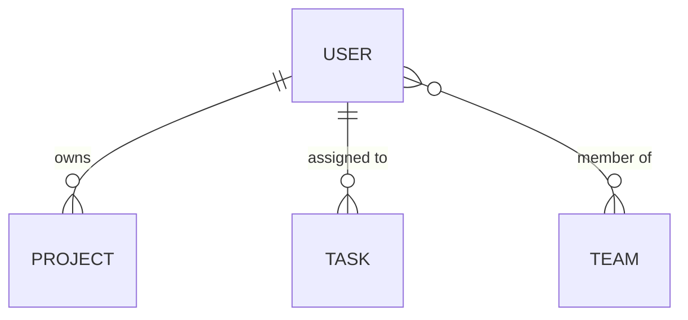
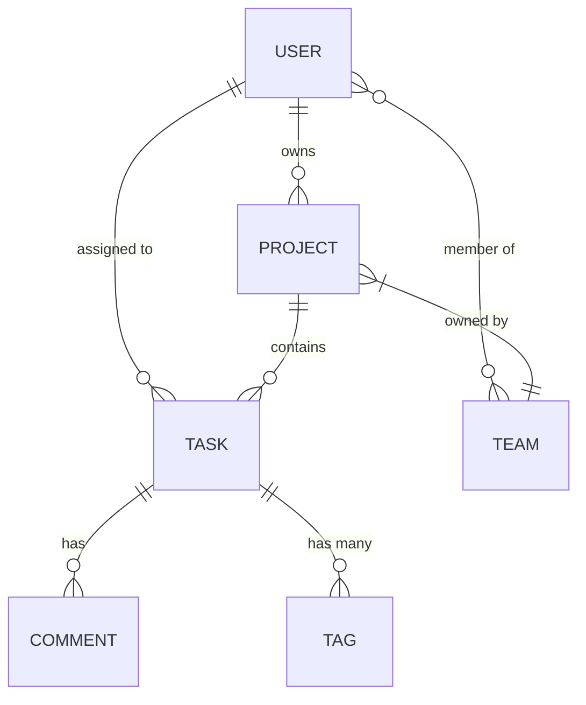

# PHASE 5.7: BACKEND DOCUMENTATION GENERATION

**НАЗНАЧЕНИЕ:** Вставить этот блок в BOOTSTRAP_START_PROMPT.md перед каждым "**⏭️ ПЕРЕХОД К PHASE 6**"

**LOCATIONS:**

- После строки 489 (Сценарий 1)
- После строки ~1200 (Сценарий 2)
- После строки ~1767 (Сценарий 3)
- После строки ~2626 (Сценарий 4)

---

## PHASE 5.7: BACKEND DOCUMENTATION GENERATION (30-90 минут, условно)

**⚠️ УСЛОВНОЕ ВЫПОЛНЕНИЕ:** Эта фаза выполняется ТОЛЬКО если обнаружен backend.

**Проверка необходимости:**

```typescript
// Псевдокод логики
IF (raw_data_mentions_backend OR tech_stack_has_backend_framework):
    EXECUTE PHASE 5.7
ELSE:
    SKIP → ПЕРЕХОД К PHASE 6
```

**Триггеры для выполнения PHASE 5.7:**

1. ✅ Raw data содержит backend спецификации (API endpoints, database schema, entities)
2. ✅ Tech stack включает backend framework (Express, Fastify, NestJS, Django, etc.)
3. ✅ Проект типа требует backend (web app, mobile backend, SaaS, etc.)

**ЕСЛИ НИ ОДИН ТРИГГЕР НЕ СРАБОТАЛ:**

```text
ℹ️ PHASE 5.7 SKIPPED:
→ Backend не обнаружен в raw data
→ Backend framework не найден в tech stack
→ Проект типа не требует backend
→ ПЕРЕХОД К PHASE 6
```

---

**ЕСЛИ ХОТЯ БЫ ОДИН ТРИГГЕР СРАБОТАЛ → ВЫПОЛНЯЕМ PHASE 5.7:**

### ШАГ 1: Анализ backend данных (5-10 минут)

**Определи стратегию:**

| Сценарий | Источник данных | Стратегия |
|----------|-----------------|-----------|
| **A) Raw data содержит backend спецификации** | Чаты/документы с API, entities, database | **Генерация из raw data** (100% точность) |
| **B) Только tech stack упоминания** | Express/PostgreSQL упомянуты, детали отсутствуют | **Intelligent inference** (на основе контекста проекта) |
| **C) Частичные данные** | Некоторые entities/API упомянуты, остальное нет | **Гибрид:** raw data + inference |

**Извлеки из raw data (если есть):**

- Упоминания сущностей (User, Project, Task, etc.)
- Упоминания API endpoints
- Упоминания database tables
- Упоминания backend services
- Архитектурные решения (REST vs GraphQL, monolith vs microservices)

**Используй extracted_features из PHASE 1:**

- Функции часто подразумевают entities
- Пример: "User can create projects" → entities: User, Project

---

### ШАГ 2: Intelligent Inference (если данных нет/мало) (10-15 минут)

**Основа для inference:**

**A) Из типа проекта:**

| Тип проекта | Предполагаемые entities | Предполагаемые services |
|-------------|------------------------|------------------------|
| **Task Manager** | User, Project, Task, Comment, Tag | Auth, Tasks, Notifications, Teams |
| **E-commerce** | User, Product, Category, Order, Cart, Payment | Auth, Catalog, Orders, Payments, Shipping |
| **Social Network** | User, Post, Comment, Like, Follow, Message | Auth, Posts, Feed, Messaging, Notifications |
| **Blog Platform** | User, Article, Comment, Tag, Category | Auth, Content, Comments, Search |
| **SaaS Platform** | User, Organization, Subscription, Invoice | Auth, Billing, Organizations, API |

**B) Из функций (extracted_features):**

```text
Функция: "Users can register and login"
→ Entity: User (email, password_hash, name)
→ Service: Auth Service
→ API: POST /auth/register, POST /auth/login

Функция: "Users can create and manage projects"
→ Entity: Project (name, description, owner_id)
→ Relationships: User ||--o{ Project
→ API: POST /projects, GET /projects, GET /projects/:id

Функция: "Team collaboration features"
→ Entities: Team, TeamMember (join table)
→ Relationships: User }o--o{ Team
→ API: POST /teams, POST /teams/:id/members
```

**C) Из tech stack:**

| Tech Stack | Следствия |
|------------|-----------|
| **PostgreSQL** | Relational entities, foreign keys, migrations, ERD diagrams |
| **MongoDB** | Document-based entities, no strict schema, JSON-like structure |
| **Express/Fastify** | RESTful API, middleware, route-based structure |
| **NestJS** | Module-based, services, controllers, decorators |
| **Prisma/Drizzle** | Schema-first, type-safe, migrations, generated types |

---

### ШАГ 3: Генерация backend документации (30-60 минут)

**Используй templates из `UPMT/structure-templates/backend-documentation/`:**

**Создай структуру:**

```text
docs/
├── backend/
│   ├── 00_BACKEND_OVERVIEW.md          # Backend architecture overview
│   ├── entities/
│   │   ├── 00_ENTITY_CATALOG.md        # Master catalog with Mermaid ERD
│   │   └── [entity-name].md            # One file per entity (from _ENTITY_TEMPLATE.md)
│   ├── api/
│   │   ├── 00_API_OVERVIEW.md          # API design overview
│   │   └── [resource]-api.md           # One file per resource (from _API_ENDPOINT_TEMPLATE.md)
│   ├── services/
│   │   ├── 00_SERVICES_CATALOG.md      # Services catalog
│   │   └── [service-name]-service.md   # One file per service (from _SERVICE_TEMPLATE.md)
│   └── database/
│       ├── 00_DATABASE_SCHEMA.md       # Complete schema with ERD
│       └── relationships.md            # Detailed relationships
│
└── adr/
    ├── 00_ADR_INDEX.md                 # Architecture decisions index
    └── [number]-[title].md             # One file per decision (from _ADR_TEMPLATE.md)
```

---

#### ШАГ 3.1: Backend Overview (5 минут)

**Создай `docs/backend/00_BACKEND_OVERVIEW.md`:**

```markdown
# Backend Architecture Overview

## Stack

- **Runtime:** [Node.js 22 / Python 3.12 / etc]
- **Framework:** [Express / Fastify / Django / etc]
- **Database:** [PostgreSQL 16 / MongoDB 7 / etc]
- **ORM:** [Prisma / Drizzle / TypeORM / etc]

## Architecture Pattern

[Monolith / Modular Monolith / Microservices]

## Key Entities

[List of 5-10 main entities]

## API Design

[REST / GraphQL / tRPC / Hybrid]

## Documentation Links

- [Entity Catalog](entities/00_ENTITY_CATALOG.md)
- [API Overview](api/00_API_OVERVIEW.md)
- [Services](services/00_SERVICES_CATALOG.md)
```

---

#### ШАГ 3.2: Entities Documentation (20-30 минут)

**Для каждой обнаруженной/inferred entity:**

**1) Используй template `UPMT/structure-templates/backend-documentation/_ENTITY_TEMPLATE.md`**

**2) Заполни секции:**

| Секция | Откуда данные | Если данных нет → Inference |
|--------|---------------|----------------------------|
| **Overview** | Raw data | Опиши purpose на основе названия entity |
| **Database Schema** | Raw data schema ИЛИ inference | Стандартные поля: id, created_at, updated_at |
| **TypeScript Type** | Derive from schema | Auto-generate from schema |
| **Relationships** | Raw data ИЛИ функции | Логические связи (User owns Projects) |
| **API Endpoints** | Raw data API ИЛИ стандарт | Standard CRUD: GET/POST/PATCH/DELETE |
| **Frontend Mapping** | Если упомянуто | Placeholder если неизвестно |
| **Permissions** | Из требований ИЛИ стандарт | Admin full, User own, Guest read |

**3) Создай файл:** `docs/backend/entities/[entity-name].md`

**Пример inference для User entity:**

```markdown
# User Entity

## Overview

User entity represents a person who can interact with the system. Central entity for authentication and ownership.

**Type:** Core  
**Module:** Authentication

## Database Schema

```sql
CREATE TABLE users (
  id                UUID PRIMARY KEY DEFAULT gen_random_uuid(),
  email             VARCHAR(255) UNIQUE NOT NULL,
  name              VARCHAR(100) NOT NULL,
  password_hash     VARCHAR(255) NOT NULL,
  avatar_url        VARCHAR(500),
  role              VARCHAR(20) DEFAULT 'user',
  is_active         BOOLEAN DEFAULT true,
  email_verified    BOOLEAN DEFAULT false,
  created_at        TIMESTAMP DEFAULT NOW(),
  updated_at        TIMESTAMP DEFAULT NOW()
);
```

## Relationships



## API Endpoints

| Method | Endpoint | Description |
|--------|----------|-------------|
| GET | `/api/users/:id` | Get user by ID |
| PATCH | `/api/users/:id` | Update user |
| DELETE | `/api/users/:id` | Delete user (soft) |

## Permissions

| Action | Admin | User | Guest |
|--------|-------|------|-------|
| Read own | ✅ | ✅ | ❌ |
| Update own | ✅ | ✅ | ❌ |
| Delete own | ✅ | ✅ | ❌ |

```

---

#### ШАГ 3.3: Entity Catalog with ERD (10 минут)

**Создай `docs/backend/entities/00_ENTITY_CATALOG.md`:**

**Включи:**

**1) Master Mermaid ERD** со ВСЕМИ entities и relationships:



**2) Entity Table:**

| Entity | Type | Module | Description | Status |
|--------|------|--------|-------------|--------|
| User | Core | Auth | System users | Implemented |
| Project | Core | Projects | Work containers | Implemented |
| Task | Core | Tasks | Work items | Planned |

**3) Relationships Matrix:**

|        | User | Project | Task | Comment |
|--------|------|---------|------|---------|
| User   | -    | owns (1:N) | assigned (1:N) | writes (1:N) |
| Project | owned by (N:1) | - | contains (1:N) | - |
| Task   | assigned to (N:1) | in project (N:1) | - | has (1:N) |
| Comment | written by (N:1) | - | on task (N:1) | - |

---

#### ШАГ 3.4: API Documentation (10-15 минут)

**1) Создай `docs/backend/api/00_API_OVERVIEW.md`:**

- API design principles (REST/GraphQL)
- Authentication strategy (JWT/OAuth)
- Conventions (naming, versioning, error format)
- Rate limiting
- CORS policy

**2) Для каждого resource (entity):**

**Используй template `UPMT/structure-templates/backend-documentation/_API_ENDPOINT_TEMPLATE.md`**

**Создай:** `docs/backend/api/[resource]-api.md`

**Минимум:**

- GET /api/[resource] - List
- GET /api/[resource]/:id - Get one
- POST /api/[resource] - Create
- PATCH /api/[resource]/:id - Update
- DELETE /api/[resource]/:id - Delete

**Заполни из raw data ИЛИ standard patterns:**

- Request/response formats
- Authentication requirements
- Validation rules
- Error responses (400, 401, 403, 404, 422, 500)

---

#### ШАГ 3.5: Database Schema (5 минут)

**Создай `docs/backend/database/00_DATABASE_SCHEMA.md`:**

**Включи:**

- Full database schema (все tables)
- Master ERD (Mermaid diagram)
- Indexes
- Constraints
- Migration strategy

**Создай `docs/backend/database/relationships.md`:**

- Детальные ERD по модулям
- Foreign keys
- Join tables
- Query examples

---

#### ШАГ 3.6: Architecture Decision Records (ADR) (10-15 минут)

**Создай `docs/adr/00_ADR_INDEX.md`**

**Создай ADRs для key decisions:**

##### 1) ADR-001: Database Choice

Используй template `UPMT/structure-templates/backend-documentation/_ADR_TEMPLATE.md`

```markdown
# ADR-001: Use PostgreSQL

**Date:** 2025-11-11
**Status:** Accepted

## Context

Need relational database for [project name] with strong ACID guarantees.

## Decision

We will use PostgreSQL 16.

## Alternatives

- MySQL: Good but PostgreSQL has better JSON support
- MongoDB: Not suitable for relational data
- SQLite: Not for multi-user production

## Consequences

**Pros:** ACID, JSON support, mature
**Cons:** Hosting cost, learning curve
```

##### 2) ADR-002: Architecture Pattern

```markdown
# ADR-002: Modular Monolith

**Date:** 2025-11-11
**Status:** Accepted

## Decision

Modular monolith (not microservices for MVP).

## Rationale

- Simpler deployment
- Faster development
- Can split to microservices later
```

##### 3) ADR-003: Authentication

```markdown
# ADR-003: JWT Authentication

**Date:** 2025-11-11
**Status:** Accepted

## Decision

Use JWT for stateless auth.

## Alternatives

- Sessions: Less scalable
- OAuth only: Need email/password too
```

**Создай минимум 3 ADRs** (database, architecture, auth).

---

### ШАГ 4: Integration with Existing Docs (5 минут)

**1) Обнови `docs/core/04_ARCHITECTURE.md`:**

Добавь секцию:

```markdown
## Backend Architecture

See detailed backend documentation:
- [Backend Overview](../backend/00_BACKEND_OVERVIEW.md)
- [Entity Catalog](../backend/entities/00_ENTITY_CATALOG.md)
- [API Overview](../backend/api/00_API_OVERVIEW.md)
- [Architecture Decisions](../adr/00_ADR_INDEX.md)
```

**2) Обнови module requirements:**

В каждом `docs/requirements/[module]_requirements.md`:

- Добавь **Section 8: Backend Integration**:

  ```markdown
  ## 8. BACKEND INTEGRATION
  
  **Entities Used:**
  - User (docs/backend/entities/user.md)
  - Project (docs/backend/entities/project.md)
  
  **API Endpoints:**
  - GET /api/projects
  - POST /api/projects
  
  **Services:**
  - Auth Service (authentication check)
  ```

---

### ШАГ 5: Validation (5 минут)

**Проверь что создано:**

- [ ] `docs/backend/00_BACKEND_OVERVIEW.md`
- [ ] `docs/backend/entities/00_ENTITY_CATALOG.md` с Mermaid ERD
- [ ] Минимум 3 entity docs (user, [entity2], [entity3])
- [ ] `docs/backend/api/00_API_OVERVIEW.md`
- [ ] Минимум 2 API endpoint docs
- [ ] `docs/backend/database/00_DATABASE_SCHEMA.md` с ERD
- [ ] `docs/adr/00_ADR_INDEX.md`
- [ ] Минимум 3 ADRs (database, architecture, auth)
- [ ] Cross-references в ARCHITECTURE.md и module requirements

**Залогируй:**

```markdown
✅ PHASE 5.7 COMPLETED (Backend Documentation):
→ Backend detected: [Yes - from raw data / Yes - inferred from stack / No - skipped]
→ Strategy: [Raw data / Intelligent inference / Hybrid]
→ Entities documented: [N]
→ API endpoints documented: [N]
→ ADRs created: [N]
→ Mermaid ERDs: [N diagrams]
→ Integration: ARCHITECTURE.md + module requirements updated
```

---
