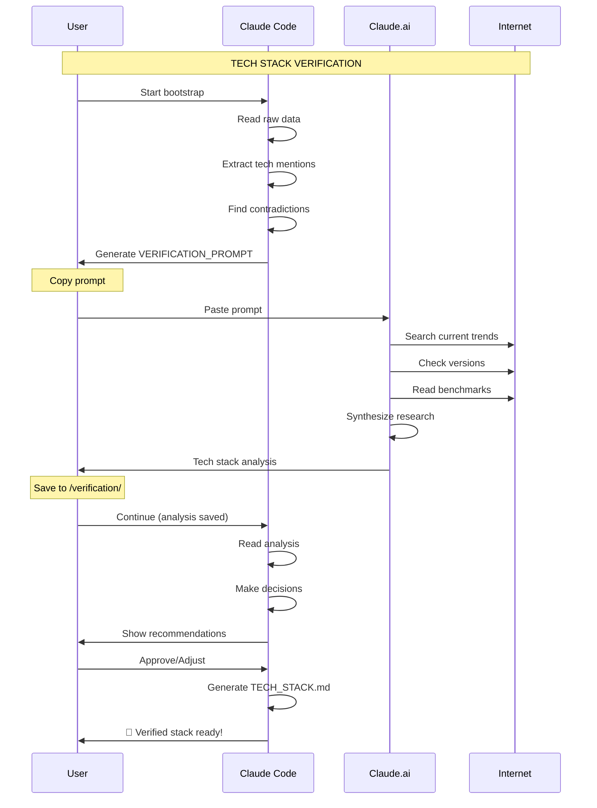

# TECH STACK VERIFICATION WORKFLOW

## Overview

This workflow ensures tech stack decisions are current and optimal.

Raw data from chats may be outdated (6+ months old).
We need to verify technologies against current trends, versions, and best practices.

---

## VERIFICATION PROCESS

### Phase 1: Extract Mentioned Technologies (Claude Code - Autonomous)

**Task:** Scan all raw data and extract every technology mention

**Output:** `/verification/tech-mentions.yaml`

```yaml
technologies_mentioned:
  frontend:
    - name: "React"
      version_mentioned: "18.2" or "not specified"
      source: "gemini-chat-1.txt, line 450"
      date: "2024-01"
      context: "User wanted component-based UI"

    - name: "Vue"
      mentioned_as: "alternative considered"
      source: "claude-chat-2.md"
      date: "2024-03"
      rejected_reason: "Team more familiar with React"

  backend:
    - name: "Node.js"
      version_mentioned: "18.x"
      source: "gemini-chat-1.txt"
      date: "2024-01"

    - name: "Express"
      mentioned_as: "preferred framework"
      source: "vision-doc.md"

  database:
    - name: "MongoDB"
      source: "gemini-chat-1.txt"
      date: "2024-01"

    - name: "PostgreSQL"
      source: "claude-chat-2.md"
      date: "2024-08"
      note: "Later discussion, likely current preference"

  infrastructure:
    - name: "AWS"
      mentioned_as: "possible hosting"

    - name: "Vercel"
      mentioned_as: "frontend hosting"
      date: "2024-10"

contradictions_found:
  - technology: "Database"
    options: ["MongoDB", "PostgreSQL"]
    recommendation: "PostgreSQL (more recent mention)"
    needs_verification: true

  - technology: "Hosting"
    options: ["AWS", "Vercel", "Railway"]
    needs_clarification: true

missing_decisions:
  - "State management library (Redux/Zustand/other)"
  - "CSS framework (Tailwind/styled-components/other)"
  - "Testing framework (Jest/Vitest/other)"
  - "CI/CD platform"
```

---

### Phase 2: Generate Verification Prompt (Claude Code - Autonomous)

**Task:** Create comprehensive prompt for web research

**Output:** `/verification/VERIFICATION_PROMPT_FOR_CLAUDE.md`

**This prompt will be used in Claude.ai web interface for research**

```markdown
# TECH STACK VERIFICATION PROMPT

I'm planning a [project type] project and need to verify/choose optimal
technologies for 2025.

## Project Context

**Type:** [from raw data]
**Scale:** [from raw data]
**Team:** [from raw data]
**Timeline:** [from raw data]
**Constraints:** [from raw data]

## Technologies Under Consideration

### Frontend Framework

**Options mentioned in planning:**
- React 18.2 (mentioned Jan 2024)
- Vue 3 (considered as alternative)

**Questions:**
1. What's the current stable version of React? (as of Nov 2025)
2. Any major changes/breaking changes since v18.2?
3. Is React still the best choice for [project type] in 2025?
4. Alternatives worth considering? (Svelte, Solid, etc.)
5. Ecosystem maturity and library support?

### State Management

**Mentioned:** Redux Toolkit, Zustand

**Questions:**
1. Current best practices for state management in React 2025?
2. Redux vs Zustand vs alternatives - which for [project scale]?
3. Any new state management solutions emerged?

### Backend Framework

**Primary:** Node.js + Express
**Mentioned date:** Jan 2024

**Questions:**
1. Current Node.js LTS version? (we mentioned 18.x)
2. Is Express still recommended in 2025? (vs Fastify, Hono, etc.)
3. Any performance/security improvements in newer versions?
4. Better alternatives for [project requirements]?

### Database

**CONTRADICTION FOUND:**
- MongoDB (mentioned Jan 2024)
- PostgreSQL (mentioned Aug 2024, likely current preference)

**Questions:**
1. For [project data structure], PostgreSQL vs MongoDB - which is better?
2. Current versions and major features?
3. Any new database solutions worth considering? (Supabase, PlanetScale, etc.)
4. Performance and scaling considerations for [expected load]?

### CSS/Styling

**Not clearly decided in raw data**

**Questions:**
1. Current best practice: Tailwind vs CSS-in-JS vs CSS Modules?
2. What's trending in 2025 for [project type]?
3. Performance implications?
4. DX (developer experience) comparison?

### Testing

**Not specified in raw data**

**Questions:**
1. Current standard: Jest vs Vitest vs other?
2. E2E testing: Playwright vs Cypress in 2025?
3. Best practices for [tech stack]?

### Deployment/Hosting

**Options mentioned:** AWS, Vercel, Railway

**Questions:**
1. For [project type]:
   - Frontend: Best option among Vercel/Netlify/Cloudflare Pages?
   - Backend: Railway vs Render vs AWS/GCP?
2. Cost comparison for [expected scale]?
3. DX and deployment speed?

### CI/CD

**Not specified**

**Questions:**
1. GitHub Actions vs GitLab CI vs other in 2025?
2. Best for [tech stack]?

---

## Research Instructions

For EACH technology category:

1. **Current Version & Stability**
   - What's the latest stable version?
   - Release date and maturity
   - Breaking changes from versions mentioned in planning

2. **Trends & Popularity (2025)**
   - npm download trends (if applicable)
   - GitHub stars/activity
   - Stack Overflow survey results
   - Industry adoption

3. **Performance**
   - Benchmarks vs alternatives
   - Build time, bundle size, runtime performance
   - Real-world production usage

4. **Ecosystem**
   - Library/plugin availability
   - Community size and activity
   - Documentation quality
   - Corporate backing/support

5. **Fit for Project**
   - Matches project requirements?
   - Team learning curve (if switching)
   - Long-term maintenance

6. **Recommendation**
   - Keep mentioned technology? (yes/no + why)
   - Upgrade version? (which version + migration effort)
   - Consider alternative? (which + migration effort)

---

## Output Format

For each technology, provide:

```yaml
category: "Frontend Framework"
technology: "React"
mentioned_version: "18.2 (Jan 2024)"
current_version: "19.0 (Nov 2025)"
status: "UPGRADE RECOMMENDED / KEEP AS IS / CONSIDER ALTERNATIVE"

analysis:
  maturity: "Stable, mature"
  popularity: "Most popular (2025 data)"
  performance: "Excellent, improved in v19"
  ecosystem: "Vast, everything available"
  fit: "Perfect for project requirements"

changes_since_mentioned:
  - "React 19 released (Apr 2025)"
  - "Server Components now stable"
  - "New compiler replaces babel"
  - "Breaking changes: [list]"

recommendation:
  decision: "UPGRADE to React 19"
  rationale: "Significant performance improvements,
              ecosystem ready, migration straightforward"
  migration_effort: "LOW (mostly compatible)"
  migration_guide: "[link to official guide]"

alternatives_considered:
  - name: "Svelte 5"
    pros: "Smaller bundle, faster"
    cons: "Smaller ecosystem, team unfamiliar"
    verdict: "Not worth switching for this project"
```

---

## IMPORTANT

- Use web search for current (Nov 2025) data
- Check official docs for latest versions
- Look at recent benchmarks and comparisons
- Consider real-world production usage, not just hype
- Focus on stability and ecosystem, not bleeding edge

Prioritize:
1. Stability & Maturity
2. Team familiarity (if switching has cost)
3. Ecosystem & Support
4. Performance (if critical)
5. Modern features (nice-to-have)

---

Please research thoroughly and provide detailed analysis!
```

**END OF VERIFICATION PROMPT**

---

### Phase 3: User Action (Manual)

**What YOU do:**

```bash
# 1. Claude Code generated the prompt above
# 2. You copy it
# 3. You go to Claude.ai (web interface)
# 4. You paste the prompt
# 5. Claude.ai does web research (has internet access)
# 6. You get comprehensive tech stack analysis
# 7. You save the response to: /verification/tech-stack-analysis.md
# 8. You commit to repository
# 9. You tell Claude Code to continue
```

**Why Claude.ai and not Claude Code directly?**
- Claude.ai has **better web search** integration
- Can browse multiple sources
- Better at synthesizing research
- You can interact and ask follow-ups
- Claude Code can read but focuses on implementation

---

### Phase 4: Process Analysis (Claude Code - Autonomous)

**Task:** Read analysis, make final tech stack decisions

**Input:** `/verification/tech-stack-analysis.md` (from Claude.ai research)

**Process:**

```yaml
For each technology:
  1. Read recommendation from analysis
  2. Check against project constraints
  3. Make decision:
     - KEEP (with version update if needed)
     - UPGRADE (to which version)
     - REPLACE (with what)
  4. Document rationale
  5. Note migration effort

Create final: `/verification/FINAL_TECH_STACK.yaml`
```

**Output Example:**

```yaml
final_tech_stack:
  frontend:
    framework:
      name: "React"
      version: "19.0"
      decision: "UPGRADE from 18.2"
      rationale: "Stable, significant improvements, easy migration"
      migration_effort: "LOW"

    state_management:
      name: "Zustand"
      version: "4.5"
      decision: "NEW (not mentioned in raw data)"
      rationale: "Simpler than Redux, sufficient for project scale"
      alternatives_rejected:
        - Redux Toolkit: "Too complex for needs"

    styling:
      name: "Tailwind CSS"
      version: "4.0"
      decision: "NEW (not specified in raw data)"
      rationale: "Industry standard 2025, fast development"

  backend:
    runtime:
      name: "Node.js"
      version: "22.x LTS"
      decision: "UPGRADE from 18.x"
      rationale: "Performance improvements, new features"

    framework:
      name: "Fastify"
      version: "5.0"
      decision: "REPLACE Express"
      rationale: "Better performance, TypeScript-first, modern DX"
      migration_effort: "MEDIUM"
      note: "Express’Fastify migration guide available"

  database:
    primary:
      name: "PostgreSQL"
      version: "16"
      decision: "CONFIRMED (was discussed, now verified)"
      rationale: "Best fit for data model, mature, performant"
      rejected:
        - MongoDB: "Wrong fit for relational data"

  infrastructure:
    frontend_hosting:
      name: "Vercel"
      decision: "CONFIRMED"
      rationale: "Best DX, zero-config, edge network"

    backend_hosting:
      name: "Railway"
      decision: "CONFIRMED"
      rationale: "Easy PostgreSQL, good DX, reasonable cost"

verification_metadata:
  research_date: "2025-11-08"
  claude_ai_session: "[link if available]"
  research_time: "45 minutes"
  sources_consulted: 25+
  confidence_level: "HIGH"
```

---

### Phase 5: User Confirmation (Interactive)

**Claude Code asks:**

```
=Ê TECH STACK VERIFICATION COMPLETE

Based on research and analysis, here are recommendations:

= CHANGES FROM RAW DATA:

1. React: 18.2 ’ 19.0 (UPGRADE)
   Reason: Major improvements, stable
   Effort: LOW (few breaking changes)

2. Express ’ Fastify (REPLACE)
   Reason: Better performance, modern
   Effort: MEDIUM (similar API)

3. Add Tailwind CSS (NEW)
   Reason: Not specified in raw data, current best practice

4. Add Zustand (NEW)
   Reason: State management not decided, Zustand optimal

5. PostgreSQL: CONFIRMED 
   Latest mention in raw data correct

 KEPT AS IS:
- Node.js (upgraded to LTS 22.x)
- PostgreSQL 16
- Vercel + Railway hosting

---

Total changes: 4 upgrades/replacements, 2 new additions

Estimated migration effort if you have existing code:
- Overall: MEDIUM
- Time: 2-3 days
- Risk: LOW (all changes well-documented)

Approve this tech stack? (yes/no/adjust)

If "adjust", which items to reconsider?
```

**User responds:**
- `yes` ’ Proceed with this stack
- `no` ’ Explain concerns, regenerate
- `adjust` ’ Specify changes

---

### Phase 6: Generate TECH_STACK.md (Claude Code - Autonomous)

**Task:** Create final TECH_STACK.md from verified decisions

Uses verified data to fill:
- `/02_PROJECT_STRUCTURE/PROJECT_CORE/03_TECH_STACK.md`

Includes:
- Current versions (Nov 2025)
- Why chosen (from research)
- Alternatives considered (from research)
- Migration notes (if upgrading)
- **Verification metadata** (when researched, confidence level)

---

## PROCESS DIAGRAM



---

END OF TECH STACK VERIFICATION WORKFLOW

This ensures your tech stack is:
 Current (Nov 2025)
 Verified against trends
 Optimized for your project
 Not based on outdated chat data

Use this for EVERY new project! =€
