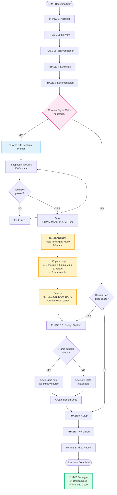

# FIGMA MAKE + UPMT PROCESS FLOW

## Визуализация полного процесса

```mermaid
flowchart TB
    Start([UPMT Bootstrap Start]) --> P1[PHASE 1: Analysis]
    P1 --> P2[PHASE 2: Interview]
    P2 --> P3[PHASE 3: Tech Verification]
    P3 --> P4[PHASE 4: Synthesis]
    
    P4 --> P5[PHASE 5: Documentation]
    
    P5 --> Q{Хочешь Figma Make<br/>прототип?}
    
    Q -->|YES| P54[PHASE 5.4: Generate Prompt]
    Q -->|NO| P55Check{Design Raw<br/>Data exists?}
    
    P54 --> GenPrompt[Генерация промпта<br/>3000+ слов]
    GenPrompt --> ValidPrompt{Validation<br/>passed?}
    ValidPrompt -->|NO| FixPrompt[Fix Issues]
    FixPrompt --> GenPrompt
    ValidPrompt -->|YES| SavePrompt[Save FIGMA_MAKE_PROMPT.md]
    
    SavePrompt --> UserAction[USER ACTION:<br/>Работа с Figma Make<br/>2-3 часа]
    
    UserAction --> FigmaWork[1. Copy prompt<br/>2. Generate in Figma Make<br/>3. Iterate<br/>4. Export results]
    
    FigmaWork --> SaveExports[Save to<br/>00_DESIGN_RAW_DATA/<br/>figma-make/exports/]
    
    SaveExports --> P55[PHASE 5.5: Design System]
    P55Check -->|YES| P55
    P55Check -->|NO| P6[PHASE 6: Setup]
    
    P55 --> AnalyzeFigma{Figma exports<br/>found?}
    AnalyzeFigma -->|YES| UseFigma[Use Figma data<br/>as primary source]
    AnalyzeFigma -->|NO| UseRaw[Use Raw Data<br/>if available]
    
    UseFigma --> CreateDesign[Create Design Docs]
    UseRaw --> CreateDesign
    
    CreateDesign --> P6
    
    P6 --> P7[PHASE 7: Validation]
    P7 --> P8[PHASE 8: Final Report]
    P8 --> Done([Bootstrap Complete!])
    
    Done --> Result[✅ MVP Prototype<br/>✅ Design Docs<br/>✅ Working Code]
    
    style P54 fill:#e0f2fe,stroke:#0ea5e9,stroke-width:3px
    style UserAction fill:#fef3c7,stroke:#f59e0b,stroke-width:3px
    style FigmaWork fill:#fef3c7,stroke:#f59e0b,stroke-width:2px
    style SaveExports fill:#fef3c7,stroke:#f59e0b,stroke-width:2px
    style Result fill:#dcfce7,stroke:#10b981,stroke-width:3px
    style Q fill:#fce7f3,stroke:#ec4899,stroke-width:2px
```

---

**Создано для UPMT + Figma Make Integration**  
**Date:** 2025-11-16

