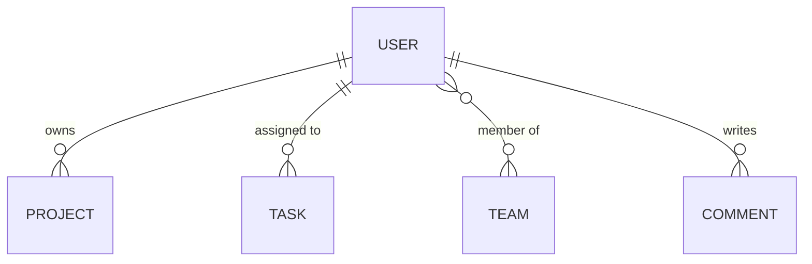
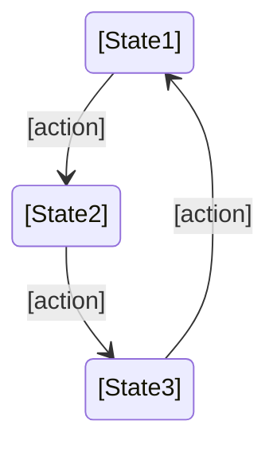
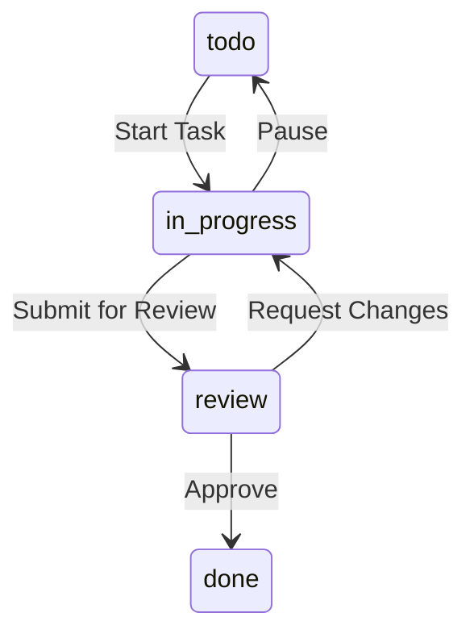

# [Entity Name] Entity

**Version:** 1.0  
**Last Updated:** [YYYY-MM-DD]  
**Status:** [✅ Implemented / 🔄 In Progress / 📋 Planned]  
**Module:** [Module Name]

---

## 📊 OVERVIEW

| Property | Value |
|----------|-------|
| **Entity Name** | [EntityName] |
| **Database Table** | `[table_name]` |
| **Module** | [Module Name (e.g., Auth, Projects, Tasks)] |
| **Type** | [Core / Supporting / Virtual] |
| **Frontend Components** | [Component1, Component2, Component3] |
| **Primary Key** | `id` (uuid) |
| **Created** | [YYYY-MM-DD] |
| **Last Modified** | [YYYY-MM-DD] |

### Description

[2-3 sentences explaining what this entity represents and why it exists]

**Example:**
User entity represents a person who can interact with the system. It stores authentication credentials, profile information, and serves as the central entity connecting projects, tasks, and teams.

### Purpose

**Business Purpose:**
[Why this entity exists from business perspective]

**Technical Purpose:**
[Why this entity exists from technical perspective]

**Example:**
**Business:** Track user information, enable personalization, manage access control  
**Technical:** Central authentication entity, owner reference for resources, join table anchor

---

## 🏗️ STRUCTURE

### Database Schema

```sql
CREATE TABLE [table_name] (
  -- Primary Key
  id                UUID PRIMARY KEY DEFAULT uuid_generate_v4(),
  
  -- Core Fields
  [field_name]      [type] [constraints],
  [field_name]      [type] [constraints],
  
  -- Relationships (Foreign Keys)
  [relation_id]     UUID REFERENCES [other_table](id),
  
  -- Metadata
  created_at        TIMESTAMP WITH TIME ZONE DEFAULT NOW(),
  updated_at        TIMESTAMP WITH TIME ZONE DEFAULT NOW(),
  deleted_at        TIMESTAMP WITH TIME ZONE DEFAULT NULL
);

-- Indexes
CREATE INDEX idx_[table]_[field] ON [table_name]([field]);
CREATE INDEX idx_[table]_[relation] ON [table_name]([relation_id]);
```

**Example:**

```sql
CREATE TABLE users (
  -- Primary Key
  id                UUID PRIMARY KEY DEFAULT uuid_generate_v4(),
  
  -- Core Fields
  email             VARCHAR(255) NOT NULL UNIQUE,
  name              VARCHAR(100) NOT NULL,
  avatar_url        VARCHAR(500),
  password_hash     VARCHAR(255) NOT NULL,
  role              VARCHAR(20) DEFAULT 'user' CHECK (role IN ('admin', 'user', 'guest')),
  
  -- Profile
  bio               TEXT,
  location          VARCHAR(100),
  website           VARCHAR(500),
  
  -- Status
  is_active         BOOLEAN DEFAULT true,
  email_verified    BOOLEAN DEFAULT false,
  
  -- Metadata
  created_at        TIMESTAMP WITH TIME ZONE DEFAULT NOW(),
  updated_at        TIMESTAMP WITH TIME ZONE DEFAULT NOW(),
  deleted_at        TIMESTAMP WITH TIME ZONE DEFAULT NULL
);

-- Indexes
CREATE INDEX idx_users_email ON users(email);
CREATE INDEX idx_users_role ON users(role);
CREATE INDEX idx_users_active ON users(is_active);
```

---

### TypeScript Type

```typescript
/**
 * [Entity description]
 */
interface [EntityName] {
  // Primary Key
  id: string; // UUID
  
  // Core Fields
  [fieldName]: [type];
  [fieldName]: [type];
  
  // Relationships (populated)
  [relationName]?: [RelatedEntity]; // Optional if lazy-loaded
  
  // Metadata
  createdAt: Date;
  updatedAt: Date;
  deletedAt?: Date | null;
}

/**
 * [Entity] for creation (POST requests)
 */
interface [EntityName]Create {
  [fieldName]: [type]; // Required fields only
  [fieldName]?: [type]; // Optional fields
}

/**
 * [Entity] for updates (PATCH requests)
 */
interface [EntityName]Update {
  [fieldName]?: [type]; // All fields optional
}
```

**Example:**

```typescript
/**
 * User entity representing a person in the system
 */
interface User {
  // Primary Key
  id: string; // UUID
  
  // Core Fields
  email: string;
  name: string;
  avatarUrl?: string;
  role: 'admin' | 'user' | 'guest';
  
  // Profile
  bio?: string;
  location?: string;
  website?: string;
  
  // Status
  isActive: boolean;
  emailVerified: boolean;
  
  // Relationships (populated on demand)
  projects?: Project[];
  teams?: Team[];
  
  // Metadata
  createdAt: Date;
  updatedAt: Date;
  deletedAt?: Date | null;
}

interface UserCreate {
  email: string;
  name: string;
  password: string;
  avatarUrl?: string;
}

interface UserUpdate {
  name?: string;
  avatarUrl?: string;
  bio?: string;
  location?: string;
  website?: string;
}
```

---

### Field Descriptions

| Field | Type | Required | Description | Validation |
|-------|------|----------|-------------|------------|
| `id` | UUID | Yes (auto) | Unique identifier | UUID v4 |
| `[field]` | [type] | [Yes/No] | [Description] | [Validation rules] |

**Example:**

| Field | Type | Required | Description | Validation |
|-------|------|----------|-------------|------------|
| `id` | UUID | Yes (auto) | Unique identifier | UUID v4 |
| `email` | string | Yes | User email address | Valid email, unique, max 255 chars |
| `name` | string | Yes | User display name | Min 2, max 100 chars |
| `avatarUrl` | string | No | Profile picture URL | Valid URL, max 500 chars |
| `role` | enum | Yes | User role | 'admin' \| 'user' \| 'guest' |
| `bio` | text | No | User biography | Max 1000 chars |
| `isActive` | boolean | Yes | Account active status | Default: true |
| `emailVerified` | boolean | Yes | Email verification status | Default: false |
| `createdAt` | timestamp | Yes (auto) | Creation timestamp | ISO 8601 |
| `updatedAt` | timestamp | Yes (auto) | Last update timestamp | ISO 8601 |
| `deletedAt` | timestamp | No | Soft delete timestamp | ISO 8601 or null |

---

## 🔗 RELATIONSHIPS

### Diagram

```mermaid
erDiagram
    [ENTITY] ||--o{ [RELATED_ENTITY] : "relationship name"
    [ENTITY] }o--|| [RELATED_ENTITY] : "relationship name"
    [ENTITY] }o--o{ [RELATED_ENTITY] : "relationship name"
```

**Example:**



---

### Detailed Relationships

#### Has Many: [RelatedEntity]

**Type:** One-to-Many  
**Foreign Key:** `[related_table].[this_entity]_id`  
**Description:** [Explain the relationship]

**Example Query:**
```sql
SELECT * FROM [related_table]
WHERE [this_entity]_id = $1;
```

**Frontend Impact:**
- [Component] displays list of [related entities]
- Used in: [Page/Component names]

---

#### Belongs To: [RelatedEntity]

**Type:** Many-to-One  
**Foreign Key:** `[this_table].[related_entity]_id`  
**Description:** [Explain the relationship]

**Example Query:**
```sql
SELECT [related_table].* 
FROM [this_table]
JOIN [related_table] ON [this_table].[related_entity]_id = [related_table].id
WHERE [this_table].id = $1;
```

**Frontend Impact:**
- [Component] shows [related entity] details
- Used in: [Page/Component names]

---

#### Many-to-Many: [RelatedEntity]

**Type:** Many-to-Many  
**Join Table:** `[join_table]`  
**Description:** [Explain the relationship]

**Join Table Schema:**
```sql
CREATE TABLE [join_table] (
  [this_entity]_id      UUID REFERENCES [this_table](id),
  [related_entity]_id   UUID REFERENCES [related_table](id),
  created_at            TIMESTAMP DEFAULT NOW(),
  PRIMARY KEY ([this_entity]_id, [related_entity]_id)
);
```

**Example Query:**
```sql
SELECT [related_table].* 
FROM [related_table]
JOIN [join_table] ON [related_table].id = [join_table].[related_entity]_id
WHERE [join_table].[this_entity]_id = $1;
```

**Frontend Impact:**
- [Component] shows list of [related entities]
- Used in: [Page/Component names]

---

## 🌐 API ENDPOINTS

### Summary Table

| Method | Endpoint | Description | Frontend Usage | Auth Required |
|--------|----------|-------------|----------------|---------------|
| GET | `/api/[resource]` | List all | [Component] | ✅ |
| GET | `/api/[resource]/:id` | Get by ID | [Component] | ✅ |
| POST | `/api/[resource]` | Create new | [Component] | ✅ |
| PATCH | `/api/[resource]/:id` | Update | [Component] | ✅ |
| DELETE | `/api/[resource]/:id` | Delete | [Component] | ✅ |

**Detailed Documentation:** [API Reference](../api/[resource]-api.md)

---

### Quick Examples

#### GET /api/[resource]/:id

**Request:**
```http
GET /api/[resource]/[uuid] HTTP/1.1
Authorization: Bearer [token]
```

**Response (200):**
```json
{
  "id": "uuid",
  "field": "value",
  "createdAt": "2025-11-10T00:00:00Z"
}
```

#### POST /api/[resource]

**Request:**
```http
POST /api/[resource] HTTP/1.1
Authorization: Bearer [token]
Content-Type: application/json

{
  "field": "value",
  "field": "value"
}
```

**Response (201):**
```json
{
  "id": "uuid",
  "field": "value",
  "createdAt": "2025-11-10T00:00:00Z"
}
```

---

## 🎨 FRONTEND MAPPING

### Components Using This Entity

#### [ComponentName]

**File:** `components/[ComponentName].tsx`  
**Purpose:** [Brief description]

**Fields Used:**
- `[field]` - [how it's displayed]
- `[field]` - [how it's displayed]

**API Calls:**
```typescript
// Example
const { data } = useQuery(['[entity]', id], () => 
  api.get(`/[resource]/${id}`)
);
```

**Used In:**
- [Page 1]
- [Page 2]

---

**Example:**

#### UserAvatar

**File:** `components/UserAvatar.tsx`  
**Purpose:** Display user avatar image with name tooltip

**Fields Used:**
- `avatarUrl` - shown as ``
- `name` - shown in tooltip on hover
- `id` - used for linking to profile

**API Calls:**
```typescript
const { data: user } = useQuery(['user', userId], () => 
  api.get(`/users/${userId}`)
);
```

**Used In:**
- TaskCard (shows task assignees)
- CommentItem (shows comment author)
- Navigation (shows current user)
- UserList (shows team members)

---

### Data Flow

```
Backend Entity ([EntityName])
    ↓ API GET /api/[resource]/:id
Frontend Hook (useQuery)
    ↓ Transform (if needed)
Component State
    ↓ Render
UI Display
```

---

## 🔐 PERMISSIONS

### Role-Based Access Control

| Action | Admin | User | Guest | Notes |
|--------|-------|------|-------|-------|
| **Read own** | ✅ | ✅ | ✅ | Everyone can read own data |
| **Read others** | ✅ | ⚠️ Limited | ❌ | Users can read public fields only |
| **Create** | ✅ | ✅ | ❌ | - |
| **Update own** | ✅ | ✅ | ❌ | - |
| **Update others** | ✅ | ❌ | ❌ | Admin only |
| **Delete own** | ✅ | ✅ | ❌ | Soft delete |
| **Delete others** | ✅ | ❌ | ❌ | Admin only |

### Field-Level Permissions

| Field | Admin (Read) | User (Read) | Guest (Read) | Notes |
|-------|--------------|-------------|--------------|-------|
| `[field]` | ✅ | ✅ | ✅ | Public field |
| `[field]` | ✅ | ⚠️ Own only | ❌ | Private field |
| `[field]` | ✅ | ❌ | ❌ | Admin only |

---

## ✅ VALIDATION RULES

### Creation Validation

**Required Fields:**
- `[field]` - [validation rule]
- `[field]` - [validation rule]

**Optional Fields:**
- `[field]` - [validation rule if provided]

**Example:**

```typescript
const createSchema = z.object({
  email: z.string().email().max(255),
  name: z.string().min(2).max(100),
  password: z.string().min(8).max(100),
  avatarUrl: z.string().url().max(500).optional(),
});
```

---

### Update Validation

All fields optional, but if provided must meet rules:

```typescript
const updateSchema = z.object({
  name: z.string().min(2).max(100).optional(),
  avatarUrl: z.string().url().max(500).optional(),
  bio: z.string().max(1000).optional(),
}).strict();
```

---

### Business Rules Validation

1. **[Rule Name]:** [Description]
   - Check: [What to check]
   - Error: [Error message if fails]

**Example:**

1. **Unique Email:** Email must be unique across all users
   - Check: `SELECT COUNT(*) FROM users WHERE email = $1 AND id != $2`
   - Error: "Email already in use"

2. **Password Strength:** Password must meet security requirements
   - Check: Min 8 chars, 1 uppercase, 1 lowercase, 1 number
   - Error: "Password does not meet security requirements"

---

## 📝 BUSINESS RULES

### Core Business Logic

1. **[Rule Name]**
   - **Description:** [Full description]
   - **Applies To:** [Create / Update / Delete / Read]
   - **Implementation:** [Where implemented]

**Example:**

1. **Soft Delete**
   - **Description:** Users are marked as deleted, not physically removed
   - **Applies To:** Delete operations
   - **Implementation:** Set `deleted_at = NOW()`, keep record in database
   - **Reason:** Preserve data integrity, allow recovery, maintain referential integrity

2. **Email Change Verification**
   - **Description:** When email changes, user must verify new email
   - **Applies To:** Update (email field)
   - **Implementation:** Set `email_verified = false`, send verification email
   - **Reason:** Security, prevent hijacking

3. **Role Change Audit**
   - **Description:** Role changes must be logged and require admin permission
   - **Applies To:** Update (role field)
   - **Implementation:** Check user.role == 'admin', log to audit table
   - **Reason:** Security, compliance

---

### Cascading Behavior

**On Delete:**
- [Related Entity]: [Cascade / Set Null / Restrict]

**Example:**

**On Delete User:**
- Projects: Set `owner_id = NULL` (orphaned projects)
- Tasks: Set `assigned_to = NULL` (unassigned)
- Comments: CASCADE DELETE (remove all comments)
- Sessions: CASCADE DELETE (logout all sessions)

---

### State Machine (if applicable)



**Example (Task Status):**



---

## 🧪 TESTING

### Test File Location

`tests/entities/[entity-name].test.ts`

### Key Test Scenarios

#### Unit Tests

1. **Creation with valid data**
   ```typescript
   test('[Entity] creates with valid data', () => {
     const entity = create[Entity]({ /* valid data */ });
     expect(entity.id).toBeDefined();
   });
   ```

2. **Validation errors**
   ```typescript
   test('[Entity] throws on invalid [field]', () => {
     expect(() => create[Entity]({ /* invalid */ }))
       .toThrow('[Error message]');
   });
   ```

3. **Business rule enforcement**
   ```typescript
   test('[Entity] enforces [business rule]', async () => {
     // Test business rule
   });
   ```

#### Integration Tests

1. **API endpoints**
2. **Database constraints**
3. **Relationship integrity**

#### E2E Tests

1. **User workflows involving this entity**

---

## 📚 RELATED DOCUMENTATION

### Entity Documentation
- [Entity Catalog](00_ENTITY_CATALOG.md) - all entities
- [[RelatedEntity].md] - related entity docs

### API Documentation
- [API Overview](../api/00_API_OVERVIEW.md)
- [[Resource] API](../api/[resource]-api.md)

### Database Documentation
- [Database Schema](../database/00_DATABASE_SCHEMA.md)
- [Relationships](../database/relationships.md)

### Frontend Documentation
- [Component: [ComponentName]](../../design/components/[component].md)

---

## 📝 CHANGELOG

| Version | Date | Changes | Author |
|---------|------|---------|--------|
| 1.0 | [YYYY-MM-DD] | Initial documentation | [Name] |

---

## 💡 NOTES & CONSIDERATIONS

### Performance
- [Performance consideration 1]
- [Performance consideration 2]

### Security
- [Security consideration 1]
- [Security consideration 2]

### Future Enhancements
- [ ] [Planned enhancement 1]
- [ ] [Planned enhancement 2]

---

**Navigation:** [← Entity Catalog](00_ENTITY_CATALOG.md) | [Database Schema →](../database/00_DATABASE_SCHEMA.md)

