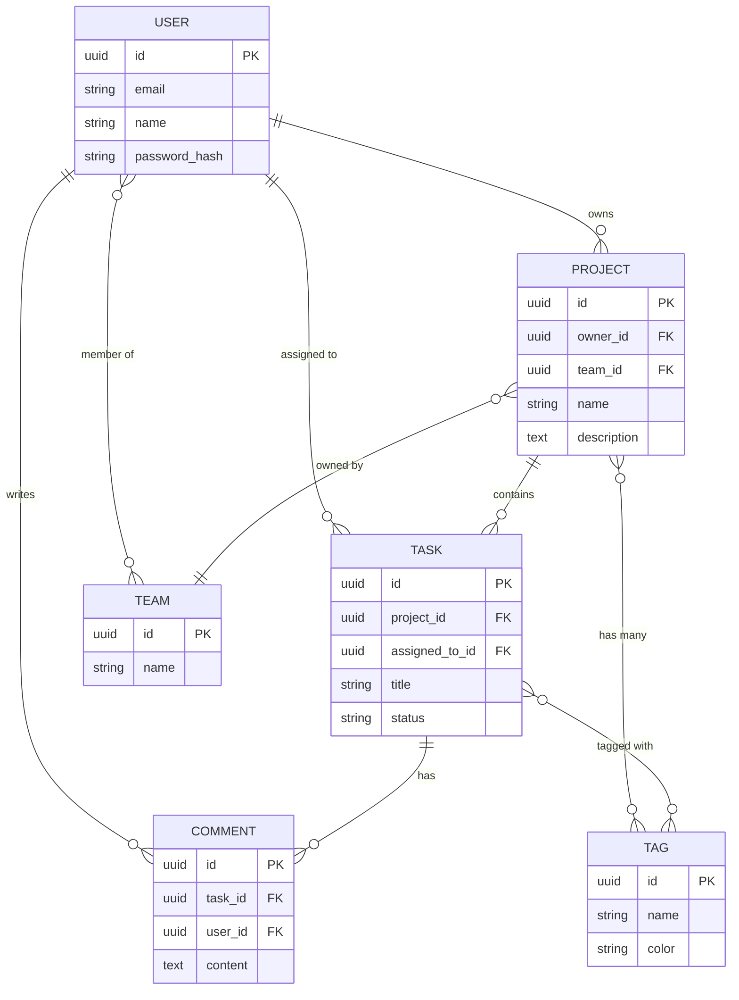
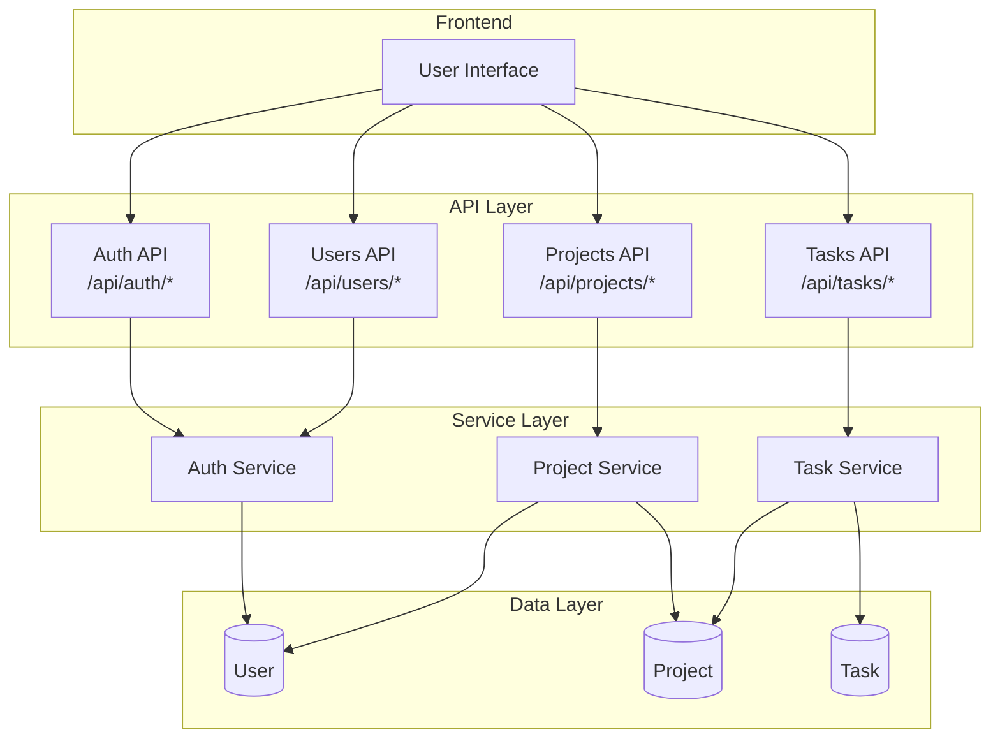
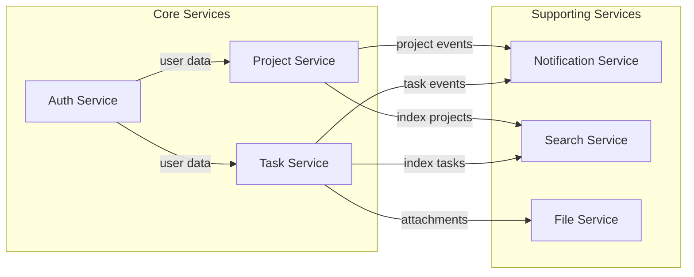
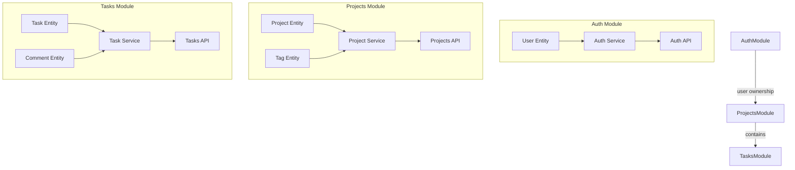

# Backend Relationships Matrix

**Version:** 1.0  
**Last Updated:** [YYYY-MM-DD]  
**Purpose:** Visual map of all relationships between entities, API endpoints, services, and modules

---

## 🗺️ OVERVIEW

This document provides a comprehensive view of how backend components relate to each other:
- **Entities** ↔ **API Endpoints**
- **Entities** ↔ **Services**
- **Services** ↔ **API Endpoints**
- **Modules** ↔ **Components**

---

## 📊 ENTITY RELATIONSHIPS MATRIX

### Entity-to-Entity Relationships

| Entity | User | Project | Task | Comment | Tag | Team |
|--------|------|---------|------|---------|-----|------|
| **User** | - | owns (1:N) | assigned (1:N) | writes (1:N) | - | member (N:M) |
| **Project** | owned by (N:1) | - | contains (1:N) | - | has (N:M) | owned by (N:1) |
| **Task** | assigned to (N:1) | in project (N:1) | - | has (1:N) | tagged (N:M) | - |
| **Comment** | written by (N:1) | - | on task (N:1) | - | - | - |
| **Tag** | - | has (M:N) | tagged (M:N) | - | - | - |
| **Team** | member (M:N) | owns (1:N) | - | - | - | - |

**Legend:**
- `1:N` = One-to-Many
- `N:1` = Many-to-One
- `N:M` = Many-to-Many
- `-` = No direct relationship

---

## 🔗 ENTITY ↔ API ENDPOINTS MATRIX

| Entity | List Endpoint | Get Endpoint | Create Endpoint | Update Endpoint | Delete Endpoint |
|--------|---------------|--------------|-----------------|-----------------|-----------------|
| **User** | GET /api/users | GET /api/users/:id | POST /api/users | PATCH /api/users/:id | DELETE /api/users/:id |
| **Project** | GET /api/projects | GET /api/projects/:id | POST /api/projects | PATCH /api/projects/:id | DELETE /api/projects/:id |
| **Task** | GET /api/tasks | GET /api/tasks/:id | POST /api/tasks | PATCH /api/tasks/:id | DELETE /api/tasks/:id |
| **Comment** | GET /api/comments | GET /api/comments/:id | POST /api/comments | PATCH /api/comments/:id | DELETE /api/comments/:id |
| **Tag** | GET /api/tags | GET /api/tags/:id | POST /api/tags | PATCH /api/tags/:id | DELETE /api/tags/:id |
| **Team** | GET /api/teams | GET /api/teams/:id | POST /api/teams | PATCH /api/teams/:id | DELETE /api/teams/:id |

**Custom Endpoints:**

| Entity | Custom Endpoint | Purpose |
|--------|----------------|---------|
| **User** | POST /api/auth/register | User registration |
| **User** | POST /api/auth/login | User authentication |
| **User** | GET /api/users/me | Get current user |
| **Project** | GET /api/projects/:id/tasks | Get project tasks |
| **Task** | PATCH /api/tasks/:id/status | Update task status |
| **Task** | POST /api/tasks/:id/comments | Add comment to task |

---

## 🏗️ ENTITY ↔ SERVICES MATRIX

| Entity | Auth Service | Project Service | Task Service | Notification Service | Search Service |
|--------|--------------|-----------------|--------------|---------------------|----------------|
| **User** | ✅ Create, Authenticate | - | - | ✅ Send notifications | ✅ Search users |
| **Project** | - | ✅ CRUD, Permissions | - | ✅ Project events | ✅ Search projects |
| **Task** | - | - | ✅ CRUD, Status | ✅ Task updates | ✅ Search tasks |
| **Comment** | - | - | ✅ Create | ✅ Comment notifications | - |
| **Tag** | - | ✅ Attach tags | ✅ Attach tags | - | ✅ Filter by tags |
| **Team** | ✅ Team auth | ✅ Team projects | - | ✅ Team notifications | - |

**Legend:**
- ✅ = Service manages this entity
- `-` = No relationship

---

## 🔄 SERVICES ↔ API ENDPOINTS MATRIX

| Service | Endpoints Used | Purpose |
|---------|----------------|---------|
| **Auth Service** | POST /api/auth/register POST /api/auth/login POST /api/auth/refresh GET /api/users/me | Authentication & authorization |
| **Project Service** | GET /api/projects POST /api/projects GET /api/projects/:id PATCH /api/projects/:id DELETE /api/projects/:id | Project management |
| **Task Service** | GET /api/tasks POST /api/tasks GET /api/tasks/:id PATCH /api/tasks/:id DELETE /api/tasks/:id PATCH /api/tasks/:id/status | Task management |
| **Notification Service** | GET /api/notifications PATCH /api/notifications/:id/read | Notification delivery |
| **Search Service** | GET /api/search?q=... | Global search |

---

## 📦 MODULE ↔ COMPONENTS MATRIX

| Module | Entities | Services | API Endpoints |
|--------|----------|----------|---------------|
| **Auth Module** | User | Auth Service | /api/auth/* /api/users/me |
| **Projects Module** | Project, Tag | Project Service | /api/projects/* /api/tags/* |
| **Tasks Module** | Task, Comment | Task Service | /api/tasks/* /api/comments/* |
| **Teams Module** | Team | Team Service | /api/teams/* |
| **Notifications Module** | Notification | Notification Service | /api/notifications/* |
| **Search Module** | All entities | Search Service | /api/search |

---

## 🗺️ VISUAL RELATIONSHIP MAPS

### Master Entity Relationship Diagram (ERD)

---

### Entity ↔ API Flow Diagram

---

### Service Dependencies Diagram

---

### Module Architecture Diagram

---

## 📋 QUICK REFERENCE TABLES

### Entity Dependencies

| Entity | Depends On | Used By |
|--------|------------|---------|
| **User** | - | Project, Task, Comment, Team |
| **Project** | User, Team | Task, Tag |
| **Task** | User, Project | Comment, Tag |
| **Comment** | User, Task | - |
| **Tag** | - | Project, Task |
| **Team** | User | Project |

### API Endpoint Dependencies

| Endpoint | Requires Entity | Uses Service | Requires Auth |
|----------|-----------------|--------------|---------------|
| POST /api/auth/register | User | Auth Service | ❌ No |
| POST /api/auth/login | User | Auth Service | ❌ No |
| GET /api/users/me | User | Auth Service | ✅ Yes |
| GET /api/projects | Project | Project Service | ✅ Yes |
| POST /api/projects | Project, User | Project Service | ✅ Yes |
| GET /api/tasks | Task | Task Service | ✅ Yes |
| POST /api/tasks | Task, Project | Task Service | ✅ Yes |

### Service Dependencies

| Service | Depends On Services | Provides To Services |
|---------|-------------------|---------------------|
| **Auth Service** | - | Project Service, Task Service |
| **Project Service** | Auth Service | Task Service, Notification Service |
| **Task Service** | Auth Service, Project Service | Notification Service |
| **Notification Service** | - | - |
| **Search Service** | - | - |

---

## 🔍 USAGE EXAMPLES

### Finding All Related Components

**Example: "What components are related to User entity?"**

1. **Entities:** Project (owns), Task (assigned), Comment (writes), Team (member)
2. **API Endpoints:** /api/users/*, /api/auth/*
3. **Services:** Auth Service, Project Service, Task Service
4. **Modules:** Auth Module

### Finding API Dependencies

**Example: "What does POST /api/projects depend on?"**

1. **Entity:** Project, User (owner)
2. **Service:** Project Service
3. **Auth:** Required (JWT token)
4. **Side Effects:** Creates project, may trigger notifications

### Finding Service Dependencies

**Example: "What does Task Service depend on?"**

1. **Services:** Auth Service (for user validation), Project Service (for project validation)
2. **Entities:** Task, User, Project
3. **Database:** tasks table, users table, projects table

---

## 📝 NOTES

- **Matrix is bidirectional:** If Entity A uses Service B, then Service B manages Entity A
- **Relationships may change:** Update this matrix when adding/modifying entities, APIs, or services
- **Use for impact analysis:** Before deleting/modifying a component, check this matrix for dependencies

---

## 🔄 UPDATING THIS MATRIX

**When to update:**
- ✅ New entity added → Add row/column
- ✅ New API endpoint added → Add to API matrix
- ✅ New service added → Add to service matrix
- ✅ Relationship changed → Update cell
- ✅ Module restructured → Update module matrix

**How to update:**
1. Update relevant matrix table
2. Update Mermaid diagrams
3. Update quick reference tables
4. Update changelog

---

**Navigation:** [← Entity Catalog](00_ENTITY_CATALOG.md) | [API Overview →](../api/00_API_OVERVIEW.md) | [Services Catalog →](../services/00_SERVICES_CATALOG.md)

