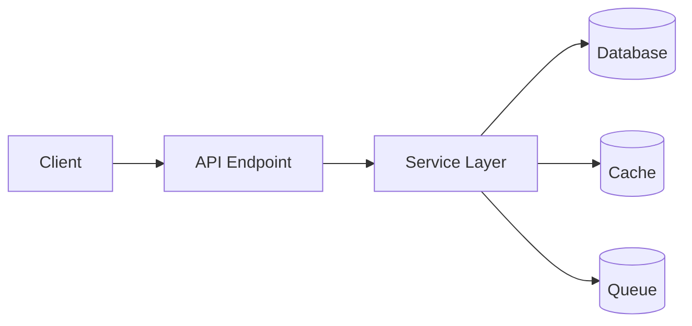
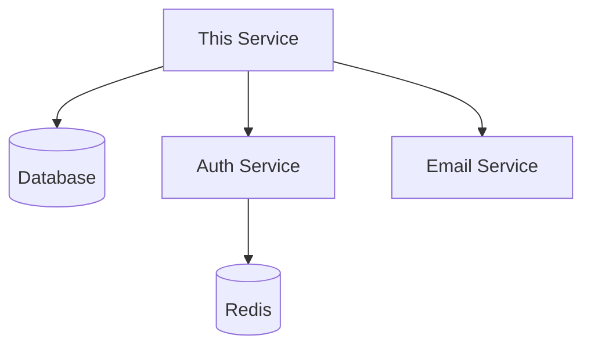
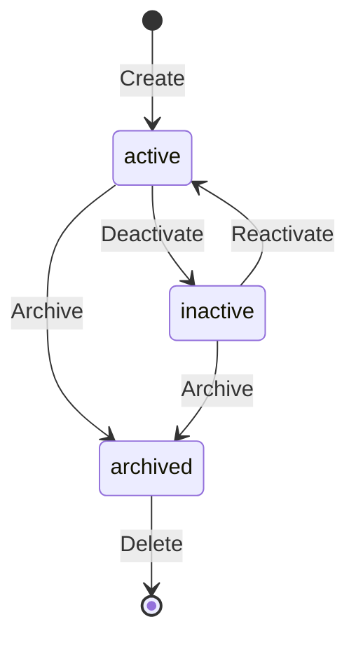

# [SERVICE_NAME] SERVICE

**Version:** 1.0  
**Last Updated:** YYYY-MM-DD  
**Status:** Active / In Development / Deprecated  
**Owner:** Team Name  
**Repository:** Link (if microservice)

---

## 🎯 PURPOSE

Brief 2-3 sentence description of what this service does and why it exists.

**Primary Responsibilities:**
- Responsibility 1
- Responsibility 2
- Responsibility 3

**NOT Responsible For:**
- What this service explicitly does NOT handle (to avoid confusion)

---

## 📋 SERVICE OVERVIEW

### Service Type

- [ ] Core Business Logic
- [ ] Infrastructure Service
- [ ] External Integration
- [ ] Background Worker

### Deployment Model

- [ ] Part of Monolith
- [ ] Standalone Microservice
- [ ] Serverless Function
- [ ] Background Job

---

## 🏗️ ARCHITECTURE

### High-Level Design



### Dependencies

| Dependency | Type | Purpose | Criticality |
|------------|------|---------|-------------|
| PostgreSQL | Database | Data persistence | Critical |
| Redis | Cache | Session storage, caching | High |
| Auth Service | Internal | User verification | Critical |
| Email Service | Internal | Notifications | Medium |

**Dependency Graph:**



---

## 📊 DATA MODEL

### Database Tables

**Primary Tables:**
- `table_name_1` - Description
- `table_name_2` - Description

**Foreign Keys:**
- `table.column → referenced_table.id`

**Example Schema:**
```sql
CREATE TABLE example_table (
  id UUID PRIMARY KEY,
  name VARCHAR(255) NOT NULL,
  user_id UUID REFERENCES users(id),
  created_at TIMESTAMP DEFAULT NOW()
);
```

**See:** [Entity Documentation](../entities/entity_name.md) | [Database Schema](../database/00_DATABASE_SCHEMA.md)

---

## 🔌 API

### Endpoints

| Method | Endpoint | Description | Auth Required |
|--------|----------|-------------|---------------|
| GET | `/api/resource` | List resources | Yes |
| POST | `/api/resource` | Create resource | Yes |
| GET | `/api/resource/:id` | Get single resource | Yes |
| PATCH | `/api/resource/:id` | Update resource | Yes |
| DELETE | `/api/resource/:id` | Delete resource | Yes |

### Detailed Endpoint Documentation

#### GET /api/resource

**Purpose:** Retrieve list of resources with filtering and pagination

**Authentication:** Required (JWT)

**Query Parameters:**
```typescript
{
  page?: number;        // Default: 1
  limit?: number;       // Default: 20, Max: 100
  status?: string;      // Filter by status
  search?: string;      // Full-text search
  sortBy?: string;      // Sort field
  sortOrder?: 'asc' | 'desc';
}
```

**Response:**
```typescript
{
  data: ResourceDTO[];
  pagination: {
    page: number;
    limit: number;
    total: number;
    totalPages: number;
  };
}
```

**Example:**
```bash
GET /api/resource?page=1&limit=20&status=active
```

**See:** [Full API Documentation](../api/resource-api.md)

---

## 📦 DATA TRANSFER OBJECTS

### ResourceDTO

```typescript
interface ResourceDTO {
  id: string;
  name: string;
  description?: string;
  status: 'active' | 'inactive' | 'archived';
  createdAt: string;       // ISO 8601
  updatedAt: string;
  createdBy: {
    id: string;
    name: string;
  };
}
```

### CreateResourceDTO

```typescript
interface CreateResourceDTO {
  name: string;           // Required, 3-255 chars
  description?: string;   // Optional, max 5000 chars
  status?: 'active' | 'inactive';  // Default: 'active'
}
```

### UpdateResourceDTO

```typescript
interface UpdateResourceDTO {
  name?: string;
  description?: string;
  status?: 'active' | 'inactive' | 'archived';
}
```

---

## 🔐 PERMISSIONS

### Permission Levels

| Role | List | View | Create | Update | Delete |
|------|------|------|--------|--------|--------|
| **Admin** | ✅ All | ✅ All | ✅ | ✅ All | ✅ All |
| **Owner** | ✅ Own | ✅ Own | ✅ | ✅ Own | ✅ Own |
| **Member** | ✅ Own | ✅ Own | ✅ | ❌ | ❌ |
| **Viewer** | ✅ Own | ✅ Own | ❌ | ❌ | ❌ |

### Permission Checks

```typescript
// Check if user can view resource
async function canViewResource(userId: string, resourceId: string): Promise<boolean> {
  const resource = await db.resources.findById(resourceId);
  const user = await authService.getUser(userId);
  
  // Admin can view all
  if (user.role === 'admin') return true;
  
  // Owner can view
  if (resource.createdBy === userId) return true;
  
  // Check membership
  const member = await db.resourceMembers.findOne({
    resourceId,
    userId
  });
  
  return member !== null;
}
```

---

## ⚙️ BUSINESS LOGIC

### Core Functions

#### createResource()

**Purpose:** Create new resource with validation

**Input:** `CreateResourceDTO`, `userId`  
**Output:** `ResourceDTO`  
**Throws:** `ValidationError`, `UnauthorizedError`

**Logic:**
1. Validate input data
2. Check user permissions
3. Create resource in database
4. Trigger notification
5. Return resource DTO

**Example:**
```typescript
async function createResource(data: CreateResourceDTO, userId: string): Promise<ResourceDTO> {
  // Validate
  const errors = validate(data, createResourceSchema);
  if (errors.length > 0) throw new ValidationError(errors);
  
  // Check permissions
  const user = await authService.getUser(userId);
  if (!user.isActive) throw new UnauthorizedError('User is inactive');
  
  // Create resource
  const resource = await db.resources.insert({
    ...data,
    createdBy: userId,
    status: data.status || 'active'
  });
  
  // Notify
  await notificationsService.create({
    type: 'resource.created',
    userId,
    resourceId: resource.id
  });
  
  // Return DTO
  return mapToDTO(resource);
}
```

---

### Business Rules

1. **Rule Name**
   - Description: What is the rule
   - Example: User can only delete their own resources
   - Enforcement: Where is this checked (service layer / database constraint)

2. **Another Rule**
   - Description: ...

---

## ✅ VALIDATION RULES

### Input Validation

```typescript
const createResourceSchema = {
  name: {
    type: 'string',
    minLength: 3,
    maxLength: 255,
    required: true,
    pattern: /^[a-zA-Z0-9\s-]+$/
  },
  description: {
    type: 'string',
    maxLength: 5000,
    required: false
  },
  status: {
    type: 'string',
    enum: ['active', 'inactive'],
    default: 'active'
  }
};
```

### Database Constraints

```sql
-- Name must be unique per user
CREATE UNIQUE INDEX idx_resources_name_user ON resources(name, created_by);

-- Status enum constraint
ALTER TABLE resources ADD CONSTRAINT resources_status_check 
  CHECK (status IN ('active', 'inactive', 'archived'));
```

---

## 🔄 STATE TRANSITIONS

### Status Flow



**Allowed Transitions:**
- `active → inactive`: Deactivate (reversible)
- `inactive → active`: Reactivate
- `active/inactive → archived`: Archive
- `archived → deleted`: Permanent delete (30 day grace period)

**Validation:**
```typescript
const validTransitions = {
  'active': ['inactive', 'archived'],
  'inactive': ['active', 'archived'],
  'archived': ['deleted'],
  'deleted': []
};

function canTransition(from: Status, to: Status): boolean {
  return validTransitions[from].includes(to);
}
```

---

## 📢 EVENTS

### Published Events

Events this service publishes for other services to consume:

| Event Name | Trigger | Payload | Consumers |
|------------|---------|---------|-----------|
| `resource.created` | Resource created | `{ resourceId, userId, timestamp }` | Notifications Service |
| `resource.updated` | Resource updated | `{ resourceId, userId, changes }` | Audit Service |
| `resource.deleted` | Resource deleted | `{ resourceId, userId }` | Cleanup Service |

**Example:**
```typescript
await eventBus.publish('resource.created', {
  resourceId: resource.id,
  userId: userId,
  timestamp: new Date().toISOString()
});
```

---

### Subscribed Events

Events this service listens to:

| Event Name | Source | Action |
|------------|--------|--------|
| `user.deleted` | Auth Service | Anonymize user data |
| `project.deleted` | Projects Service | Delete associated resources |

---

## 📈 PERFORMANCE

### Metrics

| Metric | Target | Current | Monitoring |
|--------|--------|---------|------------|
| Avg Response Time | < 200ms | 150ms | Prometheus |
| 95th Percentile | < 500ms | 400ms | Prometheus |
| Error Rate | < 1% | 0.5% | Sentry |
| Throughput | 100 req/sec | 80 req/sec | Grafana |

### Optimization Strategies

**Caching:**
```typescript
// Cache resource for 5 minutes
async function getResource(id: string): Promise<ResourceDTO> {
  const cached = await cache.get(`resource:${id}`);
  if (cached) return JSON.parse(cached);
  
  const resource = await db.resources.findById(id);
  await cache.set(`resource:${id}`, JSON.stringify(resource), 300);
  
  return resource;
}
```

**Database Indexes:**
```sql
CREATE INDEX idx_resources_created_by ON resources(created_by);
CREATE INDEX idx_resources_status ON resources(status);
CREATE INDEX idx_resources_created_at ON resources(created_at DESC);
```

---

## 🧪 TESTING

### Unit Tests

**Coverage Target:** 80%+

**Example:**
```typescript
describe('ResourceService', () => {
  describe('createResource', () => {
    it('should create resource with valid data', async () => {
      const data = { name: 'Test Resource' };
      const userId = 'user123';
      
      const resource = await resourceService.createResource(data, userId);
      
      expect(resource.id).toBeDefined();
      expect(resource.name).toBe('Test Resource');
      expect(resource.createdBy).toBe(userId);
    });
    
    it('should throw ValidationError for invalid data', async () => {
      const data = { name: 'ab' }; // Too short
      
      await expect(
        resourceService.createResource(data, 'user123')
      ).rejects.toThrow(ValidationError);
    });
  });
});
```

---

### Integration Tests

**Example:**
```typescript
describe('Resource API Integration', () => {
  beforeEach(async () => {
    await db.migrate.latest();
    await db.seed.run();
  });
  
  it('should create resource via API', async () => {
    const response = await request(app)
      .post('/api/resource')
      .set('Authorization', `Bearer ${authToken}`)
      .send({ name: 'Test Resource' });
    
    expect(response.status).toBe(201);
    expect(response.body.data.name).toBe('Test Resource');
    
    // Verify in database
    const resource = await db.resources.findById(response.body.data.id);
    expect(resource).toBeDefined();
  });
});
```

---

## 🔍 MONITORING

### Health Check

**Endpoint:** `GET /api/health`

**Response:**
```json
{
  "status": "healthy",
  "service": "resource-service",
  "version": "1.0.0",
  "uptime": 86400,
  "dependencies": {
    "database": "healthy",
    "cache": "healthy",
    "auth": "healthy"
  }
}
```

### Logs

**Log Levels:**
- `ERROR` - Service errors, exceptions
- `WARN` - Slow queries, deprecation warnings
- `INFO` - Request logs, business events
- `DEBUG` - Detailed debugging (dev only)

**Example:**
```typescript
logger.info('Resource created', {
  resourceId: resource.id,
  userId: userId,
  duration: Date.now() - startTime
});
```

---

## 🚨 ERROR HANDLING

### Error Types

```typescript
class ResourceNotFoundError extends Error {
  constructor(id: string) {
    super(`Resource ${id} not found`);
    this.name = 'ResourceNotFoundError';
    this.statusCode = 404;
  }
}

class ResourceValidationError extends Error {
  constructor(errors: ValidationError[]) {
    super('Validation failed');
    this.name = 'ResourceValidationError';
    this.statusCode = 400;
    this.errors = errors;
  }
}
```

### Error Responses

```typescript
// 404 Not Found
{
  "error": {
    "code": "RESOURCE_NOT_FOUND",
    "message": "Resource abc123 not found",
    "statusCode": 404
  }
}

// 400 Validation Error
{
  "error": {
    "code": "VALIDATION_ERROR",
    "message": "Validation failed",
    "statusCode": 400,
    "details": [
      { "field": "name", "message": "Name must be at least 3 characters" }
    ]
  }
}
```

---

## 📚 RELATED DOCUMENTATION

- [Entity Documentation](../entities/entity_name.md)
- [API Endpoints](../api/resource-api.md)
- [Database Schema](../database/00_DATABASE_SCHEMA.md)
- [Services Catalog](00_SERVICES_CATALOG.md)

---

## 📝 CHANGELOG

### Version 1.0.0 (2025-11-10)
- Initial service implementation
- Core CRUD operations
- Permission system

### Version 0.9.0 (2025-10-15)
- Beta release
- Added caching layer

---

**Navigation:** [← Services Catalog](00_SERVICES_CATALOG.md)

