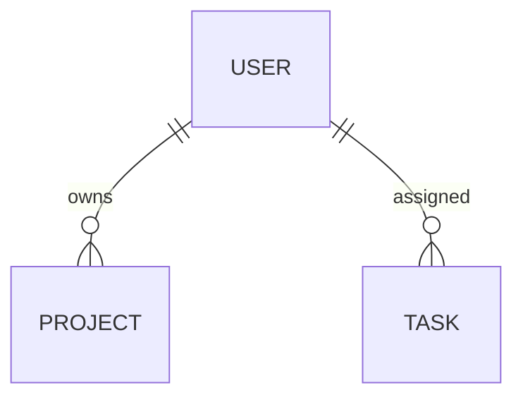

# User Entity (Minimal Example)

**Module:** Authentication  
**Status:** ✅ Implemented

---

## OVERVIEW

User entity represents a person in the system. Stores authentication credentials and profile information.

---

## STRUCTURE

### Database Schema

```sql
CREATE TABLE users (
  id                UUID PRIMARY KEY,
  email             VARCHAR(255) UNIQUE NOT NULL,
  name              VARCHAR(100) NOT NULL,
  password_hash     VARCHAR(255) NOT NULL,
  created_at        TIMESTAMP DEFAULT NOW()
);
```

### TypeScript Type

```typescript
interface User {
  id: string;
  email: string;
  name: string;
  createdAt: Date;
}
```

---

## RELATIONSHIPS



**Has Many:** Projects, Tasks

---

## API ENDPOINTS

| Method | Endpoint | Description |
|--------|----------|-------------|
| GET | `/api/users/:id` | Get user |
| PATCH | `/api/users/:id` | Update user |

---

## PERMISSIONS

| Action | Admin | User | Guest |
|--------|-------|------|-------|
| Read own | ✅ | ✅ | ❌ |
| Update own | ✅ | ✅ | ❌ |
| Delete own | ✅ | ✅ | ❌ |

---

**See:** [Full Template](_ENTITY_TEMPLATE.md) for complete documentation structure

