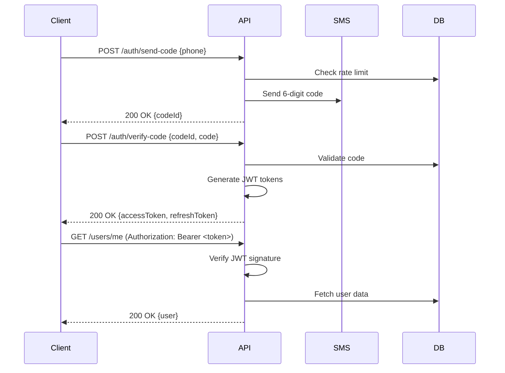

# Backend Overview - Свой Круг

**Version:** 1.0  
**Last Updated:** 2025-11-17  
**Status:** Active Development  
**Stack:** FastAPI 0.121.2 + PostgreSQL 16.11 + ClickHouse 25.8 LTS

---

## 🎯 OVERVIEW

Свой Круг (Own Circle) backend is a **modular monolith** built with FastAPI, designed to power a premium women's loyalty ecosystem. The architecture prioritizes rapid MVP delivery while maintaining clear boundaries for future microservices extraction.

### Core Capabilities

- **Multi-tenant loyalty system** - Bonuses, status tiers, coupons
- **Cross-business promotion engine** - Win-Win analytics and chained offers
- **Event management platform** - Community-driven event creation and voting
- **CRM integration hub** - 5+ connectors (YCLIENTS, Iiko, 1C, AMO CRM, Renovatio)
- **Real-time analytics** - RFM segmentation, churn prediction, transaction tracking

---

## 🏗️ ARCHITECTURE STYLE

### Modular Monolith

```
┌─────────────────────────────────────────────────────────┐
│                    MOBILE CLIENTS                       │
│              (React Native iOS/Android)                 │
└───────────────────────┬─────────────────────────────────┘
                        │ HTTPS/TLS 1.3
                        ▼
┌─────────────────────────────────────────────────────────┐
│                  FASTAPI BACKEND                        │
│  ┌──────────────┐  ┌──────────────┐  ┌──────────────┐ │
│  │ Auth Module  │  │ Loyalty Core │  │ Event Hub    │ │
│  └──────────────┘  └──────────────┘  └──────────────┘ │
│  ┌──────────────┐  ┌──────────────┐  ┌──────────────┐ │
│  │ Cross-Promo  │  │ CRM Adapters │  │ Analytics    │ │
│  └──────────────┘  └──────────────┘  └──────────────┘ │
└───────────────────────┬─────────────────────────────────┘
                        ▼
┌─────────────────────────────────────────────────────────┐
│                    DATA LAYER                           │
│  ┌──────────────┐  ┌──────────────┐  ┌──────────────┐ │
│  │ PostgreSQL   │  │ ClickHouse   │  │ Redis        │ │
│  │ (OLTP)       │  │ (OLAP)       │  │ (Cache)      │ │
│  └──────────────┘  └──────────────┘  └──────────────┘ │
└─────────────────────────────────────────────────────────┘
```

**Key Design Principles:**

1. **Domain-Driven Design** - Clear module boundaries by business domain
2. **Async First** - SQLAlchemy 2.0 async ORM, async API routes
3. **API-First** - OpenAPI 3.0 auto-generated docs
4. **Event-Driven** - Celery tasks for async operations
5. **Security by Default** - JWT RS256, field-level encryption, RBAC

---

## 📦 TECHNOLOGY STACK

### Backend Framework

| Technology | Version | Purpose |
|------------|---------|---------|
| **Python** | 3.13+ | Primary language |
| **FastAPI** | 0.121.2 | Web framework |
| **Uvicorn** | 0.34+ | ASGI server |
| **Pydantic** | 2.10+ | Data validation |

### Databases

| Database | Version | Purpose | Tables |
|----------|---------|---------|--------|
| **PostgreSQL** | 16.11 | OLTP (primary data) | 25 tables |
| **ClickHouse** | 25.8 LTS | OLAP (analytics) | 5 fact tables |
| **Redis** | 7.2+ | Cache, sessions, queues | TTL-based keys |

### ORM & Migrations

| Technology | Version | Purpose |
|------------|---------|---------|
| **SQLAlchemy** | 2.0.44 | Async ORM |
| **Alembic** | 1.14+ | Database migrations |
| **asyncpg** | 0.31+ | PostgreSQL async driver |

### Task Queue

| Technology | Version | Purpose |
|------------|---------|---------|
| **Celery** | 5.4+ | Async task queue |
| **Redis** | 7.2+ | Broker & result backend |
| **Celery Beat** | - | Scheduled tasks |

### Authentication & Security

| Technology | Version | Purpose |
|------------|---------|---------|
| **python-jose** | 3.3+ | JWT RS256 tokens |
| **passlib** | 1.7+ | Password hashing (bcrypt) |
| **cryptography** | 44+ | AES-256 encryption |

---

## 🗄️ KEY ENTITIES

### Core Business Entities (12)

| Entity | Table | Purpose | Relationships |
|--------|-------|---------|---------------|
| **User** | `users` | Member profile, status, auth | → Transactions, Bonuses, Events |
| **Business** | `businesses` | Partner business details | → Transactions, Coupons |
| **Transaction** | `transactions` | Purchase records | ← User, Business |
| **Bonus** | `bonuses` | Loyalty points balance | ← User |
| **StatusTier** | `status_tiers` | Insider/VIP/Elite/Inner | ← User |
| **Coupon** | `coupons` | Discount/bonus vouchers | ← User, Business, Chain |
| **Event** | `events` | Community events | ← User (creator) |
| **EventRegistration** | `event_registrations` | Event RSVPs | ← User, Event |
| **CrossPromoChain** | `cross_promo_chains` | A→B→C chains | → Coupons |
| **Notification** | `notifications` | Push/SMS/Email queue | ← User |
| **CRMIntegration** | `crm_integrations` | CRM sync config | ← Business |
| **ReferralCode** | `referral_codes` | Invite tracking | ← User |

### Supporting Entities (5)

- **Session** - JWT refresh tokens
- **AuditLog** - Compliance & tracking
- **OfferConstructor** - Business offers
- **VoteRecord** - Event voting (weighted)
- **Badge** - Gamification achievements

---

## 🔌 API DESIGN

### REST API Structure

**Base URL:** `https://api.svoykrug.ru/api/v1`

**Authentication:** Bearer JWT (RS256)

### Endpoint Groups

| Group | Prefix | Endpoints | Auth |
|-------|--------|-----------|------|
| **Auth** | `/auth` | 3 | Public |
| **Users** | `/users` | 8 | Required |
| **Loyalty** | `/loyalty` | 12 | Required |
| **Transactions** | `/transactions` | 6 | Required |
| **Events** | `/events` | 10 | Required |
| **Businesses** | `/businesses` | 7 | Required |
| **Coupons** | `/coupons` | 8 | Required |
| **Cross-Promo** | `/cross-promo` | 5 | Business |
| **Analytics** | `/analytics` | 6 | Business |
| **Admin** | `/admin` | 15 | Admin |

**Total:** 80+ REST endpoints

### Response Format

```json
{
  "success": true,
  "data": { /* payload */ },
  "meta": {
    "timestamp": "2025-11-17T10:30:00Z",
    "requestId": "uuid-v4"
  }
}
```

### Error Format

```json
{
  "success": false,
  "error": {
    "code": "VALIDATION_ERROR",
    "message": "Invalid input data",
    "details": {
      "email": ["Invalid email format"]
    }
  },
  "meta": {
    "timestamp": "2025-11-17T10:30:00Z",
    "requestId": "uuid-v4"
  }
}
```

---

## 🔐 AUTHENTICATION & AUTHORIZATION

### Authentication Flow



### JWT Structure

**Access Token (15 min TTL):**
```json
{
  "sub": "user-uuid",
  "role": "member",
  "status": "vip",
  "exp": 1700000000,
  "iat": 1699999000,
  "type": "access"
}
```

**Refresh Token (30 days TTL):**
```json
{
  "sub": "user-uuid",
  "jti": "token-uuid",
  "exp": 1702000000,
  "type": "refresh"
}
```

### Role-Based Access Control (RBAC)

| Role | Description | Permissions |
|------|-------------|-------------|
| **member** | Standard user | Own data CRUD, event registration |
| **vip** | VIP status user | + Event creation proposals |
| **elite** | Elite status user | + Weighted voting (3x) |
| **inner_circle** | Ambassador | + Event moderation |
| **business_owner** | Business account | Analytics, offers, transactions |
| **business_staff** | Staff account | Transaction entry only |
| **admin** | Platform admin | Full system access |
| **superadmin** | System owner | + User role changes |

---

## 📊 DATABASE ARCHITECTURE

### PostgreSQL Schema

**Core Tables (15):**
- `users`, `businesses`, `transactions`
- `bonuses`, `status_tiers`, `coupons`
- `events`, `event_registrations`, `vote_records`
- `cross_promo_chains`, `notifications`
- `crm_integrations`, `referral_codes`
- `sessions`, `audit_logs`

**Indexes:** 45+ strategic indexes for query optimization

**Constraints:**
- Foreign keys with CASCADE/SET NULL
- Check constraints for enums
- Unique constraints for business rules

### ClickHouse Schema

**Fact Tables (5):**
```sql
-- Transaction analytics (append-only)
transaction_facts (
  transaction_id UUID,
  user_id UUID,
  business_id UUID,
  amount Decimal64(2),
  bonus_accrued Decimal64(2),
  category String,
  timestamp DateTime
) ENGINE = MergeTree()
PARTITION BY toYYYYMM(timestamp)
ORDER BY (user_id, timestamp);

-- RFM snapshots (daily)
rfm_snapshots (
  snapshot_date Date,
  user_id UUID,
  recency_days Int32,
  frequency_count Int32,
  monetary_value Decimal64(2),
  rfm_segment String
) ENGINE = ReplacingMergeTree(snapshot_date)
ORDER BY (user_id, snapshot_date);

-- Win-Win matrix (hourly)
cross_promo_conversions (
  date Date,
  source_business_id UUID,
  target_business_id UUID,
  triggers Int32,
  conversions Int32,
  conversion_rate Float32
) ENGINE = SummingMergeTree()
PARTITION BY toYYYYMM(date)
ORDER BY (date, source_business_id, target_business_id);
```

---

## 🔄 EXTERNAL INTEGRATIONS

### CRM Connectors (5)

| System | Business | Protocol | Sync Interval |
|--------|----------|----------|---------------|
| **YCLIENTS** | Миндаль (salon) | REST API | 5 min |
| **Iiko** | Лисичкино (gastro) | REST API | 5 min |
| **1C** | Skinerica, Лисичкино | REST API | 15 min |
| **AMO CRM** | Стим Центр (dental) | REST API | 5 min |
| **МИС Renovatio** | Миллениум (medical) | REST API | 10 min |

### Adapter Pattern

All connectors implement `BaseCRMAdapter`:

```python
class BaseCRMAdapter(ABC):
    @abstractmethod
    async def fetch_transactions(
        self, 
        since: datetime, 
        until: datetime
    ) -> List[Transaction]:
        """Fetch transactions from CRM."""
        pass
    
    @abstractmethod
    async def get_customer_by_phone(
        self, 
        phone: str
    ) -> Optional[Customer]:
        """Find customer by phone."""
        pass
```

---

## ⚙️ BUSINESS LOGIC MODULES

### 1. Loyalty Service

**Responsibilities:**
- Bonus calculation and accrual
- Status tier calculation (Insider/VIP/Elite/Inner)
- Cashback rate determination (5%/7%/10%)
- Bonus expiration (90 days)

**Core Functions:**
- `calculate_bonus(amount, user, business) → Decimal`
- `update_status_tier(user) → StatusTier`
- `apply_bonus_multiplier(base, conditions) → Decimal`

### 2. Cross-Promo Service

**Responsibilities:**
- Chain creation (A→B, A→B→C, A⇄B, A→[B,C,D])
- Trigger evaluation
- Coupon generation
- Win-Win analytics

**Core Functions:**
- `evaluate_chain_trigger(transaction) → List[Coupon]`
- `calculate_winwin_index(business_a, business_b) → float`
- `generate_recommendations() → List[ChainSuggestion]`

### 3. Event Service

**Responsibilities:**
- Event creation & management
- Registration handling (with waitlist)
- Voting system (weighted by status)
- Check-in & attendance tracking

**Core Functions:**
- `create_event(data, creator) → Event`
- `register_for_event(user, event) → Registration`
- `process_vote(user, event, vote) → VoteResult`

### 4. Analytics Service

**Responsibilities:**
- RFM segmentation (daily job)
- Churn prediction (ML model)
- Transaction aggregation → ClickHouse
- Business dashboards

**Core Functions:**
- `calculate_rfm(user_id) → RFMSegment`
- `predict_churn(user_id) → float`
- `generate_dashboard(business_id) → DashboardData`

### 5. CRM Sync Service

**Responsibilities:**
- Scheduled transaction sync (Celery Beat)
- Webhook processing
- Duplicate detection
- Error handling & retry logic

**Core Functions:**
- `sync_transactions(business_id, since) → int`
- `process_webhook(payload) → Transaction`
- `reconcile_duplicates() → int`

---

## 🔔 NOTIFICATION SYSTEM

### Channels

| Channel | Provider | Use Case | Priority |
|---------|----------|----------|----------|
| **Push** | Firebase Cloud Messaging | Real-time alerts | High |
| **SMS** | SMS.ru | OTP codes, critical | Critical |
| **Email** | SendGrid | Digests, receipts | Medium |

### Event-Driven Architecture

```python
# Celery tasks for async notifications
@celery.task
async def send_bonus_notification(user_id: UUID, amount: Decimal):
    user = await get_user(user_id)
    await notification_service.send_push(
        user_id=user_id,
        title="Бонусы начислены!",
        body=f"Вам начислено {amount}₽ бонусов",
        data={"type": "bonus_accrued", "amount": str(amount)}
    )
```

---

## 📈 PERFORMANCE & SCALABILITY

### Current Metrics (Expected)

| Metric | Target | Monitoring |
|--------|--------|------------|
| API Response Time (p50) | < 100ms | Prometheus |
| API Response Time (p95) | < 500ms | Prometheus |
| Database Queries/sec | 1000+ | PostgreSQL stats |
| Cache Hit Rate | > 80% | Redis INFO |
| Uptime | 99.9% | UptimeRobot |

### Optimization Strategies

**1. Database Indexing:**
```sql
-- Transaction lookups by user
CREATE INDEX idx_transactions_user_created 
  ON transactions(user_id, created_at DESC);

-- Bonus balance queries
CREATE INDEX idx_bonuses_user_active 
  ON bonuses(user_id) 
  WHERE deleted_at IS NULL;
```

**2. Redis Caching:**
```python
# Cache user bonus balance (5 min TTL)
@cached(ttl=300, key_prefix="bonus_balance")
async def get_bonus_balance(user_id: UUID) -> Decimal:
    bonus = await db.query(Bonus).filter_by(user_id=user_id).first()
    return bonus.balance
```

**3. Connection Pooling:**
```python
# PostgreSQL async pool
engine = create_async_engine(
    DATABASE_URL,
    pool_size=20,
    max_overflow=10,
    pool_pre_ping=True
)
```

---

## 🧪 TESTING STRATEGY

### Test Pyramid

```
       ┌─────────┐
       │   E2E   │  10% - Critical user flows
       │  Tests  │
       └─────────┘
      ┌───────────┐
      │Integration│  30% - API + DB
      │   Tests   │
      └───────────┘
     ┌─────────────┐
     │    Unit     │  60% - Business logic
     │    Tests    │
     └─────────────┘
```

**Coverage Target:** 80%+

**Tools:**
- pytest (unit/integration)
- pytest-asyncio (async tests)
- httpx (API testing)
- faker (test data generation)

---

## 📚 RELATED DOCUMENTATION

### Backend Documentation
- [Entity Catalog](./entities/00_ENTITY_CATALOG.md) - All data models
- [API Overview](./api/00_API_OVERVIEW.md) - REST endpoints
- [Services Catalog](./services/00_SERVICES_CATALOG.md) - Business logic
- [Database Schema](./database/00_DATABASE_SCHEMA.md) - Tables & relationships

### Architecture Decisions
- [ADR Index](../adr/00_ADR_INDEX.md) - All ADRs
- [ADR-001: FastAPI vs Django](../adr/ADR-001-fastapi-choice.md)
- [ADR-002: PostgreSQL + ClickHouse](../adr/ADR-002-database-architecture.md)
- [ADR-003: SQLAlchemy Async](../adr/ADR-003-sqlalchemy-async.md)

### Core Documentation
- [Architecture Overview](../core/04_ARCHITECTURE.md)
- [Tech Stack](../core/03_TECH_STACK.md)

---

## 🔗 QUICK LINKS

**API Documentation (Auto-Generated):**
- Swagger UI: `https://api.svoykrug.ru/docs`
- ReDoc: `https://api.svoykrug.ru/redoc`
- OpenAPI JSON: `https://api.svoykrug.ru/openapi.json`

**Monitoring Dashboards:**
- Grafana: `https://monitoring.svoykrug.ru/grafana`
- Prometheus: `https://monitoring.svoykrug.ru/prometheus`
- Sentry: `https://sentry.io/svoykrug`

---

**Last Updated:** 2025-11-17  
**Maintained By:** Backend Engineering Team  
**Review Cycle:** Monthly
