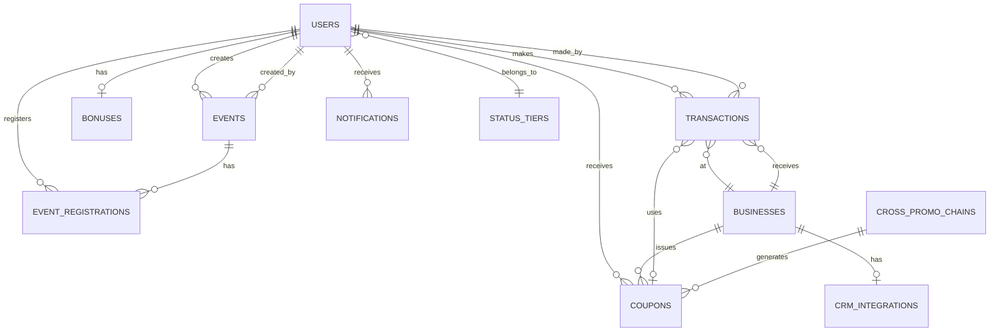

# Database Schema - Свой Круг

**Version:** 1.0  
**Last Updated:** 2025-11-17  
**PostgreSQL:** 16.11  
**ClickHouse:** 25.8 LTS

---

## 🗄️ POSTGRESQL SCHEMA

### Core Tables (15)

| Table | Rows (Est) | Purpose | Relationships |
|-------|------------|---------|---------------|
| `users` | 10,000 | Member profiles | → transactions, bonuses, events |
| `businesses` | 20 | Partner businesses | → transactions, coupons |
| `transactions` | 500,000 | Purchase records | ← users, businesses |
| `bonuses` | 10,000 | Bonus balances | ← users |
| `status_tiers` | 4 | Tier definitions | ← users |
| `coupons` | 50,000 | Discount vouchers | ← users, businesses |
| `events` | 200 | Community events | ← users |
| `event_registrations` | 2,000 | Event RSVPs | ← users, events |
| `cross_promo_chains` | 50 | Promo chains | → coupons |
| `notifications` | 100,000 | Message queue | ← users |
| `crm_integrations` | 20 | CRM configs | ← businesses |
| `referral_codes` | 10,000 | Invite tracking | ← users |
| `sessions` | 20,000 | JWT refresh tokens | ← users |
| `audit_logs` | 1,000,000 | Audit trail | → all tables |
| `offer_constructor` | 100 | Business offers | ← businesses |

---

## 📊 ENTITY RELATIONSHIP DIAGRAM



---

## 🔗 KEY FOREIGN KEYS

| Child Table | Column | References | On Delete |
|-------------|--------|------------|-----------|
| `transactions` | `user_id` | `users(id)` | RESTRICT |
| `transactions` | `business_id` | `businesses(id)` | RESTRICT |
| `bonuses` | `user_id` | `users(id)` | CASCADE |
| `coupons` | `user_id` | `users(id)` | CASCADE |
| `coupons` | `business_id` | `businesses(id)` | CASCADE |
| `event_registrations` | `user_id` | `users(id)` | CASCADE |
| `event_registrations` | `event_id` | `events(id)` | CASCADE |
| `crm_integrations` | `business_id` | `businesses(id)` | CASCADE |

---

## 📈 INDEXES

### Performance Indexes (45 total)

**Users:**
```sql
CREATE INDEX idx_users_phone ON users(phone);
CREATE INDEX idx_users_status_tier ON users(status_tier);
CREATE INDEX idx_users_referral_code ON users(referral_code);
```

**Transactions (Most Critical):**
```sql
CREATE INDEX idx_transactions_user_created 
  ON transactions(user_id, created_at DESC);
CREATE INDEX idx_transactions_business 
  ON transactions(business_id, created_at DESC);
CREATE INDEX idx_transactions_external_id 
  ON transactions(external_id);
CREATE UNIQUE INDEX idx_transactions_external_unique 
  ON transactions(business_id, external_id) 
  WHERE external_id IS NOT NULL;
```

**Bonuses:**
```sql
CREATE INDEX idx_bonuses_user ON bonuses(user_id);
CREATE INDEX idx_bonuses_expires 
  ON bonuses(expires_at) 
  WHERE expires_at IS NOT NULL;
```

**Events:**
```sql
CREATE INDEX idx_events_date 
  ON events(date) 
  WHERE status = 'published';
CREATE INDEX idx_events_status ON events(status);
```

---

## 🎯 CLICKHOUSE SCHEMA

### Fact Tables (5)

#### 1. Transaction Facts
```sql
CREATE TABLE transaction_facts (
  transaction_id UUID,
  user_id UUID,
  business_id UUID,
  amount Decimal64(2),
  bonus_accrued Decimal64(2),
  category String,
  timestamp DateTime
) ENGINE = MergeTree()
PARTITION BY toYYYYMM(timestamp)
ORDER BY (user_id, timestamp);
```

**Purpose:** Real-time transaction analytics  
**Update:** Streaming from PostgreSQL via Celery  
**Retention:** 24 months

#### 2. RFM Snapshots
```sql
CREATE TABLE rfm_snapshots (
  snapshot_date Date,
  user_id UUID,
  recency_days Int32,
  frequency_count Int32,
  monetary_value Decimal64(2),
  rfm_segment String
) ENGINE = ReplacingMergeTree(snapshot_date)
ORDER BY (user_id, snapshot_date);
```

**Purpose:** Customer segmentation  
**Update:** Daily at 02:00  
**Retention:** 12 months

#### 3. Cross-Promo Conversions
```sql
CREATE TABLE cross_promo_conversions (
  date Date,
  source_business_id UUID,
  target_business_id UUID,
  triggers Int32,
  conversions Int32,
  conversion_rate Float32
) ENGINE = SummingMergeTree()
PARTITION BY toYYYYMM(date)
ORDER BY (date, source_business_id, target_business_id);
```

**Purpose:** Win-Win matrix  
**Update:** Hourly aggregation  
**Retention:** 24 months

---

## 🔄 DATA REPLICATION

### PostgreSQL → ClickHouse

**Method:** Celery Beat scheduled tasks

**Tasks:**
- `sync_transactions_to_clickhouse` - Every 5 minutes
- `calculate_rfm_snapshots` - Daily at 02:00
- `aggregate_cross_promo_conversions` - Hourly

**Deduplication:** Use `ReplacingMergeTree` for idempotency

---

## 📚 RELATED DOCUMENTATION

- [Relationships](./relationships.md) - Detailed FK documentation
- [Migrations](./migrations.md) - Alembic workflow
- [Entity Catalog](../entities/00_ENTITY_CATALOG.md)
- [ADR-002: Database Architecture](../../adr/ADR-002-database-architecture.md)

---

**Last Updated:** 2025-11-17  
**Schema Version:** 1.0
