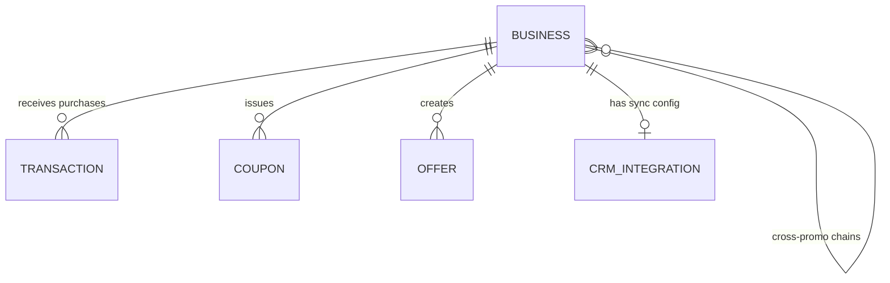

# Business Entity

**Version:** 1.0  
**Last Updated:** 2025-11-17  
**Status:** ✅ Implemented  
**Module:** Business Management & CRM Integration

---

## 📊 OVERVIEW

| Property | Value |
|----------|-------|
| **Entity Name** | Business |
| **Database Table** | `businesses` |
| **Module** | Business Management, CRM Integration |
| **Type** | Core |
| **Frontend Components** | BusinessCatalogScreen, BusinessDetailsScreen |
| **Primary Key** | `id` (uuid) |

### Description

Business entity represents a partner business in the Свой Круг ecosystem. It stores business profile, CRM integration settings, loyalty configurations, and serves as the anchor for transactions, offers, and cross-promotion chains.

### Purpose

**Business Purpose:**
Enable partner businesses to participate in the loyalty ecosystem, accept member purchases, create offers, and analyze customer behavior through integrated dashboards.

**Technical Purpose:**
Foreign key reference for transactions, offers, and cross-promo chains. Container for CRM credentials and sync configuration. Source for analytics aggregations.

---

## 🏗️ STRUCTURE

### Database Schema

```sql
CREATE TABLE businesses (
  -- Primary Key
  id                    UUID PRIMARY KEY DEFAULT gen_random_uuid(),
  
  -- Business Profile
  name                  VARCHAR(255) NOT NULL,
  legal_name            VARCHAR(255),
  inn                   VARCHAR(12) UNIQUE,  -- Russian tax ID
  category              VARCHAR(50) NOT NULL
                        CHECK (category IN ('beauty', 'cosmetology', 'dental', 
                          'medical', 'gastronomy', 'floristry', 'optics', 
                          'textile', 'legal')),
  description           TEXT,
  logo_url              VARCHAR(500),
  
  -- Contact Information
  phone                 VARCHAR(15),
  email                 VARCHAR(255),
  website               VARCHAR(500),
  address               TEXT,
  city                  VARCHAR(100) DEFAULT 'Екатеринбург',
  coordinates           JSONB,  -- {"lat": 56.838, "lon": 60.605}
  
  -- Loyalty Settings
  cashback_percent      DECIMAL(5,2) DEFAULT 5.00,  -- Base cashback rate
  bonus_multiplier      DECIMAL(3,2) DEFAULT 1.00,  -- Special multiplier
  accepts_bonus_payment BOOLEAN DEFAULT true,
  min_purchase_amount   DECIMAL(10,2) DEFAULT 0.00,
  
  -- CRM Integration
  crm_type              VARCHAR(50),  -- 'yclients' | 'iiko' | '1c' | 'amo_crm' | 'renovatio'
  crm_credentials       BYTEA,  -- Encrypted JSON with API keys
  crm_last_sync         TIMESTAMP WITH TIME ZONE,
  sync_enabled          BOOLEAN DEFAULT false,
  sync_interval_minutes INT DEFAULT 5,
  
  -- Business Status
  is_active             BOOLEAN DEFAULT true,
  is_verified           BOOLEAN DEFAULT false,
  onboarding_completed  BOOLEAN DEFAULT false,
  trial_ends_at         TIMESTAMP WITH TIME ZONE,
  
  -- Metadata
  created_at            TIMESTAMP WITH TIME ZONE DEFAULT NOW(),
  updated_at            TIMESTAMP WITH TIME ZONE DEFAULT NOW(),
  deleted_at            TIMESTAMP WITH TIME ZONE DEFAULT NULL
);

-- Indexes
CREATE INDEX idx_businesses_category ON businesses(category);
CREATE INDEX idx_businesses_city ON businesses(city);
CREATE INDEX idx_businesses_active ON businesses(is_active) WHERE is_active = true;
CREATE INDEX idx_businesses_crm_type ON businesses(crm_type);

-- Full-text search index
CREATE INDEX idx_businesses_name_search ON businesses USING gin(to_tsvector('russian', name || ' ' || COALESCE(description, '')));
```

---

### TypeScript Type

```typescript
interface Business {
  id: string;
  
  // Business Profile
  name: string;
  legalName?: string;
  inn?: string;
  category: 'beauty' | 'cosmetology' | 'dental' | 'medical' | 'gastronomy' | 'floristry' | 'optics' | 'textile' | 'legal';
  description?: string;
  logoUrl?: string;
  
  // Contact
  phone?: string;
  email?: string;
  website?: string;
  address?: string;
  city: string;
  coordinates?: {
    lat: number;
    lon: number;
  };
  
  // Loyalty
  cashbackPercent: number;
  bonusMultiplier: number;
  acceptsBonusPayment: boolean;
  minPurchaseAmount: number;
  
  // CRM
  crmType?: 'yclients' | 'iiko' | '1c' | 'amo_crm' | 'renovatio';
  crmLastSync?: Date;
  syncEnabled: boolean;
  
  // Status
  isActive: boolean;
  isVerified: boolean;
  
  createdAt: Date;
  updatedAt: Date;
}

interface BusinessCreate {
  name: string;
  category: string;
  phone: string;
  email: string;
  address: string;
  city?: string;
  cashbackPercent?: number;
}
```

---

## 🔗 RELATIONSHIPS

### Diagram



---

## 🌐 API ENDPOINTS

| Method | Endpoint | Description | Auth |
|--------|----------|-------------|------|
| GET | `/api/v1/businesses` | List all businesses | ✅ |
| GET | `/api/v1/businesses/:id` | Get business details | ✅ |
| GET | `/api/v1/businesses/:id/offers` | List business offers | ✅ |
| GET | `/api/v1/businesses/:id/analytics` | Business analytics | Business |
| PATCH | `/api/v1/businesses/:id` | Update business | Business |

**Detailed Documentation:** [Businesses API](../api/businesses-api.md)

---

## 🔐 PERMISSIONS

| Action | Member | Business Owner | Admin |
|--------|--------|----------------|-------|
| **List** | ✅ | ✅ | ✅ |
| **View details** | ✅ | ✅ | ✅ |
| **Update own** | ❌ | ✅ | ✅ |
| **View analytics** | ❌ | ✅ Own | ✅ All |
| **Manage CRM** | ❌ | ✅ | ✅ |

---

## 📝 BUSINESS RULES

1. **Category-Based Cashback**
   - Each business sets own cashback rate (3%-15%)
   - Platform default: 5% (Insider), 7% (VIP), 10% (Elite)

2. **CRM Credentials Encryption**
   - All CRM API keys encrypted with AES-256
   - Decrypted only during sync operations
   - Never exposed in API responses

3. **Sync Interval Limits**
   - Minimum: 5 minutes
   - Maximum: 60 minutes
   - Configurable per business

---

## 📚 RELATED DOCUMENTATION

- [Transaction Entity](./transaction.md)
- [CRM Integration Entity](./crm-integration.md)
- [Businesses API](../api/businesses-api.md)

---

**Navigation:** [← User Entity](./user.md) | [Transaction Entity →](./transaction.md)
