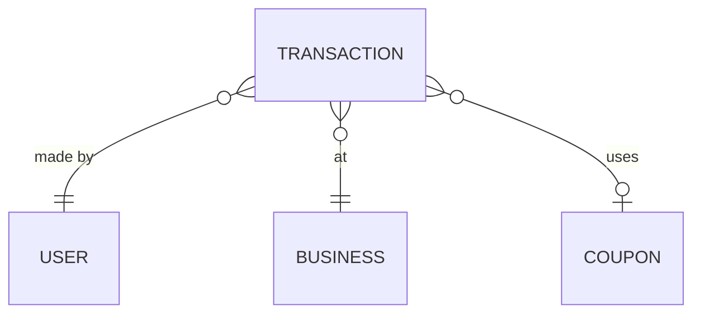

# Transaction Entity

**Version:** 1.0  
**Last Updated:** 2025-11-17  
**Status:** ✅ Implemented  
**Module:** Transaction Management & Loyalty Calculation

---

## 📊 OVERVIEW

| Property | Value |
|----------|-------|
| **Entity Name** | Transaction |
| **Database Table** | `transactions` |
| **Module** | Transaction, Loyalty |
| **Type** | Core |
| **Primary Key** | `id` (uuid) |

### Description

Transaction entity represents a purchase made by a user at a business. It triggers bonus calculations, status updates, and cross-promo chain evaluations. Immutable after creation (append-only audit log).

---

## 🏗️ STRUCTURE

### Database Schema

```sql
CREATE TABLE transactions (
  id                    UUID PRIMARY KEY DEFAULT gen_random_uuid(),
  
  -- References
  user_id               UUID NOT NULL REFERENCES users(id),
  business_id           UUID NOT NULL REFERENCES businesses(id),
  
  -- Transaction Details
  amount                DECIMAL(12,2) NOT NULL CHECK (amount >= 0),
  bonus_accrued         DECIMAL(10,2) DEFAULT 0.00,
  bonus_redeemed        DECIMAL(10,2) DEFAULT 0.00,
  final_amount          DECIMAL(12,2) NOT NULL,  -- amount - bonus_redeemed
  
  -- Type & Status
  transaction_type      VARCHAR(20) DEFAULT 'purchase'
                        CHECK (transaction_type IN ('purchase', 'refund', 'adjustment')),
  status                VARCHAR(20) DEFAULT 'completed'
                        CHECK (status IN ('pending', 'completed', 'refunded', 'failed')),
  
  -- CRM Integration
  external_id           VARCHAR(255),  -- CRM system transaction ID
  crm_metadata          JSONB,  -- Additional CRM data
  
  -- Coupon Usage
  coupon_id             UUID REFERENCES coupons(id),
  discount_amount       DECIMAL(10,2) DEFAULT 0.00,
  
  -- Metadata
  created_at            TIMESTAMP WITH TIME ZONE DEFAULT NOW(),
  refunded_at           TIMESTAMP WITH TIME ZONE
);

-- Indexes
CREATE INDEX idx_transactions_user_created ON transactions(user_id, created_at DESC);
CREATE INDEX idx_transactions_business ON transactions(business_id, created_at DESC);
CREATE INDEX idx_transactions_external_id ON transactions(external_id);
CREATE INDEX idx_transactions_status ON transactions(status);
CREATE INDEX idx_transactions_created_at ON transactions(created_at DESC);

-- Unique constraint for CRM sync deduplication
CREATE UNIQUE INDEX idx_transactions_external_unique 
  ON transactions(business_id, external_id) 
  WHERE external_id IS NOT NULL;
```

---

### TypeScript Type

```typescript
interface Transaction {
  id: string;
  userId: string;
  businessId: string;
  
  amount: number;
  bonusAccrued: number;
  bonusRedeemed: number;
  finalAmount: number;
  
  transactionType: 'purchase' | 'refund' | 'adjustment';
  status: 'pending' | 'completed' | 'refunded' | 'failed';
  
  externalId?: string;
  crmMetadata?: Record<string, any>;
  
  couponId?: string;
  discountAmount: number;
  
  createdAt: Date;
  refundedAt?: Date;
}
```

---

## 🔗 RELATIONSHIPS



---

## 🌐 API ENDPOINTS

| Method | Endpoint | Description | Auth |
|--------|----------|-------------|------|
| POST | `/api/v1/transactions` | Create transaction | Business |
| GET | `/api/v1/transactions` | List user transactions | Member |
| GET | `/api/v1/transactions/:id` | Get transaction details | Member |

**Detailed Documentation:** [Transactions API](../api/transactions-api.md)

---

## 📝 BUSINESS RULES

1. **Immutable After Creation** - Transactions cannot be edited, only refunded
2. **Bonus Calculation** - Automatic on creation: `amount * cashback_rate * multiplier`
3. **Status Tier Update** - Triggers user status recalculation
4. **Cross-Promo Evaluation** - Checks chain triggers after creation
5. **ClickHouse Replication** - Async copy to analytics DB

---

## 📚 RELATED DOCUMENTATION

- [User Entity](./user.md)
- [Business Entity](./business.md)
- [Bonus Entity](./bonus.md)

---

**Navigation:** [← Business Entity](./business.md) | [Bonus Entity →](./bonus.md)
