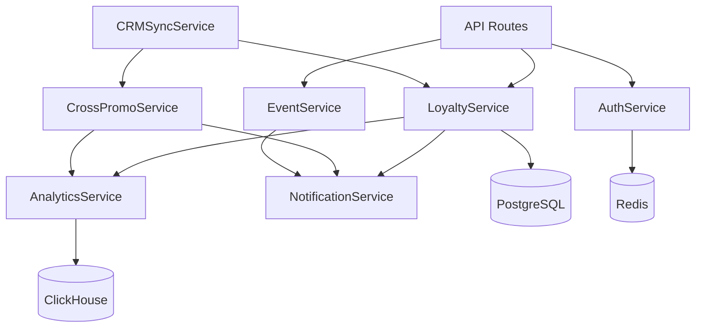

# Services Catalog - Свой Круг

**Version:** 1.0  
**Last Updated:** 2025-11-17  
**Architecture:** Modular Monolith

---

## 🎯 SERVICE ARCHITECTURE

Свой Круг backend follows a **service-oriented architecture** within a modular monolith. Each service encapsulates specific business domain logic and can be independently tested and potentially extracted as a microservice.

---

## 📦 CORE SERVICES

### 1. Auth Service
**File:** `app/services/auth_service.py`  
**Purpose:** Authentication, SMS OTP, JWT token management

**Key Functions:**
- `send_otp_code(phone: str) → CodeId`
- `verify_otp_code(code_id: str, code: str) → Tokens`
- `refresh_access_token(refresh_token: str) → AccessToken`
- `revoke_token(token: str) → bool`

**Dependencies:** Redis (OTP storage), SMS.ru API

**Documentation:** [Auth Service](./auth-service.md)

---

### 2. Loyalty Service
**File:** `app/services/loyalty_service.py`  
**Purpose:** Bonus calculations, status tier management, rewards

**Key Functions:**
- `calculate_bonus(transaction: Transaction) → Decimal`
- `update_status_tier(user: User) → StatusTier`
- `apply_bonus_redemption(user: User, amount: Decimal) → bool`
- `check_bonus_expiration() → List[UUID]`

**Dependencies:** PostgreSQL, ClickHouse

**Documentation:** [Loyalty Service](./loyalty-service.md)

---

### 3. Cross-Promo Service
**File:** `app/services/cross_promo_service.py`  
**Purpose:** Cross-promotion chains, Win-Win analytics, coupon generation

**Key Functions:**
- `evaluate_chain_triggers(transaction: Transaction) → List[Coupon]`
- `calculate_winwin_index(business_a: UUID, business_b: UUID) → float`
- `generate_chain_recommendations(business: UUID) → List[ChainSuggestion]`
- `create_chain(config: ChainConfig) → CrossPromoChain`

**Dependencies:** PostgreSQL, ClickHouse

**Documentation:** [Cross-Promo Service](./cross-promo-service.md)

---

### 4. Event Service
**File:** `app/services/event_service.py`  
**Purpose:** Event management, registrations, voting, check-ins

**Key Functions:**
- `create_event(data: EventCreate, creator: User) → Event`
- `register_for_event(user: User, event: Event) → Registration`
- `process_vote(user: User, event: Event, vote: VoteType) → VoteResult`
- `check_in_participant(registration_id: UUID) → bool`

**Dependencies:** PostgreSQL, Redis (voting cache)

**Documentation:** [Event Service](./events-service.md)

---

### 5. Analytics Service
**File:** `app/services/analytics_service.py`  
**Purpose:** RFM segmentation, churn prediction, business dashboards

**Key Functions:**
- `calculate_rfm_segments(user_ids: List[UUID]) → List[RFMSegment]`
- `predict_churn_risk(user_id: UUID) → float`
- `generate_business_dashboard(business_id: UUID) → DashboardData`
- `aggregate_transactions_to_clickhouse(since: datetime) → int`

**Dependencies:** PostgreSQL, ClickHouse, ML models

**Documentation:** [Analytics Service](./analytics-service.md)

---

## 🔌 INTEGRATION SERVICES

### 6. CRM Sync Service
**File:** `app/services/crm_sync_service.py`  
**Purpose:** CRM integration, transaction sync, webhook processing

**Key Functions:**
- `sync_transactions(business_id: UUID, since: datetime) → int`
- `process_webhook(business_id: UUID, payload: dict) → Transaction`
- `test_crm_connection(integration: CRMIntegration) → bool`

**Dependencies:** External CRM APIs (YCLIENTS, Iiko, 1C, AMO, Renovatio)

---

### 7. Notification Service
**File:** `app/services/notification_service.py`  
**Purpose:** Push, SMS, email notifications

**Key Functions:**
- `send_push(user_id: UUID, title: str, body: str) → bool`
- `send_sms(phone: str, message: str) → bool`
- `send_email(email: str, template: str, variables: dict) → bool`

**Dependencies:** Firebase Cloud Messaging, SMS.ru, SendGrid

---

## 🔄 SERVICE INTERACTIONS

---

## 📚 RELATED DOCUMENTATION

- [Auth Service](./auth-service.md)
- [Loyalty Service](./loyalty-service.md)
- [Cross-Promo Service](./cross-promo-service.md)
- [Events Service](./events-service.md)
- [Analytics Service](./analytics-service.md)
- [Backend Overview](../00_BACKEND_OVERVIEW.md)

---

**Last Updated:** 2025-11-17  
**Maintained By:** Backend Engineering Team
