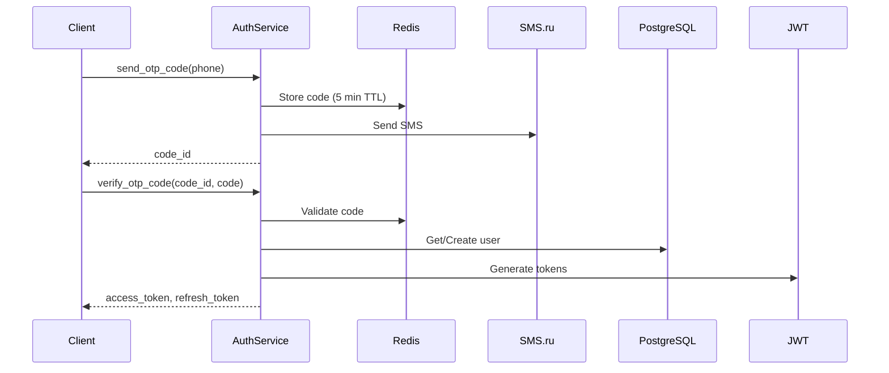

# Auth Service

**Version:** 1.0  
**Last Updated:** 2025-11-17  
**Status:** Active  
**Owner:** Backend Team

---

## 🎯 PURPOSE

Authentication service handles SMS OTP-based authentication, JWT token generation, and session management for the Свой Круг platform.

**Primary Responsibilities:**
- SMS OTP code generation and validation
- JWT access/refresh token management
- Phone number verification
- Session lifecycle management

**NOT Responsible For:**
- User profile management (User Service)
- Authorization/permissions (handled by middleware)
- Password authentication (future feature)

---

## 🏗️ ARCHITECTURE

### High-Level Design



### Dependencies

| Dependency | Type | Purpose | Criticality |
|------------|------|---------|-------------|
| PostgreSQL | Database | User data | Critical |
| Redis | Cache | OTP storage | Critical |
| SMS.ru | External | SMS delivery | Critical |
| python-jose | Library | JWT signing | Critical |

---

## ⚙️ BUSINESS LOGIC

### Core Functions

#### send_otp_code()

**Purpose:** Generate and send SMS OTP code

**Signature:**
```python
async def send_otp_code(phone: str) -> OTPResponse:
    """
    Generate 6-digit code, store in Redis, send via SMS
    
    Args:
        phone: E.164 format (+79991234567)
    
    Returns:
        OTPResponse with code_id and expires_in
    
    Raises:
        RateLimitError: More than 5 attempts in 1 minute
        SMSDeliveryError: SMS send failed
    """
```

**Logic:**
1. Validate phone format (E.164)
2. Check rate limit (5 attempts/minute per phone)
3. Generate 6-digit code
4. Store in Redis with 5-minute TTL
5. Send SMS via SMS.ru API
6. Return code_id

---

#### verify_otp_code()

**Purpose:** Validate OTP and return JWT tokens

**Signature:**
```python
async def verify_otp_code(
    code_id: str, 
    code: str
) -> TokenPair:
    """
    Validate OTP code and generate JWT tokens
    
    Args:
        code_id: UUID from send_otp_code
        code: 6-digit code from SMS
    
    Returns:
        TokenPair with access_token and refresh_token
    
    Raises:
        InvalidCodeError: Code mismatch or expired
    """
```

**Logic:**
1. Fetch code from Redis by code_id
2. Compare provided code
3. Get or create user by phone
4. Generate JWT access token (15 min)
5. Generate JWT refresh token (30 days)
6. Store refresh token in PostgreSQL
7. Delete OTP from Redis
8. Return token pair

---

## 🔐 SECURITY

### JWT Token Structure

**Access Token (RS256):**
```json
{
  "sub": "user-uuid",
  "role": "member",
  "status": "vip",
  "exp": 1700000000,
  "iat": 1699999000,
  "type": "access"
}
```

**Refresh Token (RS256):**
```json
{
  "sub": "user-uuid",
  "jti": "token-uuid",
  "exp": 1702000000,
  "type": "refresh"
}
```

### Rate Limiting

| Action | Limit | Window |
|--------|-------|--------|
| Send OTP | 5 attempts | 1 minute |
| Verify OTP | 3 attempts | 5 minutes |
| Refresh token | 10 requests | 1 hour |

---

## 📚 RELATED DOCUMENTATION

- [Auth API](../api/auth-api.md)
- [User Entity](../entities/user.md)
- [ADR-004: JWT Authentication](../../adr/ADR-004-jwt-authentication.md)

---

**Navigation:** [← Services Catalog](./00_SERVICES_CATALOG.md) | [Loyalty Service →](./loyalty-service.md)
